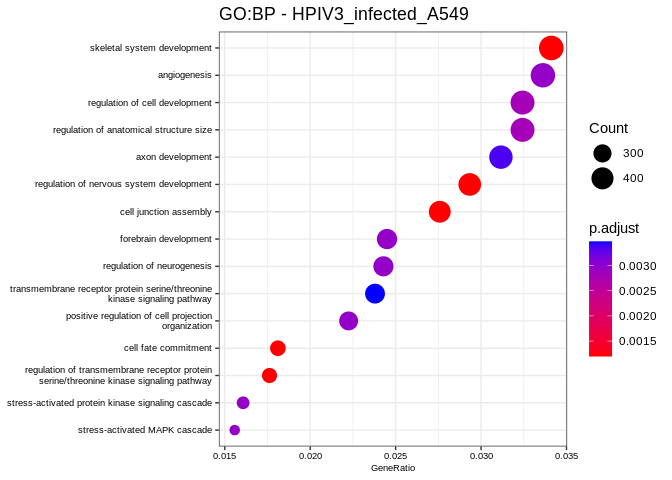

PulmonDB - COVID19.
================
Monica Padilla
2022-12-06

  

## **Exploration of Regulons based on DA and RSS specificity**

### **Preparation**

Load libraries and `regs-analysis.R` script.

``` r
library(tidyverse) # data handling: dplyr, stringr
library(ComplexHeatmap) # graphics
library(circlize) # colors for complexheatmap
# library(RColorBrewer) # colors
library(org.Hs.eg.db) # orgDB hsapiens annotations
library(ggpubr) ## ggarrange
library(enrichplot) # graphics
library(clusterProfiler) # Biological Terms enrichment analysis + dot plots
library(pathview)
library(DOSE)
library(wordcloud)
library(RColorBrewer)

## Load functions
source("/home/user/Documents/mpadilla/COVID19/pyscenic/regulons-analysis/scripts/regs-analysis.R")
```

Load general data and tidy:

``` r
## Load Data
# Load data: Experiment Metadata
meta <- as.data.frame(read_csv(params$metadata.fn, col_names = T))
if(params$celllines == 1){
  meta <- meta %>% filter(disease == "Y") %>% dplyr::select(source, cellline) %>% distinct()
  # format as in matrix for display
  meta$cellline <- str_replace_all(meta$cellline, "-", "")
  meta$cellline <- str_replace(meta$cellline, "A549_.+", "A549")
  meta$source <- str_replace_all(meta$source, "-", "")
  meta$source <- str_replace(meta$source, "w_vector_expressing_", "")
  meta$source <- str_replace(meta$source, "1hr_Ruxolitinib_pretreatment", "pt")
} else {
  meta <- meta %>% filter(disease == "Y") %>% select(source) %>% distinct()
}

# Load data: auc_mtx 
auc_mtx <- as.data.frame(readRDS(paste0(params$inputdir,params$auc_mtx.fn)))

# Load data: TFs names (in order after just scenic counts cutoff)
tfs <- as.data.frame(read_csv(paste0(params$inputdir,params$tfs.fn), col_names = F))[,1]
tfs <- stringr::str_remove(tfs, "_\\(\\+\\)")
tfs <- tfs[match(str_remove(colnames(auc_mtx),"_\\(\\+\\)"),tfs)]

# Load data: tf targets (regulons)
tfs_targets <- readRDS(paste0(params$inputdir,params$tfs_targets.fn))

# Load data: RSS matrix
rss <- as.data.frame(read_csv(paste0(params$inputdir,params$RSS.fn), col_names = T))
rss <- column_to_rownames(rss, var="...1")
# rownames(rss) <- rownames(rss)[match(colnames(auc_mtx),rownames(rss))]
rownames(rss) <- rownames(rss)[match(str_replace(tfs,"$","_\\(\\+\\)"),rownames(rss))]

# Load and tidy data: log 2 FC (auc_mtx)
l2fc <- as.data.frame(read_csv(paste0(params$inputdir,params$l2fc.fn), col_names = T))
if(params$celllines==1){
  names(l2fc) <- str_replace_all(names(l2fc), "-", "")
  names(l2fc) <- str_replace(names(l2fc), "w_vector_expressing_", "")
  names(l2fc) <- str_replace(names(l2fc), "1hr_Ruxolitinib_pretreatment", "pt")
}
# rownames(l2fc) <- colnames(auc_mtx)
rownames(l2fc) <- str_replace(tfs,"$","_\\(\\+\\)")
head(l2fc)
```

    ##            HPIV3_infected_A549 IAV_infected_A549 IAV_infected_NHBE
    ## ABL1_(+)         -0.0021213664     -0.0021213664      -0.007195385
    ## AEBP2_(+)         0.0000000000      0.0000000000       0.000000000
    ## AHCTF1_(+)        0.0000000000      0.0000000000       0.004032503
    ## AHR_(+)          -0.0004521152     -0.0004521152       0.000000000
    ## AHRR_(+)          0.0017450164     -0.0159629991      -0.004854058
    ## AIRE_(+)          0.0185965216     -0.0059102706       0.106208574
    ##            IAVdNS1_infected_NHBE RSV_infected_A549 SARSCoV2_infected_A549
    ## ABL1_(+)            -0.007195385     -0.0021213664            0.002068460
    ## AEBP2_(+)            0.000000000      0.0000000000            0.000000000
    ## AHCTF1_(+)           0.036328274      0.0000000000            0.001541727
    ## AHR_(+)              0.000000000     -0.0004521152            0.002371791
    ## AHRR_(+)            -0.004854058     -0.0042682342           -0.015962999
    ## AIRE_(+)             0.120606902      0.0031108831            0.002710615
    ##            SARSCoV2_infected_A549_hACE2 SARSCoV2_infected_A549_hACE2_pt
    ## ABL1_(+)                   0.0000000000                    0.0000000000
    ## AEBP2_(+)                  0.0000000000                    0.0000000000
    ## AHCTF1_(+)                 0.0000000000                    0.0000000000
    ## AHR_(+)                    0.0000000000                    0.0000000000
    ## AHRR_(+)                  -0.0005413744                   -0.0005413744
    ## AIRE_(+)                   0.0356925893                    0.0626059371
    ##            SARSCoV2_infected_Calu3 SARSCoV2_infected_NHBE
    ## ABL1_(+)               0.001788094          -0.0053756631
    ## AEBP2_(+)              0.000000000           0.0000000000
    ## AHCTF1_(+)             0.000000000           0.0024149692
    ## AHR_(+)                0.004923371           0.0007015325
    ## AHRR_(+)               0.002061292          -0.0048540581
    ## AIRE_(+)               0.007560817           0.0583439862
    ##            human_IFNB_treated_NHBE
    ## ABL1_(+)              -0.005038141
    ## AEBP2_(+)              0.000000000
    ## AHCTF1_(+)             0.000000000
    ## AHR_(+)                0.000000000
    ## AHRR_(+)               0.033777927
    ## AIRE_(+)               0.000000000

``` r
# Load data: mwu adj pvalues
adj_pvals_mwu.fn <- paste0(params$inputdir,params$adj_pvals_klm.fn)
pvalues <- as.data.frame(read_csv(adj_pvals_mwu.fn, col_names = T))
rownames(pvalues) <- tfs
# selected regs - 2tailed tests + rss
tfs_da.fn <- paste0(params$inputdir,params$tfs_DA_2t.fn)
tfs_da <- readRDS(tfs_da.fn)
tfs_da_enrich.fn <- paste0(params$inputdir, params$tfs_DA_enrichLFC_2t.fn)
tfs_da_enrich <- readRDS(tfs_da_enrich.fn)
names(tfs_da_enrich) <- names(tfs_da)
```

Define genes universe and graph number of genes per regulon:

``` r
# universe of genes = all genes from all tested regulons (after scenic iterations cutoff)
genes_universe <- c()
n.genes.per.reg <- c()
tested.regs <- names(tfs_targets) %in% str_replace(tfs, "$", "_\\(\\+\\)")
for (i in 1:length(names(tfs_targets))) {
  if(tested.regs[i]){
    genes_universe <- c(genes_universe, 
                        str_remove(names(tfs_targets[i]), "_\\(\\+\\)"), # tf
                        unname(unlist(tfs_targets[i]))) # gene targets
    n.genes.per.reg <- c(n.genes.per.reg, length(unname(unlist(tfs_targets[i]))))
  }
}
genes_universe.df <- bitr(unique(genes_universe), fromType = "SYMBOL",
        toType = c("ENSEMBL", "ENTREZID"),
        OrgDb = org.Hs.eg.db)
genes_universe <- genes_universe.df$ENTREZID # subset to genes found in OrgDb
#genes_universe <- symbol2EntrezID(genenames = unique(genes_universe))
names(n.genes.per.reg) <- tfs
summary(n.genes.per.reg)
```

    ##    Min. 1st Qu.  Median    Mean 3rd Qu.    Max. 
    ##     6.0   171.2   441.5  1079.5  1338.2  7747.0

``` r
# graph # target genes per regulon histogram
n.genes.per.reg <- as.data.frame(n.genes.per.reg)
p <- ggplot(n.genes.per.reg,aes(n.genes.per.reg)) + #<<
    geom_bar(fill="#8274c9") + # geom hist didnt work
    scale_x_binned() +
    labs(x="# target genes per regulon", y="") +
    geom_vline(xintercept = mean(n.genes.per.reg$n.genes.per.reg), color = "red") +
    geom_vline(xintercept = median(n.genes.per.reg$n.genes.per.reg), color = "blue")
p + annotate("text", x = 3500, y = 450, 
             label = c(summary(n.genes.per.reg)[3,])) + 
  annotate("text", x = 3500, y = 550, 
             label = c(summary(n.genes.per.reg)[4,]))
```

<!-- -->

``` r
## save to png
# png(paste0(params$outdir,"hist_genesxregulon.png"), width = 600, height = 200)
# p + annotate("text", x = 3500, y = 450,
#              label = c(summary(n.genes.per.reg)[3,])) +
#   annotate("text", x = 3500, y = 550,
#              label = c(summary(n.genes.per.reg)[4,]))
# dev.off()
```

Make lists of regulons defined as upregulated or downregulated:

``` r
## Make lists of up/down regulons
tfs_da_up = list()
tfs_da_down = list()
tfs_da_enrich_up = list()
tfs_da_enrich_down = list()
for (exp in names(tfs_da)) {
  tfs_da_up[[exp]] <- tfs_da[[exp]][tfs_da[[exp]] %in%  rownames(l2fc)[which(l2fc[exp] > 0)]]
  tfs_da_down[[exp]] <- tfs_da[[exp]][tfs_da[[exp]] %in% rownames(l2fc)[which(l2fc[exp] < 0)]]
  tfs_da_enrich_up[[exp]] <- intersect(tfs_da_enrich[[exp]], tfs_da_up[[exp]])
  tfs_da_enrich_down[[exp]] <- intersect(tfs_da_enrich[[exp]], tfs_da_down[[exp]])
}
```

### **Plots: DA**

#### **Upset Plot**

``` r
library(tidyverse)
library(ComplexHeatmap)
library(RColorBrewer)

# tfs_da
## Check intersections in pairs of experiments
#has.intersections <- checkCommonRegs(tfs_per_exp_list = tfs_da_up)
#common.regs.up <- checkCommonRegsTable(tfs_per_exp_list = tfs_da_up)

## Upset Plot
# subset for experiments that had intersections with other experiments, also plot only intersections >=2
# m <- make_comb_mat(tfs_da_up[names(tfs_da_up) %in% has.intersections], 
#                    mode = "distinct")
# m <- m[comb_degree(m) >= 2]
#
```

  

##### **Upregulated Regulons**

Upset Plot of distinctly shared upregulated regulons between
experiments:

``` r
m <- make_comb_mat(tfs_da_up, mode = "distinct")
# m <- m[6:10,]
ss = set_size(m)
cs = comb_size(m)
ht = UpSet(m, 
    set_order = order(ss),
    comb_order = order(comb_degree(m), -cs),
    top_annotation = HeatmapAnnotation(
        "Regulons Intersection" = anno_barplot(cs, 
            ylim = c(0, max(cs)*1.1),
            border = FALSE, 
            gp = gpar(fill = "black"), 
            height = unit(4, "cm")
        ), 
        annotation_name_side = "left", 
        annotation_name_rot = 90),
    left_annotation = rowAnnotation(
        "Regulons Per Experiment" = anno_barplot(-ss, 
            baseline = 0,
            axis_param = list(
                at = c(0, -500, -1000, -1500),
                labels = c(0, 500, 1000, 1500),
                labels_rot = 0),
            border = FALSE, 
            gp = gpar(fill = "black"), 
            width = unit(4, "cm")
        ),
        set_name = anno_text(set_name(m),
            location = 0.5,
            just = "center",
            width = max_text_width(set_name(m)) + unit(1, "mm"))
    ), 
    right_annotation = NULL,
    show_row_names = FALSE,
    pt_size = unit(3, "mm"), 
    lwd = 2,
    comb_col = RColorBrewer::brewer.pal(n = max(comb_degree(m)), name = "Set1")[comb_degree(m)]
    )
ht = draw(ht)
od = column_order(ht)
decorate_annotation("Regulons Intersection", {
    grid.text(cs[od], x = seq_along(cs), y = unit(cs[od], "native") + unit(2, "pt"), 
        default.units = "native", just = c("left", "bottom"), 
        gp = gpar(fontsize = 9, col = "#404040"), rot = 45)
})
```

<!-- -->

``` r
# ## save to png
# png(paste0(params$outdir,"upset_upregulated.png"), width = 1700, height = 600)
# ht = draw(ht)
# od = column_order(ht)
# decorate_annotation("Regulons Intersection", {
#     grid.text(cs[od], x = seq_along(cs), y = unit(cs[od], "native") + unit(2, "pt"), 
#         default.units = "native", just = c("left", "bottom"), 
#         gp = gpar(fontsize = 9, col = "#404040"), rot = 45)
# })
# dev.off()
```

Pairwise comparison of shared regulons, distinctly shared regulons are
shown in the next table:

Sets were compared twice, once showing which are unique to each
experiment, and the second time excluding comparison of a experiment to
itself so sharing of regulons between regulons could be found.

``` r
tableCommonDistinct <- distinctlySharedRegs(tfs_per_exp_list = tfs_da_up)
tableCommonDistinct
```

    ##                                                   HPIV3_infected_A549
    ## HPIV3_infected_A549             BCL6B,FOXP2,SP6,ZNF148,ZNF227,ZSCAN26
    ## IAV_infected_A549                                                <NA>
    ## IAV_infected_NHBE                                                <NA>
    ## IAVdNS1_infected_NHBE                                            <NA>
    ## RSV_infected_A549                                                <NA>
    ## SARSCoV2_infected_A549                                           <NA>
    ## SARSCoV2_infected_A549_hACE2                                     <NA>
    ## SARSCoV2_infected_A549_hACE2_pt                                  <NA>
    ## SARSCoV2_infected_Calu3                                          <NA>
    ## SARSCoV2_infected_NHBE                                           <NA>
    ## human_IFNB_treated_NHBE                                          <NA>
    ##                                                                                                         IAV_infected_A549
    ## HPIV3_infected_A549                                                                                           KLF3,ZBTB7A
    ## IAV_infected_A549               ASCL2,ELF5,ESRRA,GSC,IRF3,KLF4,LHX5,MTF1,MXD4,OVOL2,RARG,RORA,STAT5A,TAGLN2,TFAP2E,ZNF682
    ## IAV_infected_NHBE                                                                                                    <NA>
    ## IAVdNS1_infected_NHBE                                                                                                <NA>
    ## RSV_infected_A549                                                                                                    <NA>
    ## SARSCoV2_infected_A549                                                                                               <NA>
    ## SARSCoV2_infected_A549_hACE2                                                                                         <NA>
    ## SARSCoV2_infected_A549_hACE2_pt                                                                                      <NA>
    ## SARSCoV2_infected_Calu3                                                                                              <NA>
    ## SARSCoV2_infected_NHBE                                                                                               <NA>
    ## human_IFNB_treated_NHBE                                                                                              <NA>
    ##                                                                                                                       IAV_infected_NHBE
    ## HPIV3_infected_A549                                                                                                               CPEB1
    ## IAV_infected_A549                                                                                                                      
    ## IAV_infected_NHBE               BORCS8-MEF2B,EN1,GLIS2,LMX1B,MEF2C,NFE2L3,NKX2-5,NR2E1,NR3C1,PRRX1,SIN3A,TLX2,USF2,ZNF189,ZNF442,ZNF836
    ## IAVdNS1_infected_NHBE                                                                                                              <NA>
    ## RSV_infected_A549                                                                                                                  <NA>
    ## SARSCoV2_infected_A549                                                                                                             <NA>
    ## SARSCoV2_infected_A549_hACE2                                                                                                       <NA>
    ## SARSCoV2_infected_A549_hACE2_pt                                                                                                    <NA>
    ## SARSCoV2_infected_Calu3                                                                                                            <NA>
    ## SARSCoV2_infected_NHBE                                                                                                             <NA>
    ## human_IFNB_treated_NHBE                                                                                                            <NA>
    ##                                                                                                                                                                                                                                                                                                                                                                                                                          IAVdNS1_infected_NHBE
    ## HPIV3_infected_A549                                                                                                                                                                                                                                                                                                                                                                                                        NR2C1,ZNF449,ZNF841
    ## IAV_infected_A549                                                                                                                                                                                                                                                                                                                                                                                                                          TEF
    ## IAV_infected_NHBE               AR,ARNTL2,BDP1,BNC2,CCNT2,CDX2,CEBPA,CELF6,CNOT3,CPSF4,E2F3,E2F4,E2F6,EN2,ESRRB,EVX2,FGF19,FOS,FOXD2,FOXD3,FOXD4,FOXO6,HOXA10,HOXC9,HOXD13,HOXD3,HOXD4,HSF4,HTATIP2,IKZF3,JUNB,KLF1,MAFG,MNT,MNX1,MYOD1,MZF1,NFATC2,NPDC1,NR0B1,NR1D1,NR2F1,NR6A1,ONECUT1,PATZ1,PROX1,RFX1,RFXAP,SIX4,SIX5,SOHLH2,SOX21,SP9,STAT4,TCF4,VEZF1,VSX2,ZBTB43,ZNF263,ZNF281,ZNF441,ZNF467,ZNF486,ZNF513,ZNF713,ZNF721,ZNF740,ZNF816
    ## IAVdNS1_infected_NHBE                                                                                                                                                                                                                                                                                                                                                          CTCF,ESR2,FOXD4L4,GSX1,POU1F1,POU4F3,SMAD3,ZDHHC15,ZFHX3,ZNF205
    ## RSV_infected_A549                                                                                                                                                                                                                                                                                                                                                                                                                         <NA>
    ## SARSCoV2_infected_A549                                                                                                                                                                                                                                                                                                                                                                                                                    <NA>
    ## SARSCoV2_infected_A549_hACE2                                                                                                                                                                                                                                                                                                                                                                                                              <NA>
    ## SARSCoV2_infected_A549_hACE2_pt                                                                                                                                                                                                                                                                                                                                                                                                           <NA>
    ## SARSCoV2_infected_Calu3                                                                                                                                                                                                                                                                                                                                                                                                                   <NA>
    ## SARSCoV2_infected_NHBE                                                                                                                                                                                                                                                                                                                                                                                                                    <NA>
    ## human_IFNB_treated_NHBE                                                                                                                                                                                                                                                                                                                                                                                                                   <NA>
    ##                                 RSV_infected_A549
    ## HPIV3_infected_A549                     CDX1,ELF2
    ## IAV_infected_A549                                
    ## IAV_infected_NHBE                                
    ## IAVdNS1_infected_NHBE                            
    ## RSV_infected_A549                                
    ## SARSCoV2_infected_A549                       <NA>
    ## SARSCoV2_infected_A549_hACE2                 <NA>
    ## SARSCoV2_infected_A549_hACE2_pt              <NA>
    ## SARSCoV2_infected_Calu3                      <NA>
    ## SARSCoV2_infected_NHBE                       <NA>
    ## human_IFNB_treated_NHBE                      <NA>
    ##                                                                                                                                                                SARSCoV2_infected_A549
    ## HPIV3_infected_A549                                                                                                                                                                  
    ## IAV_infected_A549               ATF2,BACH1,BBX,BCL11B,DLX5,GABPA,GRHL3,GSX2,HES5,HIC1,HOXB13,IRX1,IRX4,MEOX1,MXD1,NFATC4,NFIA,NKX2-1,OTX1,PAX9,PRDM15,RAB18,SNAI2,ZNF35,ZNF720,ZNF729
    ## IAV_infected_NHBE                                                                                                                                                                    
    ## IAVdNS1_infected_NHBE                                                                                                                                                                
    ## RSV_infected_A549                                                                                                                                                                    
    ## SARSCoV2_infected_A549                                                                                                                           FLI1,FOXP4,NFIB,RB1,SNAI1,TLX1,ZFP64
    ## SARSCoV2_infected_A549_hACE2                                                                                                                                                     <NA>
    ## SARSCoV2_infected_A549_hACE2_pt                                                                                                                                                  <NA>
    ## SARSCoV2_infected_Calu3                                                                                                                                                          <NA>
    ## SARSCoV2_infected_NHBE                                                                                                                                                           <NA>
    ## human_IFNB_treated_NHBE                                                                                                                                                          <NA>
    ##                                 SARSCoV2_infected_A549_hACE2
    ## HPIV3_infected_A549                                         
    ## IAV_infected_A549                                           
    ## IAV_infected_NHBE                                           
    ## IAVdNS1_infected_NHBE                                       
    ## RSV_infected_A549                                           
    ## SARSCoV2_infected_A549                                      
    ## SARSCoV2_infected_A549_hACE2                            TP53
    ## SARSCoV2_infected_A549_hACE2_pt                         <NA>
    ## SARSCoV2_infected_Calu3                                 <NA>
    ## SARSCoV2_infected_NHBE                                  <NA>
    ## human_IFNB_treated_NHBE                                 <NA>
    ##                                             SARSCoV2_infected_A549_hACE2_pt
    ## HPIV3_infected_A549                                                        
    ## IAV_infected_A549                                       POU3F1,TCF12,ZNF274
    ## IAV_infected_NHBE                                                     DMRT1
    ## IAVdNS1_infected_NHBE                                                      
    ## RSV_infected_A549                                                          
    ## SARSCoV2_infected_A549                                               ZNF583
    ## SARSCoV2_infected_A549_hACE2                                        NEUROD2
    ## SARSCoV2_infected_A549_hACE2_pt E2F7,NKX2-2,NR3C2,PBX3,TWIST1,ZNF460,ZNF701
    ## SARSCoV2_infected_Calu3                                                <NA>
    ## SARSCoV2_infected_NHBE                                                 <NA>
    ## human_IFNB_treated_NHBE                                                <NA>
    ##                                                                                                                                                                                                                                                                                                                                                                                                                                                                                                     SARSCoV2_infected_Calu3
    ## HPIV3_infected_A549                                                                                                                                                                                                                                                                                                                                                                                                                                                                                     ARNTL,ZBTB33,ZNF607
    ## IAV_infected_A549                                                                                                                                                                                                                                                                                                                                                                                                                                                                            BATF,GRHL1,HES1,HINFP,NFE2,VDR
    ## IAV_infected_NHBE                                                                                                                                                                                                                                                                                                                                                                                                                                                                                                          
    ## IAVdNS1_infected_NHBE                                                                                                                                                                                                                                                                                                                                                                                                                                                                   GMEB2,SHOX2,SNAPC4,YY2,ZNF25,ZNF717
    ## RSV_infected_A549                                                                                                                                                                                                                                                                                                                                                                                                                                                                                               EP300,GMEB1
    ## SARSCoV2_infected_A549                                                                                                                                                                                                                                                                                                                                                                                                                                                                                          DRGX,TCF7L1
    ## SARSCoV2_infected_A549_hACE2                                                                                                                                                                                                                                                                                                                                                                                                                                                                                               
    ## SARSCoV2_infected_A549_hACE2_pt                                                                                                                                                                                                                                                                                                                                                                                                                                                                      BRF2,FOXN1,MLXIPL,ZXDC
    ## SARSCoV2_infected_Calu3         ATF6B,BRCA1,CIC,CREB3L1,CUX1,DBP,E2F1,E2F2,E2F8,ELK1,ESX1,ETV4,FEV,FOXJ2,FOXL1,FOXM1,FOXO4,GATA5,GATA6,GBX1,GLI1,GRHL2,GSC2,GTF3A,HIVEP1,HMGB1,HOXA6,HOXB4,HOXD1,HOXD10,HOXD8,HOXD9,KLF11,KLF12,KLF14,KLF15,KLF16,MEIS1,MESP1,MITF,MLXIP,MYBL1,MYPOP,NFIC,NFYC,NPAS2,NR1H3,OLIG3,OVOL1,PAX8,PHF2,PHF21A,PHF8,POLE3,POU2F1,POU4F1,POU6F1,PPARA,PRRX2,RAD21,SETDB1,SIX1,SMARCC2,SPDEF,SREBF2,SRF,STAT5B,TBX18,TBX6,TEAD4,TFDP1,TFDP2,TGIF2,TRIM28,USF1,VAX2,YBX1,ZNF354C,ZNF384,ZNF550,ZNF672
    ## SARSCoV2_infected_NHBE                                                                                                                                                                                                                                                                                                                                                                                                                                                                                                 <NA>
    ## human_IFNB_treated_NHBE                                                                                                                                                                                                                                                                                                                                                                                                                                                                                                <NA>
    ##                                                                                       SARSCoV2_infected_NHBE
    ## HPIV3_infected_A549                                                                                         
    ## IAV_infected_A549                                                                                           
    ## IAV_infected_NHBE                                                         AHCTF1,DUXA,HNF1A,KLF10,MEOX2,PDX1
    ## IAVdNS1_infected_NHBE                                                                                       
    ## RSV_infected_A549                                                                                           
    ## SARSCoV2_infected_A549                                                                                      
    ## SARSCoV2_infected_A549_hACE2                                                                                
    ## SARSCoV2_infected_A549_hACE2_pt                                                                             
    ## SARSCoV2_infected_Calu3                       ARID5B,CEBPG,CREBL2,HDAC2,LHX1,MIOS,SMC3,SP1,SP2,TBPL2,WT1,ZFY
    ## SARSCoV2_infected_NHBE          EBF1,FOXP3,HOXA7,HOXB5,HOXB7,HOXC5,LHX8,NFYB,NR1I2,PAX2,PBX1,SP4,UBTF,ZNF580
    ## human_IFNB_treated_NHBE                                                                                 <NA>
    ##                                 human_IFNB_treated_NHBE
    ## HPIV3_infected_A549                                    
    ## IAV_infected_A549                                      
    ## IAV_infected_NHBE                                      
    ## IAVdNS1_infected_NHBE                                  
    ## RSV_infected_A549                                      
    ## SARSCoV2_infected_A549                                 
    ## SARSCoV2_infected_A549_hACE2                           
    ## SARSCoV2_infected_A549_hACE2_pt                        
    ## SARSCoV2_infected_Calu3              POU5F1B,RARA,SOX11
    ## SARSCoV2_infected_NHBE                                 
    ## human_IFNB_treated_NHBE                  ELF3,NFIX,RXRB

``` r
# save table
# write_csv(tableCommonDistinct,
#           file = paste0(params$outdir,"tableDistinctlySharedRegulons_up.csv"), col_names = T)

## subset for SARS-CoV-2 infected experiments
tableup.sc2 <- tableCommonDistinct %>% dplyr::select(6:10) %>% dplyr::slice(6:10)
View(tableup.sc2)
# save table
# write_csv(tableup.sc2,
#           file = paste0(params$outdir,"tableDistinctlySharedRegulons_up_subSC2.csv"), col_names = T)
```

Regulons that are only present in SARS-CoV-2 infection samples:

``` r
getDistinct(tfs_per_exp_list = tfs_da_up, indexInterestGroup = 6:10)
```

    ##  [1] "AHCTF1"  "AIRE"    "ALX1"    "ARID5B"  "ARNT"    "ATF1"    "BCL3"   
    ##  [8] "CEBPB"   "CEBPG"   "CREB1"   "CREB3"   "CREBL2"  "DLX4"    "DMRTA1" 
    ## [15] "DUXA"    "EBF1"    "EGR2"    "ERF"     "ETV1"    "FOSL1"   "FOXA2"  
    ## [22] "FOXF2"   "FOXK2"   "FOXP3"   "FOXQ1"   "GATA3"   "HDAC2"   "HLF"    
    ## [29] "HNF1A"   "HNF1B"   "HOXA2"   "HOXA5"   "HOXA7"   "HOXA9"   "HOXB5"  
    ## [36] "HOXB6"   "HOXB7"   "HOXB8"   "HOXB9"   "HOXC10"  "HOXC4"   "HOXC5"  
    ## [43] "HOXC6"   "HOXC8"   "ING3"    "IRF4"    "IRF5"    "ISL2"    "JUN"    
    ## [50] "KLF10"   "LHX1"    "LHX4"    "LHX8"    "LHX9"    "MAFF"    "MEOX2"  
    ## [57] "MIOS"    "MSX1"    "MSX2"    "MYEF2"   "NFYB"    "NHLH1"   "NR1I2"  
    ## [64] "NR4A1"   "NRF1"    "ONECUT2" "PAX2"    "PAX7"    "PBX1"    "PDX1"   
    ## [71] "POU2F3"  "RBBP5"   "RFX5"    "SMC3"    "SOX2"    "SP1"     "SP2"    
    ## [78] "SP4"     "SP7"     "STAT1"   "TAF7"    "TAL1"    "TBP"     "TBPL1"  
    ## [85] "TBPL2"   "TBX15"   "TBX3"    "TET1"    "TFE3"    "UBTF"    "UQCRB"  
    ## [92] "VSX1"    "WT1"     "ZEB1"    "ZFHX2"   "ZFY"     "ZNF160"  "ZNF502" 
    ## [99] "ZNF580"

------------------------------------------------------------------------

  

##### **Downregulated Regulons**

Upset Plot of distinctly shared downregulated regulons between
experiments:

``` r
m <- make_comb_mat(tfs_da_down, mode = "distinct")
# m <- m[6:10,]
ss = set_size(m)
cs = comb_size(m)
ht = UpSet(m, 
    set_order = order(ss),
    comb_order = order(comb_degree(m), -cs),
    top_annotation = HeatmapAnnotation(
        "Regulons Intersection" = anno_barplot(cs, 
            ylim = c(0, max(cs)*1.1),
            border = FALSE, 
            gp = gpar(fill = "black"), 
            height = unit(4, "cm")
        ), 
        annotation_name_side = "left", 
        annotation_name_rot = 90),
    left_annotation = rowAnnotation(
        "Regulons Per Experiment" = anno_barplot(-ss, 
            baseline = 0,
            axis_param = list(
                at = c(0, -500, -1000, -1500),
                labels = c(0, 500, 1000, 1500),
                labels_rot = 0),
            border = FALSE, 
            gp = gpar(fill = "black"), 
            width = unit(4, "cm")
        ),
        set_name = anno_text(set_name(m),
            location = 0.5,
            just = "center",
            width = max_text_width(set_name(m)) + unit(1, "mm"))
    ), 
    right_annotation = NULL,
    show_row_names = FALSE,
    pt_size = unit(3, "mm"), 
    lwd = 2,
    comb_col = RColorBrewer::brewer.pal(n = max(comb_degree(m)), name = "Set1")[comb_degree(m)]
    )
ht = draw(ht)
od = column_order(ht)
decorate_annotation("Regulons Intersection", {
    grid.text(cs[od], x = seq_along(cs), y = unit(cs[od], "native") + unit(2, "pt"), 
        default.units = "native", just = c("left", "bottom"), 
        gp = gpar(fontsize = 9, col = "#404040"), rot = 45)
})
```

<!-- -->

``` r
# ## save to png
# png(paste0(params$outdir,"upset_downregulated.png"), width = 1200, height = 600)
# ht = draw(ht)
# od = column_order(ht)
# decorate_annotation("Regulons Intersection", {
#     grid.text(cs[od], x = seq_along(cs), y = unit(cs[od], "native") + unit(2, "pt"),
#         default.units = "native", just = c("left", "bottom"),
#         gp = gpar(fontsize = 9, col = "#404040"), rot = 45)
# })
# dev.off()
```

Pairwise comparison of shared regulons, distinctly shared downregulated
regulons are shown in the next table:

``` r
tabledown <- distinctlySharedRegs(tfs_per_exp_list = tfs_da_down)
tabledown
```

    ##                                 HPIV3_infected_A549
    ## HPIV3_infected_A549                                
    ## IAV_infected_A549                              <NA>
    ## IAV_infected_NHBE                              <NA>
    ## IAVdNS1_infected_NHBE                          <NA>
    ## RSV_infected_A549                              <NA>
    ## SARSCoV2_infected_A549                         <NA>
    ## SARSCoV2_infected_A549_hACE2                   <NA>
    ## SARSCoV2_infected_A549_hACE2_pt                <NA>
    ## SARSCoV2_infected_Calu3                        <NA>
    ## SARSCoV2_infected_NHBE                         <NA>
    ## human_IFNB_treated_NHBE                        <NA>
    ##                                                                 IAV_infected_A549
    ## HPIV3_infected_A549                                                              
    ## IAV_infected_A549               E2F6,EN2,HOXA5,MAFG,MSX2,POU2F1,TBPL2,TEAD4,TGIF2
    ## IAV_infected_NHBE                                                            <NA>
    ## IAVdNS1_infected_NHBE                                                        <NA>
    ## RSV_infected_A549                                                            <NA>
    ## SARSCoV2_infected_A549                                                       <NA>
    ## SARSCoV2_infected_A549_hACE2                                                 <NA>
    ## SARSCoV2_infected_A549_hACE2_pt                                              <NA>
    ## SARSCoV2_infected_Calu3                                                      <NA>
    ## SARSCoV2_infected_NHBE                                                       <NA>
    ## human_IFNB_treated_NHBE                                                      <NA>
    ##                                                 IAV_infected_NHBE
    ## HPIV3_infected_A549                                              
    ## IAV_infected_A549                                                
    ## IAV_infected_NHBE               CUX1,FOXJ2,FOXN1,HOXB4,SATB1,TBX6
    ## IAVdNS1_infected_NHBE                                        <NA>
    ## RSV_infected_A549                                            <NA>
    ## SARSCoV2_infected_A549                                       <NA>
    ## SARSCoV2_infected_A549_hACE2                                 <NA>
    ## SARSCoV2_infected_A549_hACE2_pt                              <NA>
    ## SARSCoV2_infected_Calu3                                      <NA>
    ## SARSCoV2_infected_NHBE                                       <NA>
    ## human_IFNB_treated_NHBE                                      <NA>
    ##                                                                                                                                                                                                             IAVdNS1_infected_NHBE
    ## HPIV3_infected_A549                                                                                                                                                                                                          ATF5
    ## IAV_infected_A549                                                                                                                                                                                                                
    ## IAV_infected_NHBE               CREB3L1,DBX1,ELK3,EP300,ETV5,GMEB1,GRHL2,GTF2IRD1,HDAC1,HINFP,HMGB1,HOXB13,KLF11,KLF12,KLF14,KLF8,LHX8,MLXIPL,NFIB,NFIC,ONECUT3,POLE3,POLR2A,POLR3G,PPARD,REL,SOX6,TFDP1,TRPS1,YBX1,ZNF208,ZNF274
    ## IAVdNS1_infected_NHBE                                                                                                                                                 GATA6,GPD1,HIC1,NHLH2,POLR3A,TBX18,UBTF,ZFP64,ZNF426,ZNF483
    ## RSV_infected_A549                                                                                                                                                                                                            <NA>
    ## SARSCoV2_infected_A549                                                                                                                                                                                                       <NA>
    ## SARSCoV2_infected_A549_hACE2                                                                                                                                                                                                 <NA>
    ## SARSCoV2_infected_A549_hACE2_pt                                                                                                                                                                                              <NA>
    ## SARSCoV2_infected_Calu3                                                                                                                                                                                                      <NA>
    ## SARSCoV2_infected_NHBE                                                                                                                                                                                                       <NA>
    ## human_IFNB_treated_NHBE                                                                                                                                                                                                      <NA>
    ##                                 RSV_infected_A549
    ## HPIV3_infected_A549                              
    ## IAV_infected_A549                                
    ## IAV_infected_NHBE                                
    ## IAVdNS1_infected_NHBE                            
    ## RSV_infected_A549                                
    ## SARSCoV2_infected_A549                       <NA>
    ## SARSCoV2_infected_A549_hACE2                 <NA>
    ## SARSCoV2_infected_A549_hACE2_pt              <NA>
    ## SARSCoV2_infected_Calu3                      <NA>
    ## SARSCoV2_infected_NHBE                       <NA>
    ## human_IFNB_treated_NHBE                      <NA>
    ##                                                                                                                    SARSCoV2_infected_A549
    ## HPIV3_infected_A549                                                                                                                      
    ## IAV_infected_A549               ALX1,E2F4,E2F5,EN1,FOXF2,HNF1B,HOXA1,HOXA7,HOXB5,HOXD3,HOXD9,HTATIP2,LBX2,PHF8,SOX5,SP3,TFDP2,USF2,ZNF281
    ## IAV_infected_NHBE                                                                                                                        
    ## IAVdNS1_infected_NHBE                                                                                                                    
    ## RSV_infected_A549                                                                                                                        
    ## SARSCoV2_infected_A549                       CELF6,ELK1,FEV,FOXQ1,GTF3A,HSF4,MESP1,NKX2-5,NR6A1,PATZ1,TAL2,TCF7L2,THRA,ZIC2,ZNF319,ZNF75A
    ## SARSCoV2_infected_A549_hACE2                                                                                                         <NA>
    ## SARSCoV2_infected_A549_hACE2_pt                                                                                                      <NA>
    ## SARSCoV2_infected_Calu3                                                                                                              <NA>
    ## SARSCoV2_infected_NHBE                                                                                                               <NA>
    ## human_IFNB_treated_NHBE                                                                                                              <NA>
    ##                                 SARSCoV2_infected_A549_hACE2
    ## HPIV3_infected_A549                                         
    ## IAV_infected_A549                                           
    ## IAV_infected_NHBE                                           
    ## IAVdNS1_infected_NHBE                                       
    ## RSV_infected_A549                                           
    ## SARSCoV2_infected_A549                                      
    ## SARSCoV2_infected_A549_hACE2                                
    ## SARSCoV2_infected_A549_hACE2_pt                         <NA>
    ## SARSCoV2_infected_Calu3                                 <NA>
    ## SARSCoV2_infected_NHBE                                  <NA>
    ## human_IFNB_treated_NHBE                                 <NA>
    ##                                                                                                SARSCoV2_infected_A549_hACE2_pt
    ## HPIV3_infected_A549                                                                                                           
    ## IAV_infected_A549                                                                                           HOXC5,MYEF2,SETDB1
    ## IAV_infected_NHBE                                                                                                       ARID5B
    ## IAVdNS1_infected_NHBE                                                                                                         
    ## RSV_infected_A549                                                                                                             
    ## SARSCoV2_infected_A549                                                                     BHLHA15,DLX4,RFX1,SHOX2,TEAD2,ZFHX3
    ## SARSCoV2_infected_A549_hACE2                                                                                                  
    ## SARSCoV2_infected_A549_hACE2_pt CEBPA,EBF1,FOXP1,GSC2,HNF4G,HOXB1,HOXC9,LHX1,NR1D1,RFXAP,SREBF1,TAF1,TGIF1,ZBED1,ZNF579,ZNF652
    ## SARSCoV2_infected_Calu3                                                                                                   <NA>
    ## SARSCoV2_infected_NHBE                                                                                                    <NA>
    ## human_IFNB_treated_NHBE                                                                                                   <NA>
    ##                                                                                                                                                                                                                                                                                                                                                         SARSCoV2_infected_Calu3
    ## HPIV3_infected_A549                                                                                                                                                                                                                                                                                                                                                   E4F1,HEY2
    ## IAV_infected_A549                                                                                                                                                                                                                                                                                                                                           HOXB7,HOXC13,ZNF761
    ## IAV_infected_NHBE                                                                                                                                                                                                                                                                                                                                                              
    ## IAVdNS1_infected_NHBE                                                                                                                                                                                                                                                                                                                                                      UBP1
    ## RSV_infected_A549                                                                                                                                                                                                                                                                                                                                                              
    ## SARSCoV2_infected_A549                                                                                                                                                                                                                                                                                                                     ATF6,FOXA3,FOXD2,MYOD1,ZNF486,ZNF513
    ## SARSCoV2_infected_A549_hACE2                                                                                                                                                                                                                                                                                                                                                   
    ## SARSCoV2_infected_A549_hACE2_pt                                                                                                                                                                                                                                                                    AKR1A1,HSF1,KDM4D,NPDC1,NR4A1,PDX1,PRRX1,SP6,TBX20,TET1,ZNF276,ZNF668,ZNF721
    ## SARSCoV2_infected_Calu3         AR,ARID3C,ARX,ASCL1,ASCL2,BDP1,BNC2,BORCS8-MEF2B,CCNT2,CTCF,DUX4,DUXA,EOMES,EVX2,FBXL19,FOXA2,FOXC1,FOXF1,FOXG1,FOXJ3,GSC,HESX1,HOXB9,HOXC4,HOXC8,ISL2,LBX1,LHX4,LHX5,MAFK,MEF2C,MEOX2,NFE2L3,NKX6-2,NR0B1,NR1H2,NR1I2,NR5A2,OLIG2,PAX9,PBX1,PHOX2A,RBBP5,RFX7,SP9,STAT4,STAU2,TAL1,TBX15,TCF4,TLX1,VSX1,ZFHX2,ZNF264,ZNF441,ZNF606,ZNF713,ZNF8
    ## SARSCoV2_infected_NHBE                                                                                                                                                                                                                                                                                                                                                     <NA>
    ## human_IFNB_treated_NHBE                                                                                                                                                                                                                                                                                                                                                    <NA>
    ##                                              SARSCoV2_infected_NHBE
    ## HPIV3_infected_A549                                                
    ## IAV_infected_A549                                                  
    ## IAV_infected_NHBE                                              SIX2
    ## IAVdNS1_infected_NHBE                                          MXD4
    ## RSV_infected_A549                                                  
    ## SARSCoV2_infected_A549                                             
    ## SARSCoV2_infected_A549_hACE2                                       
    ## SARSCoV2_infected_A549_hACE2_pt                                    
    ## SARSCoV2_infected_Calu3                                   BBX,DMRT1
    ## SARSCoV2_infected_NHBE          BCL6B,HSF2,IRF3,OVOL2,TWIST1,ZNF773
    ## human_IFNB_treated_NHBE                                        <NA>
    ##                                 human_IFNB_treated_NHBE
    ## HPIV3_infected_A549                                    
    ## IAV_infected_A549                                      
    ## IAV_infected_NHBE                                      
    ## IAVdNS1_infected_NHBE                                  
    ## RSV_infected_A549                                      
    ## SARSCoV2_infected_A549                                 
    ## SARSCoV2_infected_A549_hACE2                           
    ## SARSCoV2_infected_A549_hACE2_pt                        
    ## SARSCoV2_infected_Calu3                                
    ## SARSCoV2_infected_NHBE                                 
    ## human_IFNB_treated_NHBE

``` r
# save table
# write_csv(tabledown,
#           file = paste0(params$outdir,"tableDistinctlySharedRegulons_down.csv"), col_names = T)

## subset for SARS-CoV-2 infected experiments
tabledown.sc2 <- tabledown %>% 
                dplyr::select(6:10) %>% 
                dplyr::slice(6:10)
View(tabledown.sc2)
# save table
# write_csv(tabledown.sc2,
#           file = paste0(params$outdir,
#                         "tableDistinctlySharedRegulons_down_subSC2.csv"),
#           col_names = T)
```

Regulons that were only turned off in SARS-CoV-2 infection samples:

``` r
getDistinct(tfs_per_exp_list = tfs_da_down, indexInterestGroup = 6:10)
```

    ##  [1] "BATF"   "BBX"    "BCL6B"  "CKMT1B" "DMRT1"  "ESRRA"  "HES5"   "HSF2"  
    ##  [9] "IRF3"   "IRX2"   "KLF5"   "MLXIP"  "MXD4"   "NKX2-1" "OVOL2"  "PKNOX1"
    ## [17] "RARG"   "SIX2"   "SOX13"  "SREBF2" "TAGLN2" "TCF7"   "TFAP2A" "TLX3"  
    ## [25] "TWIST1" "ZNF471" "ZNF560" "ZNF768" "ZNF773" "ZXDC"

#### **Heatmap**

``` r
## Load and tidy data to plot: pvalues adjusted of regulons in DA [UP|DOWN]

# Load and tidy data: regulons/tfs that were in DA + enriched 
paste0("using set of DA regulons (tfs): ",tfs_da.fn)
```

    ## [1] "using set of DA regulons (tfs): ../regulons-analysis/out/celllines/tfs_mwu_ks_fdr1-24-2t.RData"

``` r
tfs_da <- readRDS(tfs_da.fn)
if(params$celllines==1){
  names(tfs_da) <- str_replace_all(names(tfs_da), "-", "")
  names(tfs_da) <- str_replace(names(tfs_da), "_w_vector_expressing", "")
  names(tfs_da) <- str_replace(names(tfs_da), "1hr_Ruxolitinib_pretreatment", "pt")
}
tfs_da
```

    ## $HPIV3_infected_A549
    ##   [1] "ALX3_(+)"    "ALX4_(+)"    "ARNT_(+)"    "ARNTL_(+)"   "ATF1_(+)"   
    ##   [6] "ATF4_(+)"    "ATF5_(+)"    "BCL6B_(+)"   "BHLHE40_(+)" "BHLHE41_(+)"
    ##  [11] "BRF1_(+)"    "CDX1_(+)"    "CHD2_(+)"    "CLOCK_(+)"   "CPEB1_(+)"  
    ##  [16] "CREB1_(+)"   "CREB5_(+)"   "DDIT3_(+)"   "DLX2_(+)"    "E2F1_(+)"   
    ##  [21] "E4F1_(+)"    "ELF2_(+)"    "ESRRA_(+)"   "FOSL1_(+)"   "FOXA2_(+)"  
    ##  [26] "FOXB1_(+)"   "FOXC2_(+)"   "FOXF2_(+)"   "FOXK1_(+)"   "FOXO1_(+)"  
    ##  [31] "FOXO3_(+)"   "FOXP2_(+)"   "GABPB1_(+)"  "GCM1_(+)"    "HAND1_(+)"  
    ##  [36] "HES6_(+)"    "HEY1_(+)"    "HEY2_(+)"    "HIVEP2_(+)"  "HLF_(+)"    
    ##  [41] "HOXA9_(+)"   "HOXB2_(+)"   "HOXB6_(+)"   "HOXB8_(+)"   "HOXB9_(+)"  
    ##  [46] "HOXC10_(+)"  "HOXC13_(+)"  "HOXC8_(+)"   "HOXD11_(+)"  "HSF2_(+)"   
    ##  [51] "IKZF2_(+)"   "IRF4_(+)"    "ISL2_(+)"    "KDM5A_(+)"   "KLF3_(+)"   
    ##  [56] "KLF7_(+)"    "KLF9_(+)"    "LHX4_(+)"    "MAF_(+)"     "MAZ_(+)"    
    ##  [61] "MECOM_(+)"   "MXD3_(+)"    "MXI1_(+)"    "MYCN_(+)"    "MYEF2_(+)"  
    ##  [66] "NEUROD1_(+)" "NFE2L1_(+)"  "NFIA_(+)"    "NFIL3_(+)"   "NFKB1_(+)"  
    ##  [71] "NFKB2_(+)"   "NFYA_(+)"    "NFYC_(+)"    "NHLH1_(+)"   "NKX3-1_(+)" 
    ##  [76] "NR2C1_(+)"   "NR5A2_(+)"   "OTP_(+)"     "PAX7_(+)"    "POU3F2_(+)" 
    ##  [81] "POU5F1_(+)"  "RARB_(+)"    "RFX2_(+)"    "RFX3_(+)"    "RREB1_(+)"  
    ##  [86] "RUNX2_(+)"   "SNAI3_(+)"   "SOX1_(+)"    "SOX15_(+)"   "SP6_(+)"    
    ##  [91] "TAF7_(+)"    "TAGLN2_(+)"  "TAL1_(+)"    "TBX15_(+)"   "TBX20_(+)"  
    ##  [96] "TCF3_(+)"    "TFE3_(+)"    "TFEB_(+)"    "THAP1_(+)"   "VSX1_(+)"   
    ## [101] "ZBTB33_(+)"  "ZBTB7A_(+)"  "ZEB1_(+)"    "ZFX_(+)"     "ZIC2_(+)"   
    ## [106] "ZNF134_(+)"  "ZNF143_(+)"  "ZNF148_(+)"  "ZNF160_(+)"  "ZNF227_(+)" 
    ## [111] "ZNF354C_(+)" "ZNF429_(+)"  "ZNF449_(+)"  "ZNF502_(+)"  "ZNF524_(+)" 
    ## [116] "ZNF571_(+)"  "ZNF597_(+)"  "ZNF607_(+)"  "ZNF668_(+)"  "ZNF672_(+)" 
    ## [121] "ZNF787_(+)"  "ZNF841_(+)"  "ZSCAN26_(+)"
    ## 
    ## $IAV_infected_A549
    ##   [1] "ALX1_(+)"     "ALX4_(+)"     "ARNT_(+)"     "ARNT2_(+)"    "ARNTL2_(+)"  
    ##   [6] "ASCL2_(+)"    "ATF2_(+)"     "ATF4_(+)"     "BACH1_(+)"    "BATF_(+)"    
    ##  [11] "BBX_(+)"      "BCL11A_(+)"   "BCL11B_(+)"   "BCLAF1_(+)"   "BHLHE40_(+)" 
    ##  [16] "BRF1_(+)"     "CDX2_(+)"     "CLOCK_(+)"    "CPEB1_(+)"    "CREB5_(+)"   
    ##  [21] "CTCFL_(+)"    "DLX3_(+)"     "DLX5_(+)"     "E2F1_(+)"     "E2F2_(+)"    
    ##  [26] "E2F4_(+)"     "E2F5_(+)"     "E2F6_(+)"     "E2F8_(+)"     "EGR1_(+)"    
    ##  [31] "EGR3_(+)"     "EHF_(+)"      "ELF1_(+)"     "ELF4_(+)"     "ELF5_(+)"    
    ##  [36] "ELK3_(+)"     "ELK4_(+)"     "EN1_(+)"      "EN2_(+)"      "ERF_(+)"     
    ##  [41] "ESRRA_(+)"    "ETS1_(+)"     "ETS2_(+)"     "ETV1_(+)"     "ETV7_(+)"    
    ##  [46] "FOSB_(+)"     "FOSL2_(+)"    "FOXB1_(+)"    "FOXC1_(+)"    "FOXD3_(+)"   
    ##  [51] "FOXF2_(+)"    "FOXM1_(+)"    "FOXO1_(+)"    "GABPA_(+)"    "GABPB1_(+)"  
    ##  [56] "GATA5_(+)"    "GCM1_(+)"     "GLI1_(+)"     "GLIS2_(+)"    "GRHL1_(+)"   
    ##  [61] "GRHL3_(+)"    "GRHPR_(+)"    "GSC_(+)"      "GSX2_(+)"     "GTF2B_(+)"   
    ##  [66] "GTF2IRD1_(+)" "HES1_(+)"     "HES5_(+)"     "HES6_(+)"     "HIC1_(+)"    
    ##  [71] "HINFP_(+)"    "HIVEP2_(+)"   "HLX_(+)"      "HNF1A_(+)"    "HNF1B_(+)"   
    ##  [76] "HOXA1_(+)"    "HOXA2_(+)"    "HOXA5_(+)"    "HOXA6_(+)"    "HOXA7_(+)"   
    ##  [81] "HOXA9_(+)"    "HOXB13_(+)"   "HOXB5_(+)"    "HOXB7_(+)"    "HOXB8_(+)"   
    ##  [86] "HOXC10_(+)"   "HOXC11_(+)"   "HOXC13_(+)"   "HOXC5_(+)"    "HOXC6_(+)"   
    ##  [91] "HOXD3_(+)"    "HOXD4_(+)"    "HOXD9_(+)"    "HTATIP2_(+)"  "IRF1_(+)"    
    ##  [96] "IRF2_(+)"     "IRF3_(+)"     "IRF5_(+)"     "IRF6_(+)"     "IRF7_(+)"    
    ## [101] "IRF9_(+)"     "IRX1_(+)"     "IRX2_(+)"     "IRX4_(+)"     "IRX5_(+)"    
    ## [106] "JUND_(+)"     "KLF10_(+)"    "KLF3_(+)"     "KLF4_(+)"     "KLF5_(+)"    
    ## [111] "KLF6_(+)"     "KLF8_(+)"     "KLF9_(+)"     "LBX2_(+)"     "LHX2_(+)"    
    ## [116] "LHX5_(+)"     "LMX1B_(+)"    "MAFA_(+)"     "MAFB_(+)"     "MAFG_(+)"    
    ## [121] "MAX_(+)"      "MAZ_(+)"      "MECOM_(+)"    "MEOX1_(+)"    "MNX1_(+)"    
    ## [126] "MSX2_(+)"     "MTF1_(+)"     "MXD1_(+)"     "MXD3_(+)"     "MXD4_(+)"    
    ## [131] "MXI1_(+)"     "MYCN_(+)"     "MYEF2_(+)"    "MYPOP_(+)"    "MZF1_(+)"    
    ## [136] "NEUROD1_(+)"  "NFATC4_(+)"   "NFE2_(+)"     "NFE2L1_(+)"   "NFIA_(+)"    
    ## [141] "NFKB1_(+)"    "NFYA_(+)"     "NFYC_(+)"     "NHLH2_(+)"    "NKX2-1_(+)"  
    ## [146] "NKX3-1_(+)"   "NR1H3_(+)"    "NR1H4_(+)"    "NR2E1_(+)"    "NR2F1_(+)"   
    ## [151] "NR2F6_(+)"    "ONECUT2_(+)"  "OTP_(+)"      "OTX1_(+)"     "OVOL2_(+)"   
    ## [156] "PAX7_(+)"     "PAX9_(+)"     "PHF21A_(+)"   "PHF8_(+)"     "PKNOX1_(+)"  
    ## [161] "POLE4_(+)"    "POLR2A_(+)"   "POLR3A_(+)"   "POLR3G_(+)"   "POU2F1_(+)"  
    ## [166] "POU2F3_(+)"   "POU3F1_(+)"   "POU3F4_(+)"   "PPARD_(+)"    "PRDM1_(+)"   
    ## [171] "PRDM15_(+)"   "PRRX2_(+)"    "PSMD12_(+)"   "RAB18_(+)"    "RARG_(+)"    
    ## [176] "REL_(+)"      "RFX2_(+)"     "RORA_(+)"     "RREB1_(+)"    "RXRG_(+)"    
    ## [181] "SATB1_(+)"    "SETDB1_(+)"   "SIN3A_(+)"    "SIX2_(+)"     "SIX5_(+)"    
    ## [186] "SMAD1_(+)"    "SMARCA5_(+)"  "SMARCC2_(+)"  "SNAI2_(+)"    "SNAI3_(+)"   
    ## [191] "SOX5_(+)"     "SP3_(+)"      "SP5_(+)"      "STAT1_(+)"    "STAT2_(+)"   
    ## [196] "STAT5A_(+)"   "STAT5B_(+)"   "TAGLN2_(+)"   "TBPL2_(+)"    "TCF12_(+)"   
    ## [201] "TCF3_(+)"     "TCF7_(+)"     "TEAD4_(+)"    "TEF_(+)"      "TFAP2A_(+)"  
    ## [206] "TFAP2C_(+)"   "TFAP2E_(+)"   "TFDP2_(+)"    "TGIF2_(+)"    "TLX2_(+)"    
    ## [211] "TRIM28_(+)"   "USF1_(+)"     "USF2_(+)"     "VAX1_(+)"     "VDR_(+)"     
    ## [216] "VSX2_(+)"     "ZBTB7A_(+)"   "ZFX_(+)"      "ZNF134_(+)"   "ZNF143_(+)"  
    ## [221] "ZNF208_(+)"   "ZNF219_(+)"   "ZNF274_(+)"   "ZNF281_(+)"   "ZNF35_(+)"   
    ## [226] "ZNF354C_(+)"  "ZNF426_(+)"   "ZNF429_(+)"   "ZNF471_(+)"   "ZNF483_(+)"  
    ## [231] "ZNF502_(+)"   "ZNF524_(+)"   "ZNF554_(+)"   "ZNF560_(+)"   "ZNF597_(+)"  
    ## [236] "ZNF672_(+)"   "ZNF682_(+)"   "ZNF720_(+)"   "ZNF729_(+)"   "ZNF730_(+)"  
    ## [241] "ZNF761_(+)"   "ZNF773_(+)"   "ZNF787_(+)"  
    ## 
    ## $IAV_infected_NHBE
    ##   [1] "AHCTF1_(+)"       "AIRE_(+)"         "ALX1_(+)"        
    ##   [4] "ALX3_(+)"         "ALX4_(+)"         "AR_(+)"          
    ##   [7] "ARID5B_(+)"       "ARNT_(+)"         "ARNTL2_(+)"      
    ##  [10] "ATF1_(+)"         "ATF3_(+)"         "BACH2_(+)"       
    ##  [13] "BATF_(+)"         "BCL3_(+)"         "BCLAF1_(+)"      
    ##  [16] "BDP1_(+)"         "BHLHE41_(+)"      "BNC2_(+)"        
    ##  [19] "BORCS8-MEF2B_(+)" "BRF1_(+)"         "CCNT2_(+)"       
    ##  [22] "CDX2_(+)"         "CEBPA_(+)"        "CEBPB_(+)"       
    ##  [25] "CEBPD_(+)"        "CELF6_(+)"        "CHD2_(+)"        
    ##  [28] "CKMT1B_(+)"       "CLOCK_(+)"        "CNOT3_(+)"       
    ##  [31] "CPEB1_(+)"        "CPSF4_(+)"        "CREB1_(+)"       
    ##  [34] "CREB3_(+)"        "CREB3L1_(+)"      "CUX1_(+)"        
    ##  [37] "DBX1_(+)"         "DLX2_(+)"         "DLX4_(+)"        
    ##  [40] "DMRT1_(+)"        "DMRTA1_(+)"       "DUXA_(+)"        
    ##  [43] "E2F3_(+)"         "E2F4_(+)"         "E2F6_(+)"        
    ##  [46] "EGR1_(+)"         "EGR2_(+)"         "EGR3_(+)"        
    ##  [49] "ELK3_(+)"         "EMX1_(+)"         "EN1_(+)"         
    ##  [52] "EN2_(+)"          "ENO1_(+)"         "EP300_(+)"       
    ##  [55] "ERF_(+)"          "ESRRA_(+)"        "ESRRB_(+)"       
    ##  [58] "ETV1_(+)"         "ETV3_(+)"         "ETV5_(+)"        
    ##  [61] "EVX2_(+)"         "FGF19_(+)"        "FOS_(+)"         
    ##  [64] "FOSL1_(+)"        "FOXA1_(+)"        "FOXA2_(+)"       
    ##  [67] "FOXB1_(+)"        "FOXC1_(+)"        "FOXC2_(+)"       
    ##  [70] "FOXD2_(+)"        "FOXD3_(+)"        "FOXD4_(+)"       
    ##  [73] "FOXD4L6_(+)"      "FOXF2_(+)"        "FOXJ2_(+)"       
    ##  [76] "FOXK1_(+)"        "FOXK2_(+)"        "FOXM1_(+)"       
    ##  [79] "FOXN1_(+)"        "FOXO1_(+)"        "FOXO3_(+)"       
    ##  [82] "FOXO6_(+)"        "FOXQ1_(+)"        "GATA3_(+)"       
    ##  [85] "GCM1_(+)"         "GLIS2_(+)"        "GMEB1_(+)"       
    ##  [88] "GRHL2_(+)"        "GTF2IRD1_(+)"     "HAND1_(+)"       
    ##  [91] "HDAC1_(+)"        "HES5_(+)"         "HEY1_(+)"        
    ##  [94] "HINFP_(+)"        "HLF_(+)"          "HMGB1_(+)"       
    ##  [97] "HNF1A_(+)"        "HNF1B_(+)"        "HOXA10_(+)"      
    ## [100] "HOXA2_(+)"        "HOXA5_(+)"        "HOXA9_(+)"       
    ## [103] "HOXB13_(+)"       "HOXB4_(+)"        "HOXB6_(+)"       
    ## [106] "HOXB8_(+)"        "HOXB9_(+)"        "HOXC10_(+)"      
    ## [109] "HOXC13_(+)"       "HOXC4_(+)"        "HOXC6_(+)"       
    ## [112] "HOXC8_(+)"        "HOXC9_(+)"        "HOXD11_(+)"      
    ## [115] "HOXD13_(+)"       "HOXD3_(+)"        "HOXD4_(+)"       
    ## [118] "HSF2_(+)"         "HSF4_(+)"         "HTATIP2_(+)"     
    ## [121] "IKZF3_(+)"        "ING3_(+)"         "IRF1_(+)"        
    ## [124] "IRF4_(+)"         "IRX2_(+)"         "IRX5_(+)"        
    ## [127] "ISL2_(+)"         "JUN_(+)"          "JUNB_(+)"        
    ## [130] "JUND_(+)"         "KDM5A_(+)"        "KLF1_(+)"        
    ## [133] "KLF10_(+)"        "KLF11_(+)"        "KLF12_(+)"       
    ## [136] "KLF13_(+)"        "KLF14_(+)"        "KLF2_(+)"        
    ## [139] "KLF5_(+)"         "KLF8_(+)"         "LHX4_(+)"        
    ## [142] "LHX8_(+)"         "LHX9_(+)"         "LMX1B_(+)"       
    ## [145] "MAF_(+)"          "MAFB_(+)"         "MAFF_(+)"        
    ## [148] "MAFG_(+)"         "MEF2B_(+)"        "MEF2C_(+)"       
    ## [151] "MEOX2_(+)"        "MLXIP_(+)"        "MLXIPL_(+)"      
    ## [154] "MNT_(+)"          "MNX1_(+)"         "MSX1_(+)"        
    ## [157] "MSX2_(+)"         "MYEF2_(+)"        "MYOD1_(+)"       
    ## [160] "MZF1_(+)"         "NFATC2_(+)"       "NFE2L2_(+)"      
    ## [163] "NFE2L3_(+)"       "NFIA_(+)"         "NFIB_(+)"        
    ## [166] "NFIC_(+)"         "NFIL3_(+)"        "NFKB2_(+)"       
    ## [169] "NHLH1_(+)"        "NKX2-1_(+)"       "NKX2-5_(+)"      
    ## [172] "NKX3-1_(+)"       "NPDC1_(+)"        "NR0B1_(+)"       
    ## [175] "NR1D1_(+)"        "NR2E1_(+)"        "NR2F1_(+)"       
    ## [178] "NR3C1_(+)"        "NR4A1_(+)"        "NR5A2_(+)"       
    ## [181] "NR6A1_(+)"        "NRF1_(+)"         "ONECUT1_(+)"     
    ## [184] "ONECUT2_(+)"      "ONECUT3_(+)"      "OTP_(+)"         
    ## [187] "PATZ1_(+)"        "PAX7_(+)"         "PDX1_(+)"        
    ## [190] "PKNOX1_(+)"       "POLE3_(+)"        "POLR2A_(+)"      
    ## [193] "POLR3G_(+)"       "POU3F2_(+)"       "POU3F4_(+)"      
    ## [196] "POU5F1_(+)"       "PPARD_(+)"        "PROX1_(+)"       
    ## [199] "PRRX1_(+)"        "PSMD12_(+)"       "RARB_(+)"        
    ## [202] "RARG_(+)"         "RBBP5_(+)"        "REL_(+)"         
    ## [205] "RELA_(+)"         "RFX1_(+)"         "RFX2_(+)"        
    ## [208] "RFX3_(+)"         "RFX5_(+)"         "RFXAP_(+)"       
    ## [211] "SATB1_(+)"        "SIN3A_(+)"        "SIX2_(+)"        
    ## [214] "SIX4_(+)"         "SIX5_(+)"         "SOHLH2_(+)"      
    ## [217] "SOX1_(+)"         "SOX13_(+)"        "SOX15_(+)"       
    ## [220] "SOX2_(+)"         "SOX21_(+)"        "SOX4_(+)"        
    ## [223] "SOX6_(+)"         "SP7_(+)"          "SP9_(+)"         
    ## [226] "SPDEF_(+)"        "SREBF2_(+)"       "STAT4_(+)"       
    ## [229] "TAF7_(+)"         "TAGLN2_(+)"       "TAL1_(+)"        
    ## [232] "TBP_(+)"          "TBPL1_(+)"        "TBX15_(+)"       
    ## [235] "TBX20_(+)"        "TBX3_(+)"         "TBX6_(+)"        
    ## [238] "TCF4_(+)"         "TCF7_(+)"         "TET1_(+)"        
    ## [241] "TFAP2A_(+)"       "TFDP1_(+)"        "TFE3_(+)"        
    ## [244] "TFEB_(+)"         "THAP1_(+)"        "TLX2_(+)"        
    ## [247] "TLX3_(+)"         "TRPS1_(+)"        "UQCRB_(+)"       
    ## [250] "USF2_(+)"         "VEZF1_(+)"        "VSX1_(+)"        
    ## [253] "VSX2_(+)"         "XBP1_(+)"         "YBX1_(+)"        
    ## [256] "ZBTB41_(+)"       "ZBTB43_(+)"       "ZEB1_(+)"        
    ## [259] "ZFHX2_(+)"        "ZIC2_(+)"         "ZNF160_(+)"      
    ## [262] "ZNF189_(+)"       "ZNF208_(+)"       "ZNF239_(+)"      
    ## [265] "ZNF263_(+)"       "ZNF264_(+)"       "ZNF274_(+)"      
    ## [268] "ZNF281_(+)"       "ZNF316_(+)"       "ZNF441_(+)"      
    ## [271] "ZNF442_(+)"       "ZNF467_(+)"       "ZNF471_(+)"      
    ## [274] "ZNF486_(+)"       "ZNF502_(+)"       "ZNF513_(+)"      
    ## [277] "ZNF560_(+)"       "ZNF571_(+)"       "ZNF597_(+)"      
    ## [280] "ZNF668_(+)"       "ZNF713_(+)"       "ZNF721_(+)"      
    ## [283] "ZNF740_(+)"       "ZNF816_(+)"       "ZNF836_(+)"      
    ## [286] "ZSCAN31_(+)"      "ZXDC_(+)"        
    ## 
    ## $IAVdNS1_infected_NHBE
    ##   [1] "AIRE_(+)"     "ALX1_(+)"     "AR_(+)"       "ARNT_(+)"     "ARNTL2_(+)"  
    ##   [6] "ATF1_(+)"     "ATF3_(+)"     "ATF5_(+)"     "BACH2_(+)"    "BATF_(+)"    
    ##  [11] "BCL3_(+)"     "BCLAF1_(+)"   "BDP1_(+)"     "BHLHE40_(+)"  "BHLHE41_(+)" 
    ##  [16] "BNC2_(+)"     "BRF1_(+)"     "CCNT2_(+)"    "CDX2_(+)"     "CEBPA_(+)"   
    ##  [21] "CEBPB_(+)"    "CEBPD_(+)"    "CELF6_(+)"    "CHD2_(+)"     "CKMT1B_(+)"  
    ##  [26] "CNOT3_(+)"    "CPSF4_(+)"    "CREB1_(+)"    "CREB3_(+)"    "CREB3L1_(+)" 
    ##  [31] "CTCF_(+)"     "DBX1_(+)"     "DDIT3_(+)"    "DLX2_(+)"     "E2F3_(+)"    
    ##  [36] "E2F4_(+)"     "E2F6_(+)"     "E2F8_(+)"     "EGR1_(+)"     "EGR2_(+)"    
    ##  [41] "EGR3_(+)"     "ELK3_(+)"     "EMX1_(+)"     "EN2_(+)"      "ENO1_(+)"    
    ##  [46] "EP300_(+)"    "ERF_(+)"      "ESR2_(+)"     "ESRRA_(+)"    "ESRRB_(+)"   
    ##  [51] "ETV1_(+)"     "ETV3_(+)"     "ETV5_(+)"     "EVX2_(+)"     "FGF19_(+)"   
    ##  [56] "FOS_(+)"      "FOSL1_(+)"    "FOXA1_(+)"    "FOXA2_(+)"    "FOXB1_(+)"   
    ##  [61] "FOXC1_(+)"    "FOXC2_(+)"    "FOXD2_(+)"    "FOXD3_(+)"    "FOXD4_(+)"   
    ##  [66] "FOXD4L4_(+)"  "FOXD4L6_(+)"  "FOXK1_(+)"    "FOXK2_(+)"    "FOXM1_(+)"   
    ##  [71] "FOXO1_(+)"    "FOXO3_(+)"    "FOXO6_(+)"    "FOXQ1_(+)"    "GATA3_(+)"   
    ##  [76] "GATA6_(+)"    "GCM1_(+)"     "GMEB1_(+)"    "GMEB2_(+)"    "GPD1_(+)"    
    ##  [81] "GRHL2_(+)"    "GSX1_(+)"     "GTF2IRD1_(+)" "HAND1_(+)"    "HDAC1_(+)"   
    ##  [86] "HES5_(+)"     "HIC1_(+)"     "HINFP_(+)"    "HLF_(+)"      "HMGB1_(+)"   
    ##  [91] "HNF1B_(+)"    "HOXA10_(+)"   "HOXA2_(+)"    "HOXA5_(+)"    "HOXA9_(+)"   
    ##  [96] "HOXB13_(+)"   "HOXB2_(+)"    "HOXB6_(+)"    "HOXB8_(+)"    "HOXB9_(+)"   
    ## [101] "HOXC10_(+)"   "HOXC13_(+)"   "HOXC4_(+)"    "HOXC6_(+)"    "HOXC8_(+)"   
    ## [106] "HOXC9_(+)"    "HOXD11_(+)"   "HOXD13_(+)"   "HOXD3_(+)"    "HOXD4_(+)"   
    ## [111] "HSF2_(+)"     "HSF4_(+)"     "HTATIP2_(+)"  "IKZF3_(+)"    "ING3_(+)"    
    ## [116] "IRF1_(+)"     "IRF4_(+)"     "IRX2_(+)"     "IRX5_(+)"     "ISL2_(+)"    
    ## [121] "JUN_(+)"      "JUNB_(+)"     "JUND_(+)"     "KDM5A_(+)"    "KLF1_(+)"    
    ## [126] "KLF11_(+)"    "KLF12_(+)"    "KLF14_(+)"    "KLF2_(+)"     "KLF5_(+)"    
    ## [131] "KLF8_(+)"     "LHX4_(+)"     "LHX8_(+)"     "LHX9_(+)"     "MAF_(+)"     
    ## [136] "MAFB_(+)"     "MAFF_(+)"     "MAFG_(+)"     "MEF2B_(+)"    "MLXIP_(+)"   
    ## [141] "MLXIPL_(+)"   "MNT_(+)"      "MNX1_(+)"     "MSX1_(+)"     "MSX2_(+)"    
    ## [146] "MXD4_(+)"     "MXI1_(+)"     "MYEF2_(+)"    "MYOD1_(+)"    "MYPOP_(+)"   
    ## [151] "MZF1_(+)"     "NFATC2_(+)"   "NFE2L1_(+)"   "NFE2L2_(+)"   "NFIA_(+)"    
    ## [156] "NFIB_(+)"     "NFIC_(+)"     "NFIL3_(+)"    "NFKB2_(+)"    "NHLH1_(+)"   
    ## [161] "NHLH2_(+)"    "NKX2-1_(+)"   "NKX3-1_(+)"   "NPDC1_(+)"    "NR0B1_(+)"   
    ## [166] "NR1D1_(+)"    "NR2C1_(+)"    "NR2F1_(+)"    "NR4A1_(+)"    "NR5A2_(+)"   
    ## [171] "NR6A1_(+)"    "NRF1_(+)"     "ONECUT1_(+)"  "ONECUT2_(+)"  "ONECUT3_(+)" 
    ## [176] "OTP_(+)"      "PATZ1_(+)"    "PAX7_(+)"     "PHF21A_(+)"   "PKNOX1_(+)"  
    ## [181] "POLE3_(+)"    "POLR2A_(+)"   "POLR3A_(+)"   "POLR3G_(+)"   "POU1F1_(+)"  
    ## [186] "POU3F2_(+)"   "POU3F4_(+)"   "POU4F3_(+)"   "POU5F1_(+)"   "PPARD_(+)"   
    ## [191] "PROX1_(+)"    "PSMD12_(+)"   "RARB_(+)"     "RARG_(+)"     "RBBP5_(+)"   
    ## [196] "REL_(+)"      "RELA_(+)"     "RFX1_(+)"     "RFX2_(+)"     "RFX3_(+)"    
    ## [201] "RFX5_(+)"     "RFXAP_(+)"    "SHOX2_(+)"    "SIX4_(+)"     "SIX5_(+)"    
    ## [206] "SMAD3_(+)"    "SNAPC4_(+)"   "SOHLH2_(+)"   "SOX1_(+)"     "SOX13_(+)"   
    ## [211] "SOX15_(+)"    "SOX21_(+)"    "SOX4_(+)"     "SOX6_(+)"     "SP9_(+)"     
    ## [216] "SPDEF_(+)"    "SREBF2_(+)"   "STAT4_(+)"    "TAF7_(+)"     "TAGLN2_(+)"  
    ## [221] "TAL1_(+)"     "TBP_(+)"      "TBPL1_(+)"    "TBX18_(+)"    "TBX20_(+)"   
    ## [226] "TBX3_(+)"     "TCF4_(+)"     "TCF7_(+)"     "TEF_(+)"      "TET1_(+)"    
    ## [231] "TFAP2A_(+)"   "TFDP1_(+)"    "TFE3_(+)"     "TFEB_(+)"     "THAP1_(+)"   
    ## [236] "TLX3_(+)"     "TRPS1_(+)"    "UBP1_(+)"     "UBTF_(+)"     "UQCRB_(+)"   
    ## [241] "VEZF1_(+)"    "VSX1_(+)"     "VSX2_(+)"     "XBP1_(+)"     "YBX1_(+)"    
    ## [246] "YY2_(+)"      "ZBTB41_(+)"   "ZBTB43_(+)"   "ZDHHC15_(+)"  "ZEB1_(+)"    
    ## [251] "ZFHX2_(+)"    "ZFHX3_(+)"    "ZFP64_(+)"    "ZFX_(+)"      "ZIC2_(+)"    
    ## [256] "ZNF143_(+)"   "ZNF160_(+)"   "ZNF205_(+)"   "ZNF208_(+)"   "ZNF239_(+)"  
    ## [261] "ZNF25_(+)"    "ZNF263_(+)"   "ZNF264_(+)"   "ZNF274_(+)"   "ZNF281_(+)"  
    ## [266] "ZNF316_(+)"   "ZNF426_(+)"   "ZNF441_(+)"   "ZNF449_(+)"   "ZNF467_(+)"  
    ## [271] "ZNF471_(+)"   "ZNF483_(+)"   "ZNF486_(+)"   "ZNF502_(+)"   "ZNF513_(+)"  
    ## [276] "ZNF560_(+)"   "ZNF571_(+)"   "ZNF597_(+)"   "ZNF668_(+)"   "ZNF713_(+)"  
    ## [281] "ZNF717_(+)"   "ZNF721_(+)"   "ZNF740_(+)"   "ZNF816_(+)"   "ZNF841_(+)"  
    ## [286] "ZSCAN31_(+)"  "ZXDC_(+)"    
    ## 
    ## $RSV_infected_A549
    ##  [1] "ARNT_(+)"    "BCLAF1_(+)"  "BHLHE40_(+)" "CDX1_(+)"    "CLOCK_(+)"  
    ##  [6] "CREB5_(+)"   "ELF2_(+)"    "ELK3_(+)"    "EP300_(+)"   "ETV1_(+)"   
    ## [11] "ETV3_(+)"    "FOSL2_(+)"   "GMEB1_(+)"   "HEY1_(+)"    "HOXB6_(+)"  
    ## [16] "IRX2_(+)"    "KLF7_(+)"    "MAX_(+)"     "MNX1_(+)"    "MXD3_(+)"   
    ## [21] "MYCN_(+)"    "NFATC2_(+)"  "NFKB1_(+)"   "NFYA_(+)"    "NFYC_(+)"   
    ## [26] "NKX3-1_(+)"  "NR2F1_(+)"   "PKNOX1_(+)"  "POLR3A_(+)"  "POLR3G_(+)" 
    ## [31] "PPARD_(+)"   "PRDM16_(+)"  "REL_(+)"     "RREB1_(+)"   "SMAD1_(+)"  
    ## [36] "SNAI3_(+)"   "SP5_(+)"     "TCF7_(+)"    "ZFX_(+)"     "ZNF208_(+)" 
    ## [41] "ZNF264_(+)"  "ZNF267_(+)"  "ZNF426_(+)"  "ZNF429_(+)"  "ZNF502_(+)" 
    ## [46] "ZNF560_(+)"  "ZNF773_(+)" 
    ## 
    ## $SARSCoV2_infected_A549
    ##   [1] "ALX1_(+)"     "ALX3_(+)"     "ALX4_(+)"     "ARNT_(+)"     "ARNT2_(+)"   
    ##   [6] "ARNTL2_(+)"   "ATF2_(+)"     "ATF4_(+)"     "ATF6_(+)"     "BACH1_(+)"   
    ##  [11] "BBX_(+)"      "BCL11A_(+)"   "BCL11B_(+)"   "BCLAF1_(+)"   "BHLHA15_(+)" 
    ##  [16] "BHLHE40_(+)"  "BRF1_(+)"     "CDX2_(+)"     "CELF6_(+)"    "CLOCK_(+)"   
    ##  [21] "CPEB1_(+)"    "CTCFL_(+)"    "DLX3_(+)"     "DLX4_(+)"     "DLX5_(+)"    
    ##  [26] "DRGX_(+)"     "E2F1_(+)"     "E2F2_(+)"     "E2F4_(+)"     "E2F5_(+)"    
    ##  [31] "EHF_(+)"      "ELF1_(+)"     "ELK1_(+)"     "ELK3_(+)"     "ELK4_(+)"    
    ##  [36] "EN1_(+)"      "ERF_(+)"      "ETS1_(+)"     "ETS2_(+)"     "ETV1_(+)"    
    ##  [41] "ETV3_(+)"     "FEV_(+)"      "FLI1_(+)"     "FOSL2_(+)"    "FOXA3_(+)"   
    ##  [46] "FOXD2_(+)"    "FOXD3_(+)"    "FOXF2_(+)"    "FOXP4_(+)"    "FOXQ1_(+)"   
    ##  [51] "GABPA_(+)"    "GABPB1_(+)"   "GATA5_(+)"    "GCM1_(+)"     "GLI1_(+)"    
    ##  [56] "GLIS2_(+)"    "GRHL3_(+)"    "GRHPR_(+)"    "GSX2_(+)"     "GTF2B_(+)"   
    ##  [61] "GTF2IRD1_(+)" "GTF3A_(+)"    "HES5_(+)"     "HES6_(+)"     "HEY1_(+)"    
    ##  [66] "HIC1_(+)"     "HLX_(+)"      "HNF1A_(+)"    "HNF1B_(+)"    "HOXA1_(+)"   
    ##  [71] "HOXA6_(+)"    "HOXA7_(+)"    "HOXB13_(+)"   "HOXB2_(+)"    "HOXB5_(+)"   
    ##  [76] "HOXB6_(+)"    "HOXB8_(+)"    "HOXC10_(+)"   "HOXC11_(+)"   "HOXC6_(+)"   
    ##  [81] "HOXD3_(+)"    "HOXD4_(+)"    "HOXD9_(+)"    "HSF4_(+)"     "HTATIP2_(+)" 
    ##  [86] "IKZF2_(+)"    "ING3_(+)"     "IRF2_(+)"     "IRF6_(+)"     "IRF9_(+)"    
    ##  [91] "IRX1_(+)"     "IRX2_(+)"     "IRX4_(+)"     "JUND_(+)"     "KLF10_(+)"   
    ##  [96] "KLF6_(+)"     "KLF7_(+)"     "KLF8_(+)"     "LBX2_(+)"     "LHX2_(+)"    
    ## [101] "LMX1B_(+)"    "MAF_(+)"      "MAFA_(+)"     "MAX_(+)"      "MAZ_(+)"     
    ## [106] "MECOM_(+)"    "MEOX1_(+)"    "MESP1_(+)"    "MNX1_(+)"     "MXD1_(+)"    
    ## [111] "MXD3_(+)"     "MXI1_(+)"     "MYCN_(+)"     "MYOD1_(+)"    "MYPOP_(+)"   
    ## [116] "MZF1_(+)"     "NEUROD1_(+)"  "NFATC4_(+)"   "NFE2L1_(+)"   "NFIA_(+)"    
    ## [121] "NFIB_(+)"     "NFKB1_(+)"    "NFYA_(+)"     "NFYC_(+)"     "NHLH2_(+)"   
    ## [126] "NKX2-1_(+)"   "NKX2-5_(+)"   "NKX3-1_(+)"   "NR1H3_(+)"    "NR1H4_(+)"   
    ## [131] "NR2E1_(+)"    "NR2F1_(+)"    "NR2F6_(+)"    "NR6A1_(+)"    "ONECUT2_(+)" 
    ## [136] "OTP_(+)"      "OTX1_(+)"     "PATZ1_(+)"    "PAX7_(+)"     "PAX9_(+)"    
    ## [141] "PHF8_(+)"     "PKNOX1_(+)"   "POLE4_(+)"    "POLR2A_(+)"   "POLR3A_(+)"  
    ## [146] "POLR3G_(+)"   "POU3F4_(+)"   "PRDM1_(+)"    "PRDM15_(+)"   "PRRX2_(+)"   
    ## [151] "PSMD12_(+)"   "RAB18_(+)"    "RB1_(+)"      "RFX1_(+)"     "RFX2_(+)"    
    ## [156] "RREB1_(+)"    "RUNX2_(+)"    "RXRG_(+)"     "SATB1_(+)"    "SHOX2_(+)"   
    ## [161] "SIN3A_(+)"    "SIX5_(+)"     "SMAD1_(+)"    "SMARCA5_(+)"  "SMARCC2_(+)" 
    ## [166] "SNAI1_(+)"    "SNAI2_(+)"    "SNAI3_(+)"    "SOX5_(+)"     "SP3_(+)"     
    ## [171] "SP5_(+)"      "SPDEF_(+)"    "STAT1_(+)"    "STAT5B_(+)"   "TAL2_(+)"    
    ## [176] "TCF3_(+)"     "TCF7L1_(+)"   "TCF7L2_(+)"   "TEAD2_(+)"    "TFAP2A_(+)"  
    ## [181] "TFAP2C_(+)"   "TFDP2_(+)"    "THRA_(+)"     "TLX1_(+)"     "TLX2_(+)"    
    ## [186] "TRIM28_(+)"   "USF1_(+)"     "USF2_(+)"     "VAX1_(+)"     "VSX2_(+)"    
    ## [191] "ZFHX3_(+)"    "ZFP64_(+)"    "ZFX_(+)"      "ZIC2_(+)"     "ZNF134_(+)"  
    ## [196] "ZNF143_(+)"   "ZNF219_(+)"   "ZNF267_(+)"   "ZNF281_(+)"   "ZNF319_(+)"  
    ## [201] "ZNF35_(+)"    "ZNF354C_(+)"  "ZNF426_(+)"   "ZNF429_(+)"   "ZNF471_(+)"  
    ## [206] "ZNF483_(+)"   "ZNF486_(+)"   "ZNF502_(+)"   "ZNF513_(+)"   "ZNF524_(+)"  
    ## [211] "ZNF554_(+)"   "ZNF560_(+)"   "ZNF583_(+)"   "ZNF597_(+)"   "ZNF672_(+)"  
    ## [216] "ZNF720_(+)"   "ZNF729_(+)"   "ZNF730_(+)"   "ZNF75A_(+)"   "ZNF768_(+)"  
    ## [221] "ZNF773_(+)"   "ZNF787_(+)"  
    ## 
    ## $SARSCoV2_infected_A549_hACE2
    ##  [1] "ATF3_(+)"    "CEBPD_(+)"   "DLX2_(+)"    "EGR3_(+)"    "EMX1_(+)"   
    ##  [6] "ETV6_(+)"    "ETV7_(+)"    "FOXK1_(+)"   "HIVEP2_(+)"  "HOXB6_(+)"  
    ## [11] "IRF1_(+)"    "IRF5_(+)"    "IRF8_(+)"    "IRF9_(+)"    "KLF13_(+)"  
    ## [16] "MEF2B_(+)"   "NEUROD2_(+)" "NFE2L2_(+)"  "NKX3-1_(+)"  "RXRG_(+)"   
    ## [21] "SMARCA5_(+)" "SOX2_(+)"    "SOX21_(+)"   "STAT1_(+)"   "STAT2_(+)"  
    ## [26] "TP53_(+)"    "TP73_(+)"    "XBP1_(+)"    "ZNF768_(+)" 
    ## 
    ## $SARSCoV2_infected_A549_hACE2_pt
    ##   [1] "AIRE_(+)"    "AKR1A1_(+)"  "ALX4_(+)"    "ARID5B_(+)"  "ARNT_(+)"   
    ##   [6] "ATF3_(+)"    "BCLAF1_(+)"  "BHLHA15_(+)" "BHLHE40_(+)" "BRF2_(+)"   
    ##  [11] "CDX2_(+)"    "CEBPA_(+)"   "CEBPD_(+)"   "CLOCK_(+)"   "CTCFL_(+)"  
    ##  [16] "DLX2_(+)"    "DLX3_(+)"    "DLX4_(+)"    "DMRT1_(+)"   "DMRTA1_(+)" 
    ##  [21] "E2F1_(+)"    "E2F2_(+)"    "E2F7_(+)"    "E2F8_(+)"    "EBF1_(+)"   
    ##  [26] "EGR1_(+)"    "EHF_(+)"     "ELF1_(+)"    "ELF4_(+)"    "ELK3_(+)"   
    ##  [31] "ELK4_(+)"    "EMX1_(+)"    "ENO1_(+)"    "ERF_(+)"     "ETS1_(+)"   
    ##  [36] "ETS2_(+)"    "ETV6_(+)"    "ETV7_(+)"    "FOSB_(+)"    "FOSL2_(+)"  
    ##  [41] "FOXB1_(+)"   "FOXD3_(+)"   "FOXK1_(+)"   "FOXK2_(+)"   "FOXM1_(+)"  
    ##  [46] "FOXN1_(+)"   "FOXO1_(+)"   "FOXP1_(+)"   "GATA5_(+)"   "GLI1_(+)"   
    ##  [51] "GRHPR_(+)"   "GSC2_(+)"    "GTF2B_(+)"   "HES6_(+)"    "HEY1_(+)"   
    ##  [56] "HIVEP2_(+)"  "HLX_(+)"     "HNF4G_(+)"   "HOXA2_(+)"   "HOXA6_(+)"  
    ##  [61] "HOXA9_(+)"   "HOXB1_(+)"   "HOXB6_(+)"   "HOXC11_(+)"  "HOXC5_(+)"  
    ##  [66] "HOXC9_(+)"   "HOXD4_(+)"   "HSF1_(+)"    "IKZF2_(+)"   "IRF1_(+)"   
    ##  [71] "IRF2_(+)"    "IRF5_(+)"    "IRF6_(+)"    "IRF7_(+)"    "IRF8_(+)"   
    ##  [76] "IRF9_(+)"    "IRX5_(+)"    "JUND_(+)"    "KDM4D_(+)"   "KLF13_(+)"  
    ##  [81] "KLF5_(+)"    "KLF6_(+)"    "KLF7_(+)"    "LHX1_(+)"    "LHX2_(+)"   
    ##  [86] "LMX1B_(+)"   "MAFB_(+)"    "MAX_(+)"     "MAZ_(+)"     "MLXIP_(+)"  
    ##  [91] "MLXIPL_(+)"  "MNX1_(+)"    "MXD3_(+)"    "MYCN_(+)"    "MYEF2_(+)"  
    ##  [96] "MZF1_(+)"    "NEUROD2_(+)" "NFATC2_(+)"  "NFE2L1_(+)"  "NFE2L2_(+)" 
    ## [101] "NFKB1_(+)"   "NKX2-2_(+)"  "NKX3-1_(+)"  "NPDC1_(+)"   "NR1D1_(+)"  
    ## [106] "NR1H3_(+)"   "NR1H4_(+)"   "NR2F1_(+)"   "NR2F6_(+)"   "NR3C2_(+)"  
    ## [111] "NR4A1_(+)"   "ONECUT2_(+)" "PBX3_(+)"    "PDX1_(+)"    "PHF21A_(+)" 
    ## [116] "POLE4_(+)"   "POLR3A_(+)"  "POLR3G_(+)"  "POU2F3_(+)"  "POU3F1_(+)" 
    ## [121] "POU3F4_(+)"  "PPARD_(+)"   "PRDM16_(+)"  "PRRX1_(+)"   "PRRX2_(+)"  
    ## [126] "REL_(+)"     "RFX1_(+)"    "RFXAP_(+)"   "RUNX2_(+)"   "RXRG_(+)"   
    ## [131] "SATB1_(+)"   "SETDB1_(+)"  "SHOX2_(+)"   "SIX2_(+)"    "SIX5_(+)"   
    ## [136] "SMARCA5_(+)" "SMARCC2_(+)" "SNAI3_(+)"   "SOX2_(+)"    "SOX21_(+)"  
    ## [141] "SOX9_(+)"    "SP6_(+)"     "SREBF1_(+)"  "STAT1_(+)"   "STAT2_(+)"  
    ## [146] "STAT5B_(+)"  "TAF1_(+)"    "TBX20_(+)"   "TBX3_(+)"    "TCF12_(+)"  
    ## [151] "TEAD2_(+)"   "TET1_(+)"    "TFAP2A_(+)"  "TFAP2C_(+)"  "TGIF1_(+)"  
    ## [156] "TP73_(+)"    "TRIM28_(+)"  "TWIST1_(+)"  "USF1_(+)"    "VAX1_(+)"   
    ## [161] "VEZF1_(+)"   "XBP1_(+)"    "ZBED1_(+)"   "ZBTB41_(+)"  "ZFHX3_(+)"  
    ## [166] "ZFX_(+)"     "ZNF239_(+)"  "ZNF274_(+)"  "ZNF276_(+)"  "ZNF460_(+)" 
    ## [171] "ZNF502_(+)"  "ZNF524_(+)"  "ZNF579_(+)"  "ZNF583_(+)"  "ZNF652_(+)" 
    ## [176] "ZNF668_(+)"  "ZNF672_(+)"  "ZNF701_(+)"  "ZNF721_(+)"  "ZNF730_(+)" 
    ## [181] "ZNF768_(+)"  "ZNF773_(+)"  "ZNF787_(+)"  "ZXDC_(+)"   
    ## 
    ## $SARSCoV2_infected_Calu3
    ##   [1] "AKR1A1_(+)"       "ALX4_(+)"         "AR_(+)"          
    ##   [4] "ARID3C_(+)"       "ARID5B_(+)"       "ARNT_(+)"        
    ##   [7] "ARNT2_(+)"        "ARNTL_(+)"        "ARNTL2_(+)"      
    ##  [10] "ARX_(+)"          "ASCL1_(+)"        "ASCL2_(+)"       
    ##  [13] "ATF3_(+)"         "ATF4_(+)"         "ATF6_(+)"        
    ##  [16] "ATF6B_(+)"        "BACH2_(+)"        "BATF_(+)"        
    ##  [19] "BBX_(+)"          "BCL11A_(+)"       "BCL3_(+)"        
    ##  [22] "BDP1_(+)"         "BHLHE40_(+)"      "BHLHE41_(+)"     
    ##  [25] "BNC2_(+)"         "BORCS8-MEF2B_(+)" "BRCA1_(+)"       
    ##  [28] "BRF2_(+)"         "CCNT2_(+)"        "CDX2_(+)"        
    ##  [31] "CEBPD_(+)"        "CEBPG_(+)"        "CIC_(+)"         
    ##  [34] "CPEB1_(+)"        "CREB3L1_(+)"      "CREB5_(+)"       
    ##  [37] "CREBL2_(+)"       "CTCF_(+)"         "CUX1_(+)"        
    ##  [40] "DBP_(+)"          "DDIT3_(+)"        "DLX2_(+)"        
    ##  [43] "DLX3_(+)"         "DLX4_(+)"         "DMRT1_(+)"       
    ##  [46] "DRGX_(+)"         "DUX4_(+)"         "DUXA_(+)"        
    ##  [49] "E2F1_(+)"         "E2F2_(+)"         "E2F8_(+)"        
    ##  [52] "E4F1_(+)"         "EGR2_(+)"         "EGR3_(+)"        
    ##  [55] "EHF_(+)"          "ELF1_(+)"         "ELF4_(+)"        
    ##  [58] "ELK1_(+)"         "ELK3_(+)"         "ELK4_(+)"        
    ##  [61] "EMX1_(+)"         "ENO1_(+)"         "EOMES_(+)"       
    ##  [64] "EP300_(+)"        "ESRRA_(+)"        "ESX1_(+)"        
    ##  [67] "ETS1_(+)"         "ETS2_(+)"         "ETV3_(+)"        
    ##  [70] "ETV4_(+)"         "ETV6_(+)"         "ETV7_(+)"        
    ##  [73] "EVX2_(+)"         "FBXL19_(+)"       "FEV_(+)"         
    ##  [76] "FOSB_(+)"         "FOSL1_(+)"        "FOSL2_(+)"       
    ##  [79] "FOXA2_(+)"        "FOXA3_(+)"        "FOXC1_(+)"       
    ##  [82] "FOXC2_(+)"        "FOXD2_(+)"        "FOXD3_(+)"       
    ##  [85] "FOXD4L6_(+)"      "FOXF1_(+)"        "FOXF2_(+)"       
    ##  [88] "FOXG1_(+)"        "FOXJ2_(+)"        "FOXJ3_(+)"       
    ##  [91] "FOXK1_(+)"        "FOXL1_(+)"        "FOXM1_(+)"       
    ##  [94] "FOXN1_(+)"        "FOXO1_(+)"        "FOXO3_(+)"       
    ##  [97] "FOXO4_(+)"        "GABPB1_(+)"       "GATA2_(+)"       
    ## [100] "GATA3_(+)"        "GATA5_(+)"        "GATA6_(+)"       
    ## [103] "GBX1_(+)"         "GLI1_(+)"         "GLIS2_(+)"       
    ## [106] "GMEB1_(+)"        "GMEB2_(+)"        "GRHL1_(+)"       
    ## [109] "GRHL2_(+)"        "GRHPR_(+)"        "GSC_(+)"         
    ## [112] "GSC2_(+)"         "GTF2B_(+)"        "GTF2IRD1_(+)"    
    ## [115] "GTF3A_(+)"        "HAND1_(+)"        "HDAC2_(+)"       
    ## [118] "HES1_(+)"         "HES5_(+)"         "HES6_(+)"        
    ## [121] "HESX1_(+)"        "HEY2_(+)"         "HINFP_(+)"       
    ## [124] "HIVEP1_(+)"       "HIVEP2_(+)"       "HLF_(+)"         
    ## [127] "HLX_(+)"          "HMGB1_(+)"        "HNF1A_(+)"       
    ## [130] "HOXA2_(+)"        "HOXA6_(+)"        "HOXA9_(+)"       
    ## [133] "HOXB4_(+)"        "HOXB6_(+)"        "HOXB7_(+)"       
    ## [136] "HOXB8_(+)"        "HOXB9_(+)"        "HOXC10_(+)"      
    ## [139] "HOXC11_(+)"       "HOXC13_(+)"       "HOXC4_(+)"       
    ## [142] "HOXC6_(+)"        "HOXC8_(+)"        "HOXD1_(+)"       
    ## [145] "HOXD10_(+)"       "HOXD4_(+)"        "HOXD8_(+)"       
    ## [148] "HOXD9_(+)"        "HSF1_(+)"         "HSF2_(+)"        
    ## [151] "IKZF2_(+)"        "ING3_(+)"         "IRF1_(+)"        
    ## [154] "IRF2_(+)"         "IRF4_(+)"         "IRF5_(+)"        
    ## [157] "IRF6_(+)"         "IRF7_(+)"         "IRF8_(+)"        
    ## [160] "IRF9_(+)"         "IRX2_(+)"         "ISL2_(+)"        
    ## [163] "JUN_(+)"          "JUND_(+)"         "KDM4D_(+)"       
    ## [166] "KDM5A_(+)"        "KLF10_(+)"        "KLF11_(+)"       
    ## [169] "KLF12_(+)"        "KLF13_(+)"        "KLF14_(+)"       
    ## [172] "KLF15_(+)"        "KLF16_(+)"        "KLF2_(+)"        
    ## [175] "KLF5_(+)"         "KLF6_(+)"         "KLF7_(+)"        
    ## [178] "KLF8_(+)"         "KLF9_(+)"         "LBX1_(+)"        
    ## [181] "LHX1_(+)"         "LHX4_(+)"         "LHX5_(+)"        
    ## [184] "LMX1B_(+)"        "MAFA_(+)"         "MAFB_(+)"        
    ## [187] "MAFK_(+)"         "MAX_(+)"          "MAZ_(+)"         
    ## [190] "MECOM_(+)"        "MEF2C_(+)"        "MEIS1_(+)"       
    ## [193] "MEOX2_(+)"        "MESP1_(+)"        "MIOS_(+)"        
    ## [196] "MITF_(+)"         "MLXIP_(+)"        "MLXIPL_(+)"      
    ## [199] "MXI1_(+)"         "MYBL1_(+)"        "MYCN_(+)"        
    ## [202] "MYEF2_(+)"        "MYOD1_(+)"        "MYPOP_(+)"       
    ## [205] "MZF1_(+)"         "NEUROD1_(+)"      "NFATC2_(+)"      
    ## [208] "NFE2_(+)"         "NFE2L1_(+)"       "NFE2L2_(+)"      
    ## [211] "NFE2L3_(+)"       "NFIC_(+)"         "NFKB1_(+)"       
    ## [214] "NFYA_(+)"         "NFYC_(+)"         "NHLH1_(+)"       
    ## [217] "NHLH2_(+)"        "NKX3-1_(+)"       "NKX6-2_(+)"      
    ## [220] "NPAS2_(+)"        "NPDC1_(+)"        "NR0B1_(+)"       
    ## [223] "NR1H2_(+)"        "NR1H3_(+)"        "NR1H4_(+)"       
    ## [226] "NR1I2_(+)"        "NR2E1_(+)"        "NR2F1_(+)"       
    ## [229] "NR2F6_(+)"        "NR4A1_(+)"        "NR5A2_(+)"       
    ## [232] "NRF1_(+)"         "OLIG2_(+)"        "OLIG3_(+)"       
    ## [235] "ONECUT2_(+)"      "OTP_(+)"          "OVOL1_(+)"       
    ## [238] "PAX7_(+)"         "PAX8_(+)"         "PAX9_(+)"        
    ## [241] "PBX1_(+)"         "PDX1_(+)"         "PHF2_(+)"        
    ## [244] "PHF21A_(+)"       "PHF8_(+)"         "PHOX2A_(+)"      
    ## [247] "PKNOX1_(+)"       "POLE3_(+)"        "POLR2A_(+)"      
    ## [250] "POLR3A_(+)"       "POU2F1_(+)"       "POU4F1_(+)"      
    ## [253] "POU5F1_(+)"       "POU5F1B_(+)"      "POU6F1_(+)"      
    ## [256] "PPARA_(+)"        "PPARD_(+)"        "PRDM1_(+)"       
    ## [259] "PRDM16_(+)"       "PRRX1_(+)"        "PRRX2_(+)"       
    ## [262] "RAD21_(+)"        "RARA_(+)"         "RARG_(+)"        
    ## [265] "RBBP5_(+)"        "REL_(+)"          "RFX7_(+)"        
    ## [268] "RREB1_(+)"        "RUNX2_(+)"        "SATB1_(+)"       
    ## [271] "SETDB1_(+)"       "SHOX2_(+)"        "SIN3A_(+)"       
    ## [274] "SIX1_(+)"         "SIX2_(+)"         "SIX5_(+)"        
    ## [277] "SMAD1_(+)"        "SMARCA5_(+)"      "SMARCC2_(+)"     
    ## [280] "SMC3_(+)"         "SNAI3_(+)"        "SNAPC4_(+)"      
    ## [283] "SOX11_(+)"        "SOX13_(+)"        "SOX15_(+)"       
    ## [286] "SOX2_(+)"         "SOX21_(+)"        "SOX4_(+)"        
    ## [289] "SOX9_(+)"         "SP1_(+)"          "SP2_(+)"         
    ## [292] "SP6_(+)"          "SP7_(+)"          "SP9_(+)"         
    ## [295] "SPDEF_(+)"        "SREBF2_(+)"       "SRF_(+)"         
    ## [298] "STAT1_(+)"        "STAT2_(+)"        "STAT4_(+)"       
    ## [301] "STAT5B_(+)"       "STAU2_(+)"        "TAF7_(+)"        
    ## [304] "TAL1_(+)"         "TBP_(+)"          "TBPL2_(+)"       
    ## [307] "TBX15_(+)"        "TBX18_(+)"        "TBX20_(+)"       
    ## [310] "TBX6_(+)"         "TCF3_(+)"         "TCF4_(+)"        
    ## [313] "TCF7_(+)"         "TCF7L1_(+)"       "TEAD4_(+)"       
    ## [316] "TET1_(+)"         "TFAP2A_(+)"       "TFAP2C_(+)"      
    ## [319] "TFDP1_(+)"        "TFDP2_(+)"        "TFE3_(+)"        
    ## [322] "TFEB_(+)"         "TGIF2_(+)"        "THAP1_(+)"       
    ## [325] "TLX1_(+)"         "TLX2_(+)"         "TP73_(+)"        
    ## [328] "TRIM28_(+)"       "UBP1_(+)"         "USF1_(+)"        
    ## [331] "VAX1_(+)"         "VAX2_(+)"         "VDR_(+)"         
    ## [334] "VEZF1_(+)"        "VSX1_(+)"         "VSX2_(+)"        
    ## [337] "WT1_(+)"          "YBX1_(+)"         "YY2_(+)"         
    ## [340] "ZBTB33_(+)"       "ZEB1_(+)"         "ZFHX2_(+)"       
    ## [343] "ZFY_(+)"          "ZNF134_(+)"       "ZNF143_(+)"      
    ## [346] "ZNF160_(+)"       "ZNF208_(+)"       "ZNF219_(+)"      
    ## [349] "ZNF25_(+)"        "ZNF264_(+)"       "ZNF267_(+)"      
    ## [352] "ZNF276_(+)"       "ZNF316_(+)"       "ZNF354C_(+)"     
    ## [355] "ZNF384_(+)"       "ZNF429_(+)"       "ZNF441_(+)"      
    ## [358] "ZNF471_(+)"       "ZNF483_(+)"       "ZNF486_(+)"      
    ## [361] "ZNF513_(+)"       "ZNF524_(+)"       "ZNF550_(+)"      
    ## [364] "ZNF554_(+)"       "ZNF560_(+)"       "ZNF606_(+)"      
    ## [367] "ZNF607_(+)"       "ZNF668_(+)"       "ZNF672_(+)"      
    ## [370] "ZNF713_(+)"       "ZNF717_(+)"       "ZNF721_(+)"      
    ## [373] "ZNF761_(+)"       "ZNF768_(+)"       "ZNF787_(+)"      
    ## [376] "ZNF8_(+)"         "ZSCAN31_(+)"      "ZXDC_(+)"        
    ## 
    ## $SARSCoV2_infected_NHBE
    ##   [1] "AHCTF1_(+)"  "AIRE_(+)"    "ALX1_(+)"    "ARID5B_(+)"  "ARNT_(+)"   
    ##   [6] "ATF1_(+)"    "BATF_(+)"    "BBX_(+)"     "BCL3_(+)"    "BCL6B_(+)"  
    ##  [11] "CEBPB_(+)"   "CEBPG_(+)"   "CKMT1B_(+)"  "CREB1_(+)"   "CREB3_(+)"  
    ##  [16] "CREBL2_(+)"  "DLX4_(+)"    "DMRT1_(+)"   "DMRTA1_(+)"  "DUXA_(+)"   
    ##  [21] "EBF1_(+)"    "EGR2_(+)"    "ERF_(+)"     "ESRRA_(+)"   "ETV1_(+)"   
    ##  [26] "ETV6_(+)"    "ETV7_(+)"    "FOSL1_(+)"   "FOXA2_(+)"   "FOXF2_(+)"  
    ##  [31] "FOXK2_(+)"   "FOXP3_(+)"   "FOXQ1_(+)"   "GATA2_(+)"   "GATA3_(+)"  
    ##  [36] "HDAC2_(+)"   "HES5_(+)"    "HLF_(+)"     "HNF1A_(+)"   "HNF1B_(+)"  
    ##  [41] "HOXA2_(+)"   "HOXA5_(+)"   "HOXA7_(+)"   "HOXA9_(+)"   "HOXB5_(+)"  
    ##  [46] "HOXB6_(+)"   "HOXB7_(+)"   "HOXB8_(+)"   "HOXB9_(+)"   "HOXC10_(+)" 
    ##  [51] "HOXC4_(+)"   "HOXC5_(+)"   "HOXC6_(+)"   "HOXC8_(+)"   "HSF2_(+)"   
    ##  [56] "ING3_(+)"    "IRF1_(+)"    "IRF3_(+)"    "IRF4_(+)"    "IRF5_(+)"   
    ##  [61] "IRF8_(+)"    "IRF9_(+)"    "IRX2_(+)"    "ISL2_(+)"    "JUN_(+)"    
    ##  [66] "KLF10_(+)"   "KLF5_(+)"    "LHX1_(+)"    "LHX4_(+)"    "LHX8_(+)"   
    ##  [71] "LHX9_(+)"    "MAFF_(+)"    "MEOX2_(+)"   "MIOS_(+)"    "MLXIP_(+)"  
    ##  [76] "MSX1_(+)"    "MSX2_(+)"    "MXD4_(+)"    "MYEF2_(+)"   "NFIL3_(+)"  
    ##  [81] "NFYB_(+)"    "NHLH1_(+)"   "NKX2-1_(+)"  "NKX3-1_(+)"  "NR1I2_(+)"  
    ##  [86] "NR4A1_(+)"   "NRF1_(+)"    "ONECUT2_(+)" "OVOL2_(+)"   "PAX2_(+)"   
    ##  [91] "PAX7_(+)"    "PBX1_(+)"    "PDX1_(+)"    "PKNOX1_(+)"  "POU2F3_(+)" 
    ##  [96] "PRDM16_(+)"  "RARG_(+)"    "RBBP5_(+)"   "RELA_(+)"    "RFX5_(+)"   
    ## [101] "SIX2_(+)"    "SMC3_(+)"    "SOX13_(+)"   "SOX2_(+)"    "SP1_(+)"    
    ## [106] "SP2_(+)"     "SP4_(+)"     "SP7_(+)"     "SREBF2_(+)"  "STAT1_(+)"  
    ## [111] "STAT2_(+)"   "TAF7_(+)"    "TAGLN2_(+)"  "TAL1_(+)"    "TBP_(+)"    
    ## [116] "TBPL1_(+)"   "TBPL2_(+)"   "TBX15_(+)"   "TBX3_(+)"    "TCF7_(+)"   
    ## [121] "TET1_(+)"    "TFAP2A_(+)"  "TFE3_(+)"    "TFEB_(+)"    "TLX3_(+)"   
    ## [126] "TWIST1_(+)"  "UBTF_(+)"    "UQCRB_(+)"   "VSX1_(+)"    "WT1_(+)"    
    ## [131] "ZEB1_(+)"    "ZFHX2_(+)"   "ZFY_(+)"     "ZNF160_(+)"  "ZNF471_(+)" 
    ## [136] "ZNF502_(+)"  "ZNF560_(+)"  "ZNF580_(+)"  "ZNF768_(+)"  "ZNF773_(+)" 
    ## [141] "ZXDC_(+)"   
    ## 
    ## $human_IFNB_treated_NHBE
    ##  [1] "ATF3_(+)"    "BACH2_(+)"   "ELF3_(+)"    "ETV6_(+)"    "ETV7_(+)"   
    ##  [6] "FOXA1_(+)"   "FOXK1_(+)"   "GATA2_(+)"   "GCM1_(+)"    "GTF2B_(+)"  
    ## [11] "HIVEP2_(+)"  "HLX_(+)"     "HOXD11_(+)"  "IRF1_(+)"    "IRF2_(+)"   
    ## [16] "IRF7_(+)"    "IRF8_(+)"    "IRF9_(+)"    "NFIL3_(+)"   "NFIX_(+)"   
    ## [21] "NKX3-1_(+)"  "POU5F1B_(+)" "PRDM16_(+)"  "RARA_(+)"    "RELA_(+)"   
    ## [26] "RXRB_(+)"    "SOX11_(+)"   "SOX9_(+)"    "STAT2_(+)"   "TFEB_(+)"   
    ## [31] "VEZF1_(+)"

``` r
# Load and tidy data: adjusted pvalues, format
paste0("using pvalues from test : ", adj_pvals_mwu.fn)
```

    ## [1] "using pvalues from test : ../regulons-analysis/out/celllines/pvalues-klm-2t-adjusted.csv"

``` r
pvalues <- as.data.frame(read_csv(adj_pvals_mwu.fn, col_names = T))
if(params$celllines==1){
  names(pvalues) <- str_replace_all(names(pvalues), "-", "")
  names(pvalues) <- str_replace(names(pvalues), "w_vector_expressing_", "")
  names(pvalues) <- str_replace(names(pvalues), "1hr_Ruxolitinib_pretreatment", "pt")
}
rownames(pvalues) <- tfs
# retrieve regs/tfs in DA
selectedTFsUp <- selectTFs(tfs_per_exp_list = tfs_da_up)
# selectedTFsDown <- selectTFs(tfs_per_exp_list = tfs_da_up, test = "downregulated")

selectedTFs <- selectedTFsUp

# subset pvalues for selectedTFs
pvalues <- pvalues[rownames(pvalues) %in% selectedTFs,]
pvalues <- t(as.matrix(pvalues))
```

**Basic heatmap**

Regulons that passed `Mann Whitney` and `Kolmogrov` Tests for
Differential Activation with and `FDR Adjusted Pval of <= 0.2`. Only
Mann Whitney Adjusted pvalue is shown.

``` r
# heatmap colors
col_fun = colorRamp2(c(0, 0.2, 1), c("red", "white", "steelblue1")) # red is cool, blue is bad pval

Heatmap(pvalues, name = "Adj pvalue", col = col_fun,
        column_title = "Per Experiment Downregulated Regulons",
        column_title_gp = gpar(fontsize = 15, fontface = "bold"), column_names_gp = gpar(fontsize = 2))
```

<!-- -->

**TF family info**

``` r
# heatmap colors
col_fun = colorRamp2(c(0, 0.2, 1), c("red", "white", "steelblue1"))

## Tf families annotation
tf_fam_dbd <- family_annot(tfs_interest = colnames(pvalues))
```

    ## [1] "Warning! 43 TFs were not found in the database. Annotating them as UNKNOWN"

``` r
cols.tfs <- rainbow(n = length(unique(tf_fam_dbd$Family_Name))) # colors vector
names(cols.tfs) <- unique(tf_fam_dbd$Family_Name)

# rearrange matrix in TF family order
pvalues <- pvalues[,match(tf_fam_dbd$TF_Name,colnames(pvalues))]

## Celllines and infection annotation
if(params$celllines==1){
  # reorder experiments according to clustering
  order <- c(11,4,6,7,8,9,1,3,5,10,2)
  pvalues <- pvalues[order,]
  meta <- meta[match(rownames(pvalues),meta$source),] # order as in matrix
  ## cell lines
  cell.lines <- meta$cellline
  cols.cells <- RColorBrewer::brewer.pal(n=3, name = "Set1")
  names(cols.cells) <- unique(cell.lines)
  ## treatment
  treatment <- str_replace(
    str_remove(str_remove(str_extract(meta$source, "^.+ed_"), "_infected_"), "_treated_"), "human_","h")
  cols.trtm <- RColorBrewer::brewer.pal(n=length(unique(treatment)), name = "Set3")
  names(cols.trtm) <- unique(treatment)
}

## Plots

# TF family annotation
h1 <- HeatmapAnnotation(TF_family = tf_fam_dbd$Family_Name, col = list(TF_family = cols.tfs),
                        annotation_name_side = "left", annotation_name_gp = gpar(fontsize = 9),
                        annotation_legend_param = list(TF_family = list(direction = "horizontal", nrow = 3)))
# experiment cell lines and treatment annotation
h2 <- rowAnnotation(Cell_line = cell.lines, Treatment = treatment, annotation_name_gp = gpar(fontsize = 9),
                        col = list(Cell_line = cols.cells, Treatment = cols.trtm),
                        annotation_legend_param = list(Cell_line = list(direction = "horizontal", nrow = 1),
                                                       Treatment = list(direction = "horizontal", nrow = 1)))
## regs_heatmap_DA_[UP|DOWN]_tffam.png
htmp <- Heatmap(pvalues, name = "Adj pvalue", cluster_columns = FALSE, col = col_fun,
        column_title = "Per Experiment Downregulated Regulons",
        column_title_gp = gpar(fontsize = 15, fontface = "bold"), 
        column_names_rot = 45, column_names_gp = gpar(fontsize = 2), 
        row_names_gp = gpar(fontsize = 10),
        bottom_annotation = h1, right_annotation = h2, 
        heatmap_legend_param = list(direction = "horizontal"))

draw(htmp, merge_legend = TRUE, heatmap_legend_side = "bottom", 
    annotation_legend_side = "bottom")
```

<!-- -->

``` r
## regs_heatmap_DA_[UP|DOWN]_tffam_tfclust.png
htmp <- Heatmap(pvalues, name = "Adj pvalue", cluster_columns = TRUE, col = col_fun,
        column_title = "Per Experiment Upregulated Regulons",
        column_title_gp = gpar(fontsize = 15, fontface = "bold"), 
        column_names_rot = 45, column_names_gp = gpar(fontsize = 2), 
        row_names_gp = gpar(fontsize = 10),
        bottom_annotation = h1, right_annotation = h2, 
        heatmap_legend_param = list(direction = "horizontal"))

draw(htmp, merge_legend = TRUE, heatmap_legend_side = "bottom", 
    annotation_legend_side = "bottom")
```

<!-- -->

#### **Heatmap auc_mtx**

``` r
## Load and tidy data to plot: pvalues adjusted of regulons in DA [UP|DOWN]

# Load metadata to name samples as experiments
meta2 <- as.data.frame(read_csv(params$metadata.fn, col_names = T))
if(params$celllines == 1){
  meta2 <- meta2 %>% dplyr::select(ID,source)
  meta2$source <- str_remove(meta2$source, "_treated")
  meta2$source <- str_remove(meta2$source, "_infected")
  meta2$source <- str_replace_all(meta2$source, "-", "")
  meta2$source <- str_remove(meta2$source, "w_vector_expressing_")
  meta2$source <- str_replace(meta2$source, "1hr_Ruxolitinib_pretreatment", "pt")
}

# Load and tidy data: adjusted pvalues, format
auc_mtx.hm <- auc_mtx
colnames(auc_mtx.hm) <- tfs

# rearrange meta as in auc_mtx
meta2 <- meta2[match(rownames(auc_mtx.hm),meta2$ID),]
meta2$source_num <- paste0(meta2$source,"-",1:74)
rownames(auc_mtx.hm) <- meta2$source_num
paste0("using auc_mtx")
```

    ## [1] "using auc_mtx"

**Basic heatmap**

Regulons that passed `Mann Whitney` and `Kolmogrov` Tests for
Differential Activation with and `FDR Adjusted Pval of <= 0.2`.

``` r
# # heatmap colors
# max.auc = max(apply(auc_mtx, 1, max))
# median.auc = summary(apply(auc_mtx, 1, sum)/length(colnames(auc_mtx)))[3]
# min.auc = min(apply(auc_mtx, 1, min))
# col_fun = colorRamp2(c(max.auc, median.auc, min.auc), c("red", "white", "steelblue1")) # red is cool, blue is bad pval

# # retrieve regs/tfs in DA
# selectedTFs <- selectTFs(tfs_per_exp_list = tfs_da_up[6:10])
# # subset pvalues for selectedTFs
# auc_mtx.hm <- as.matrix(auc_mtx.hm[,colnames(auc_mtx.hm) %in% selectedTFs])
# Heatmap(auc_mtx.hm, name = "AUC", col = col_fun,
#         column_title = "Per Experiment Upregulated Regulons",
#         column_title_gp = gpar(fontsize = 10, fontface = "bold"), 
#         column_names_gp = gpar(fontsize = 2), row_names_gp = gpar(fontsize = 5))
```

Heatmaps showing AUC values for the subset of regulons that were
Differentially Activated - upregulated in SARS-CoV-2 infection
experiments per cell line.

**NHBE**

``` r
## NHBE
# retrieve regs/tfs in DA
selectedTFs <- selectTFs(tfs_per_exp_list = tfs_da_up[10])
# subset pvalues for selectedTFs
auc_mtx.hm.nhbe <- as.matrix(auc_mtx.hm[str_detect(rownames(auc_mtx.hm),"NHBE"), ## show nhbe experiments
                                        colnames(auc_mtx.hm) %in% selectedTFs]) ## up regs sc2 nhbe
max.auc = max(apply(auc_mtx.hm.nhbe, 1, max))
median.auc = summary(apply(auc_mtx.hm.nhbe, 1, sum)/length(colnames(auc_mtx.hm.nhbe)))[3]
min.auc = min(apply(auc_mtx.hm.nhbe, 1, min))
col_fun = colorRamp2(c(max.auc, median.auc, min.auc), c("red", "white", "steelblue1")) # red is cool, blue is bad pval
hm <- Heatmap(auc_mtx.hm.nhbe, name = "AUC", col = col_fun,
        column_title = "NHBE SARS-CoV-2 infected Upregulated Regulons",
        column_title_gp = gpar(fontsize = 10, fontface = "bold"), column_names_rot = 45,
        column_names_gp = gpar(fontsize = 5), row_names_gp = gpar(fontsize = 10))
hm
```

<!-- -->

``` r
## save to png
# png(paste0(params$outdir,"heatmap_upreg_nhbe.png"), width = 900, height = 600)
# hm
# dev.off()
```

``` r
## Tf families annotation
tf_fam_dbd <- family_annot(tfs_interest = colnames(auc_mtx.hm.nhbe))
```

    ## [1] "Warning! 10 TFs were not found in the database. Annotating them as UNKNOWN"

``` r
cols.tfs <- rainbow(n = length(unique(tf_fam_dbd$Family_Name))) # colors vector
names(cols.tfs) <- unique(tf_fam_dbd$Family_Name)

# rearrange matrix in TF family order
auc_mtx.hm.nhbe <- auc_mtx.hm.nhbe[,match(tf_fam_dbd$TF_Name,colnames(auc_mtx.hm.nhbe))]

## Celllines and infection annotation
if(params$celllines==1){
  # reorder experiments according to clustering
  ## nhbe
  order <- c(7,8,5,6,22,21,23,24,19,20,17,18,16,11,10,9,1,2,4,3,13,12,15,14)
  auc_mtx.hm.cl <- auc_mtx.hm.nhbe[order,]
  meta2.sub <- meta2[match(rownames(auc_mtx.hm.cl),meta2$source_num),] # order as in matrix
  ## sc2 infected
  sc2_infected <- rep("No",length(rownames(auc_mtx.hm.cl)))
  sc2_infected[str_detect(meta2.sub$source,"SARSCoV2")] <- "Yes"
  cols.sc2 <- RColorBrewer::brewer.pal(n=2, name = "Set3")
  names(cols.sc2) <- unique(sc2_infected)
  cols.sc2 <- cols.sc2[1:2]
}

## Plots

# TF family annotation
h1 <- HeatmapAnnotation(TF_family = tf_fam_dbd$Family_Name, col = list(TF_family = cols.tfs),
                        annotation_name_side = "left", annotation_name_gp = gpar(fontsize = 9),
                        annotation_legend_param = list(TF_family = list(direction = "horizontal", nrow = 3)))
# experiment cell lines and treatment annotation
h2 <- rowAnnotation(SARSCov2 = sc2_infected, annotation_name_gp = gpar(fontsize = 9),
                        col = list(SARSCov2 = cols.sc2),
                        annotation_legend_param = list(SARSCov2 = list(direction = "horizontal", nrow = 1)))
## regs_heatmap_DA_[UP|DOWN]_tffam.png
htmp <- Heatmap(auc_mtx.hm.cl, name = "AUC", cluster_columns = FALSE, col = col_fun,
        column_title = "NHBE SARS-CoV-2 infected Upregulated Regulons",
        column_title_gp = gpar(fontsize = 12, fontface = "bold"), 
        column_names_rot = 45, column_names_gp = gpar(fontsize = 3), 
        row_names_gp = gpar(fontsize = 6),
        bottom_annotation = h1, right_annotation = h2, 
        heatmap_legend_param = list(direction = "horizontal"))

draw(htmp, merge_legend = TRUE, heatmap_legend_side = "bottom", 
    annotation_legend_side = "bottom")
```

<!-- -->

``` r
## regs_heatmap_DA_[UP|DOWN]_tffam_tfclust.png
htmp <- Heatmap(auc_mtx.hm.cl, name = "AUC", cluster_columns = TRUE, col = col_fun,
        column_title = "NHBE SARS-CoV-2 infected Upregulated Regulons",
        column_title_gp = gpar(fontsize = 12, fontface = "bold"), 
        column_names_rot = 45, column_names_gp = gpar(fontsize = 3), 
        row_names_gp = gpar(fontsize = 6),
        bottom_annotation = h1, right_annotation = h2, 
        heatmap_legend_param = list(direction = "horizontal"))

draw(htmp, merge_legend = TRUE, heatmap_legend_side = "bottom", 
    annotation_legend_side = "bottom")
```

<!-- -->

``` r
## save to png
# png(paste0(params$outdir,"heatmap_upreg_nhbe_tfannot.png"), width = 900, height = 600)
# draw(htmp, merge_legend = TRUE, heatmap_legend_side = "bottom", 
#     annotation_legend_side = "bottom")
# dev.off()
```

**Calu3**

``` r
## Calu3
selectedTFs <- selectTFs(tfs_per_exp_list = tfs_da_up[9])
auc_mtx.hm.calu3 <- as.matrix(auc_mtx.hm[str_detect(rownames(auc_mtx.hm),"Calu3"), ## show nhbe experiments
                                        colnames(auc_mtx.hm) %in% selectedTFs]) ## up regs sc2 nhbe
## readjust colors
max.auc = max(apply(auc_mtx.hm.calu3, 1, max))
median.auc = summary(apply(auc_mtx.hm.calu3, 1, sum)/length(colnames(auc_mtx.hm.calu3)))[3]
min.auc = min(apply(auc_mtx.hm.calu3, 1, min))
col_fun = colorRamp2(c(max.auc, median.auc, min.auc), c("red", "white", "steelblue1")) # red is cool, blue is bad pval
## Plot
hm <- Heatmap(auc_mtx.hm.calu3, name = "AUC", col = col_fun,
        column_title = "Calu3 SARS-CoV-2 infected Upregulated Regulons",
        column_title_gp = gpar(fontsize = 10, fontface = "bold"), column_names_rot = 45,
        column_names_gp = gpar(fontsize = 3), row_names_gp = gpar(fontsize = 8))
hm
```

<!-- -->

``` r
## save to png
# png(paste0(params$outdir,"heatmap_upreg_calu3.png"), width = 900, height = 600)
# hm
# dev.off()
```

``` r
## Tf families annotation
tf_fam_dbd <- family_annot(tfs_interest = colnames(auc_mtx.hm.calu3))
```

    ## [1] "Warning! 21 TFs were not found in the database. Annotating them as UNKNOWN"

``` r
cols.tfs <- rainbow(n = length(unique(tf_fam_dbd$Family_Name))) # colors vector
names(cols.tfs) <- unique(tf_fam_dbd$Family_Name)

# rearrange matrix in TF family order
auc_mtx.hm.calu3 <- auc_mtx.hm.calu3[,match(tf_fam_dbd$TF_Name,colnames(auc_mtx.hm.calu3))]

## Celllines and infection annotation
if(params$celllines==1){
  # reorder experiments according to clustering
  ## nhbe
  order <- c(4:6,1,3,2)
  auc_mtx.hm.cl <- auc_mtx.hm.calu3[order,]
  meta2.sub <- meta2[match(rownames(auc_mtx.hm.cl),meta2$source_num),] # order as in matrix
  ## sc2 infected
  sc2_infected <- rep("No",length(rownames(auc_mtx.hm.cl)))
  sc2_infected[str_detect(meta2.sub$source,"SARSCoV2")] <- "Yes"
  cols.sc2 <- RColorBrewer::brewer.pal(n=2, name = "Set3")
  names(cols.sc2) <- unique(sc2_infected)
  cols.sc2 <- cols.sc2[1:2]
}

## Plots

# TF family annotation
h1 <- HeatmapAnnotation(TF_family = tf_fam_dbd$Family_Name, col = list(TF_family = cols.tfs),
                        annotation_name_side = "left", annotation_name_gp = gpar(fontsize = 9),
                        annotation_legend_param = list(TF_family = list(direction = "horizontal", nrow = 3)))
# experiment cell lines and treatment annotation
h2 <- rowAnnotation(SARSCov2 = sc2_infected, annotation_name_gp = gpar(fontsize = 9),
                        col = list(SARSCov2 = cols.sc2),
                        annotation_legend_param = list(SARSCov2 = list(direction = "horizontal", nrow = 1)))
## regs_heatmap_DA_[UP|DOWN]_tffam.png
htmp <- Heatmap(auc_mtx.hm.cl, name = "AUC", cluster_columns = FALSE, col = col_fun,
        column_title = "Calu3 SARS-CoV-2 infected Upregulated Regulons",
        column_title_gp = gpar(fontsize = 12, fontface = "bold"), 
        column_names_rot = 45, column_names_gp = gpar(fontsize = 3), 
        row_names_gp = gpar(fontsize = 6),
        bottom_annotation = h1, right_annotation = h2, 
        heatmap_legend_param = list(direction = "horizontal"))

draw(htmp, merge_legend = TRUE, heatmap_legend_side = "bottom", 
    annotation_legend_side = "bottom")
```

<!-- -->

``` r
## regs_heatmap_DA_[UP|DOWN]_tffam_tfclust.png
htmp <- Heatmap(auc_mtx.hm.cl, name = "AUC", cluster_columns = TRUE, col = col_fun,
        column_title = "Calu3 SARS-CoV-2 infected Upregulated Regulons",
        column_title_gp = gpar(fontsize = 12, fontface = "bold"), 
        column_names_rot = 45, column_names_gp = gpar(fontsize = 3), 
        row_names_gp = gpar(fontsize = 6),
        bottom_annotation = h1, right_annotation = h2, 
        heatmap_legend_param = list(direction = "horizontal"))

draw(htmp, merge_legend = TRUE, heatmap_legend_side = "bottom", 
    annotation_legend_side = "bottom")
```

<!-- -->

``` r
## save to png
# png(paste0(params$outdir,"heatmap_upreg_calu3_tfannot.png"), width = 900, height = 600)
# draw(htmp, merge_legend = TRUE, heatmap_legend_side = "bottom", 
#     annotation_legend_side = "bottom")
# dev.off()
```

**A549**

``` r
## A549
selectedTFs <- selectTFs(tfs_per_exp_list = tfs_da_up[6:8])
auc_mtx.hm.a549 <- as.matrix(auc_mtx.hm[str_detect(rownames(auc_mtx.hm),"A549"), ## show nhbe experiments
                                        colnames(auc_mtx.hm) %in% selectedTFs]) ## up regs sc2 nhbe
max.auc = max(apply(auc_mtx.hm.a549, 1, max))
median.auc = summary(apply(auc_mtx.hm.a549, 1, sum)/length(colnames(auc_mtx.hm.a549)))[3]
min.auc = min(apply(auc_mtx.hm.a549, 1, min))
col_fun = colorRamp2(c(max.auc, median.auc, min.auc), c("red", "white", "steelblue1"))
hm <- Heatmap(auc_mtx.hm.a549, name = "AUC", col = col_fun,
        column_title = "A549 SARS-CoV-2 infected Upregulated Regulons",
        column_title_gp = gpar(fontsize = 10, fontface = "bold"), column_names_rot = 45,
        column_names_gp = gpar(fontsize = 4), row_names_gp = gpar(fontsize = 8))
hm
```

<!-- -->

``` r
## save to png
# png(paste0(params$outdir,"heatmap_upreg_a549.png"), width = 900, height = 600)
# hm
# dev.off()
```

**TF family info**

``` r
## Tf families annotation
tf_fam_dbd <- family_annot(tfs_interest = colnames(auc_mtx.hm.a549))
```

    ## [1] "Warning! 11 TFs were not found in the database. Annotating them as UNKNOWN"

``` r
cols.tfs <- rainbow(n = length(unique(tf_fam_dbd$Family_Name))) # colors vector
names(cols.tfs) <- unique(tf_fam_dbd$Family_Name)

# rearrange matrix in TF family order
auc_mtx.hm.a549 <- auc_mtx.hm.a549[,match(tf_fam_dbd$TF_Name,colnames(auc_mtx.hm.a549))]

## Celllines and infection annotation
if(params$celllines==1){
  # reorder experiments according to clustering
  ## nhbe
  
  ## calu3
  ## a549
  order <- c(41,40,39,42:44,36:38,29,27,28,1,3,2,34,35,33,4,5,25,26,10,
             9,30,32,31,6:8,18,15,14,17,13,11,12,20,21,19,23,24,22,16)
  auc_mtx.hm.cl <- auc_mtx.hm.a549[order,]
  meta2.sub <- meta2[match(rownames(auc_mtx.hm.cl),meta2$source_num),] # order as in matrix
  ## sc2 infected
  sc2_infected <- rep("No",length(rownames(auc_mtx.hm.cl)))
  sc2_infected[str_detect(meta2.sub$source,"SARSCoV2")] <- "Yes"
  cols.sc2 <- RColorBrewer::brewer.pal(n=2, name = "Set3")
  names(cols.sc2) <- unique(sc2_infected)
  cols.sc2 <- cols.sc2[1:2]
}

## Plots

# TF family annotation
h1 <- HeatmapAnnotation(TF_family = tf_fam_dbd$Family_Name, col = list(TF_family = cols.tfs),
                        annotation_name_side = "left", annotation_name_gp = gpar(fontsize = 9),
                        annotation_legend_param = list(TF_family = list(direction = "horizontal", nrow = 3)))
# experiment cell lines and treatment annotation
h2 <- rowAnnotation(SARSCov2 = sc2_infected, annotation_name_gp = gpar(fontsize = 9),
                        col = list(SARSCov2 = cols.sc2),
                        annotation_legend_param = list(SARSCov2 = list(direction = "horizontal", nrow = 1)))
## regs_heatmap_DA_[UP|DOWN]_tffam.png
htmp <- Heatmap(auc_mtx.hm.cl, name = "AUC", cluster_columns = FALSE, col = col_fun,
        column_title = "A549 SARS-CoV-2 infected Upregulated Regulons",
        column_title_gp = gpar(fontsize = 12, fontface = "bold"), 
        column_names_rot = 45, column_names_gp = gpar(fontsize = 3), 
        row_names_gp = gpar(fontsize = 6),
        bottom_annotation = h1, right_annotation = h2, 
        heatmap_legend_param = list(direction = "horizontal"))

draw(htmp, merge_legend = TRUE, heatmap_legend_side = "bottom", 
    annotation_legend_side = "bottom")
```

<!-- -->

``` r
## regs_heatmap_DA_[UP|DOWN]_tffam_tfclust.png
htmp <- Heatmap(auc_mtx.hm.cl, name = "AUC", cluster_columns = TRUE, col = col_fun,
        column_title = "A549 SARS-CoV-2 infected Upregulated Regulons",
        column_title_gp = gpar(fontsize = 12, fontface = "bold"), 
        column_names_rot = 45, column_names_gp = gpar(fontsize = 3), 
        row_names_gp = gpar(fontsize = 6),
        bottom_annotation = h1, right_annotation = h2, 
        heatmap_legend_param = list(direction = "horizontal"))

draw(htmp, merge_legend = TRUE, heatmap_legend_side = "bottom", 
    annotation_legend_side = "bottom")
```

<!-- -->

``` r
## save to png
png(paste0(params$outdir,"heatmap_upreg_a549_tfannot.png"), width = 900, height = 600)
draw(htmp, merge_legend = TRUE, heatmap_legend_side = "bottom", 
    annotation_legend_side = "bottom")
dev.off()
```

    ## png 
    ##   2

#### **GO Enrichment Analysis**

``` r
library(clusterProfiler)
library(org.Hs.eg.db)
library(enrichplot)

# Load and tidy data: regulons/tfs that were in DA + enriched 
# Store all genes from all upregulated regulons per experiment to search for enriched terms
regs_genes_per_exp <- regsGenesPerExp(tfs_per_exp_list = tfs_da_up, tfs_targets = tfs_targets, entrezids = T)
```

Number of genes in all regulons per experiment

``` r
# number of genes in all regulons per experiment
t(as.data.frame(lapply(regs_genes_per_exp, length)))
```

    ##                                  [,1]
    ## HPIV3_infected_A549             15746
    ## IAV_infected_A549               16147
    ## IAV_infected_NHBE               16638
    ## IAVdNS1_infected_NHBE           16629
    ## RSV_infected_A549               13287
    ## SARSCoV2_infected_A549          15659
    ## SARSCoV2_infected_A549_hACE2    14156
    ## SARSCoV2_infected_A549_hACE2_pt 16128
    ## SARSCoV2_infected_Calu3         16777
    ## SARSCoV2_infected_NHBE          16459
    ## human_IFNB_treated_NHBE         14161

<GO:BP> analysis

``` r
# Perform GO Enrichment Analysis on regulons per experiment case
# BP Biological Process, CC Cellular Component, MF Molecular Functions
ego_perexp_da <- list()
i <- 1
for (regs in regs_genes_per_exp) {
  ego <- enrichGO(gene = regs, universe = genes_universe, #  change
                OrgDb = org.Hs.eg.db, ont = "BP", pAdjustMethod = "BH", pvalueCutoff  = 0.01,
                qvalueCutoff  = 0.05, readable = TRUE)
  ego_perexp_da[i] <- list(ego)
  i=i+1
}
names(ego_perexp_da) <- names(regs_genes_per_exp)
# ego_perexp_da <- ego_perexp_da[-which(t(as.data.frame(lapply(ego_perexp_da, is.na))))]

## Generate Dotplots iteratively
plots <- iterDotplot(ego_perexp_da, db = "GO:BP", savepngs = F, outdir = params$outdir, test_name = "upregulated")
# names(plots) <- names(ego_perexp_da)
plots
```

    ## $HPIV3_infected_A549

<!-- -->

    ## 
    ## $RSV_infected_A549

<!-- -->

    ## 
    ## $SARSCoV2_infected_A549

<!-- -->

    ## 
    ## $SARSCoV2_infected_A549_hACE2

<!-- -->

    ## 
    ## $SARSCoV2_infected_A549_hACE2_pt

<!-- -->

    ## 
    ## $human_IFNB_treated_NHBE

<!-- -->

``` r
# if(params$celllines==1){
#   # display plots together
#   p <- ggarrange(plots[[1]],plots[[2]],plots[[3]], ncol = 3, nrow = 1)
#   annotate_figure(p, top = text_grob("GO:BP Enriched Terms in Upregulated TFs",face = "bold", size = 14))
#   p <- ggarrange(plots[[4]],plots[[5]], plots[[11]], ncol = 3, nrow = 1)
#   annotate_figure(p, top = text_grob("GO:BP Enriched Terms in Upregulated TFs",face = "bold", size = 14))
#   p <- ggarrange(plots[[6]],plots[[7]],ncol = 2, nrow = 1)
#   annotate_figure(p, top = text_grob("GO:BP Enriched Terms in Upregulated TFs",face = "bold", size = 14))
#   p <- ggarrange(plots[[8]],plots[[10]],ncol = 2, nrow = 1)
#   annotate_figure(p, top = text_grob("GO:BP Enriched Terms in Upregulated TFs",face = "bold", size = 14))
# }
```

#### **KEGG Enrichment Analysis**

``` r
# Perform KEGG Pathway over-representation Analysis on regulons per experiment case
kk_perexp_da <- list()
i <- 1
for (regs in regs_genes_per_exp) {
  kk <- enrichKEGG(gene = regs, organism = 'hsa', pvalueCutoff = 0.05, 
                    pAdjustMethod = "BH", universe = genes_universe)
  kk_perexp_da[i] <- list(kk)
  i=i+1
}
names(kk_perexp_da) <- names(regs_genes_per_exp)

## Generate Dotplots iteratively
plots <- iterDotplot(kk_perexp_da, db = "KEGG", savepngs = F, outdir = params$outdir, test_name = "upregulated")
# names(plots) <- names(ego_perexp_da)
plots
```

#### **Enrichment Analysis per Regulon**

##### **<GO:BO>**

Perform Enrichment Analysis runs for all regulons (tfs and target genes)

``` r
# Perform GO Enrichment Analysis on individual regulons
# BP Biological Process, CC Cellular Component, MF Molecular Functions
ego_per_regulon <- list()
for (tf in names(tfs_targets)) {
  regulon <- unique(c(str_remove(tf,"_\\(\\+\\)"), tfs_targets[[tf]]))
  ego <- enrichGO(gene = regulon, universe = genes_universe.df$SYMBOL, keyType = "SYMBOL",
                OrgDb = org.Hs.eg.db, ont = "BP", pAdjustMethod = "BH", 
                pvalueCutoff  = 0.01, qvalueCutoff  = 0.05, readable = TRUE)
  ego_per_regulon[[tf]] <- ego
}
```

Number of regulons for which at least one enriched term was found:

For each experiment, take GOEA of each regulon and make a cloudplot of
the terms:

``` r
# For each experiment, take GOEA of each regulon and make a cloudplot of the terms:
plots_per_exp <- list()
for (exp in names(tfs_per_exp_list)) {
  # Store ego enriched terms per regulon
  terms_perexp <- c()
  for (tf in names(tfs_per_exp_list[[exp]])) {
    # take top n enriched terms per regulon of experiment
    enriched_terms <- as.data.frame(ego_per_regulon[[tf]])[,2]
    enriched_terms <- str_replace_all(enriched_terms," ","_")
    if(length(enriched_terms) > n){
      enriched_terms <- enriched_terms[1:n]
    }
    terms_perexp <- c(terms_perexp, enriched_terms)
    wordcloud(terms_perexp, max.words = 1, 
                                    colors = RColorBrewer::brewer.pal(1,name = "Paired"))
  }
  plots_per_exp[[exp]] <- wordcloud(terms_perexp, max.words = 1, 
                                    colors = RColorBrewer::brewer.pal(1,name = "Paired"))
}
```

##### **KEGG**

### **Plots: DA+enrichment Regulon Selection**

#### **Upset Plot**

##### **Upregulated Regulons**

``` r
library(tidyverse)
library(ComplexHeatmap)
library(RColorBrewer)

# Load and tidy data: regulons/tfs that were in DA + enriched 
# tfs_da_enrich

## Upset Plot
# subset for experiments that had intersections with other experiments, also plot only intersections >=2
#m <- make_comb_mat(lfc[names(lfc) %in% has.intersections], mode = "intersect")
m <- make_comb_mat(tfs_da_enrich_up, mode = "distinct")
#m <- m[comb_degree(m) >= 2]
ss = set_size(m)
cs = comb_size(m)
ht = UpSet(m, 
    set_order = order(ss),
    comb_order = order(comb_degree(m), -cs),
    top_annotation = HeatmapAnnotation(
        "Regulons Intersection" = anno_barplot(cs, 
            ylim = c(0, max(cs)*1.1),
            border = FALSE, 
            gp = gpar(fill = "black"), 
            height = unit(4, "cm")
        ), 
        annotation_name_side = "left", 
        annotation_name_rot = 90),
    left_annotation = rowAnnotation(
        "# Regulons" = anno_barplot(-ss, 
            baseline = 0,
            border = FALSE, 
            gp = gpar(fill = "black"), 
            width = unit(4, "cm")
        ),
        set_name = anno_text(set_name(m), 
            location = 0.5, 
            just = "center",
            width = max_text_width(set_name(m)) + unit(4, "mm"))
    ), 
    right_annotation = NULL,
    show_row_names = FALSE,
    pt_size = unit(5, "mm"), 
    lwd = 3,
    comb_col = RColorBrewer::brewer.pal(n = max(comb_degree(m)), name = "Set1")[comb_degree(m)]
    )
ht = draw(ht)
od = column_order(ht)
decorate_annotation("Regulons Intersection", {
    grid.text(cs[od], x = seq_along(cs), y = unit(cs[od], "native") + unit(2, "pt"), 
        default.units = "native", just = c("left", "bottom"), 
        gp = gpar(fontsize = 11, col = "#404040"), rot = 45)
})
```

<!-- -->

``` r
# ## save to png
# png(paste0(params$outdir,"upset_upregulated_enrich.png"), width = 1000, height = 600)
# ht = draw(ht)
# od = column_order(ht)
# decorate_annotation("Regulons Intersection", {
#     grid.text(cs[od], x = seq_along(cs), y = unit(cs[od], "native") + unit(2, "pt"), 
#         default.units = "native", just = c("left", "bottom"), 
#         gp = gpar(fontsize = 11, col = "#404040"), rot = 45)
# })
# dev.off()
```

Pairwise comparison of shared regulons, distinctly shared regulons are
shown in the next table:

``` r
tableCommonDistinct <- distinctlySharedRegs(tfs_per_exp_list = tfs_da_enrich_up)
View(tableCommonDistinct)
# save table
# write_csv(tableCommonDistinct,
#           file = paste0(params$outdir,"tableDistinctlySharedRegulons_up-enrich.csv"), col_names = T)

## subset for SARS-CoV-2 infected experiments
tabledown.sc2 <- tableCommonDistinct %>% 
  dplyr::select(6:10) %>% dplyr::slice(6:10)
View(tabledown.sc2)
# save table
# write_csv(tabledown.sc2,
#           file = paste0(params$outdir,"tableDistinctlySharedRegulons_down-enrich_subSC2.csv"), col_names = T)
```

Regulons that are only present in SARS-CoV-2 infection samples:

``` r
getDistinct(tfs_per_exp_list = tfs_da_enrich_up, indexInterestGroup = 6:10)
```

    ## [1] "AHCTF1" "ARID5B" "NR1I2"  "ZNF502"

##### **Downregulated Regulons**

``` r
library(tidyverse)
library(ComplexHeatmap)
library(RColorBrewer)

# Load and tidy data: regulons/tfs that were in DA + enriched 
# tfs_da_enrich

## Upset Plot
# subset for experiments that had intersections with other experiments, also plot only intersections >=2
#m <- make_comb_mat(lfc[names(lfc) %in% has.intersections], mode = "intersect")
m <- make_comb_mat(tfs_da_enrich_down, mode = "distinct")
#m <- m[comb_degree(m) >= 2]
ss = set_size(m)
cs = comb_size(m)
ht = UpSet(m, 
    set_order = order(ss),
    comb_order = order(comb_degree(m), -cs),
    top_annotation = HeatmapAnnotation(
        "Regulons Intersection" = anno_barplot(cs, 
            ylim = c(0, max(cs)*1.1),
            border = FALSE, 
            gp = gpar(fill = "black"), 
            height = unit(4, "cm")
        ), 
        annotation_name_side = "left", 
        annotation_name_rot = 90),
    left_annotation = rowAnnotation(
        "# Regulons" = anno_barplot(-ss, 
            baseline = 0,
            border = FALSE, 
            gp = gpar(fill = "black"), 
            width = unit(4, "cm")
        ),
        set_name = anno_text(set_name(m), 
            location = 0.5, 
            just = "center",
            width = max_text_width(set_name(m)) + unit(4, "mm"))
    ), 
    right_annotation = NULL,
    show_row_names = FALSE,
    pt_size = unit(5, "mm"), 
    lwd = 3,
    comb_col = RColorBrewer::brewer.pal(n = max(comb_degree(m)), name = "Set1")[comb_degree(m)]
    )
ht = draw(ht)
od = column_order(ht)
decorate_annotation("Regulons Intersection", {
    grid.text(cs[od], x = seq_along(cs), y = unit(cs[od], "native") + unit(2, "pt"), 
        default.units = "native", just = c("left", "bottom"), 
        gp = gpar(fontsize = 11, col = "#404040"), rot = 45)
})
```

<!-- -->

``` r
# ## save to png
# png(paste0(params$outdir,"upset_downregulated_enrich.png"), width = 1000, height = 600)
# ht = draw(ht)
# od = column_order(ht)
# decorate_annotation("Regulons Intersection", {
#     grid.text(cs[od], x = seq_along(cs), y = unit(cs[od], "native") + unit(2, "pt"),
#         default.units = "native", just = c("left", "bottom"),
#         gp = gpar(fontsize = 11, col = "#404040"), rot = 45)
# })
# dev.off()
```

Pairwise comparison of shared regulons, distinctly shared regulons are
shown in the next table:

``` r
tabledown <- distinctlySharedRegs(tfs_per_exp_list = tfs_da_enrich_down)
tabledown
```

    ##                                 HPIV3_infected_A549 IAV_infected_A549
    ## HPIV3_infected_A549                                                  
    ## IAV_infected_A549                              <NA>                  
    ## IAV_infected_NHBE                              <NA>              <NA>
    ## IAVdNS1_infected_NHBE                          <NA>              <NA>
    ## RSV_infected_A549                              <NA>              <NA>
    ## SARSCoV2_infected_A549                         <NA>              <NA>
    ## SARSCoV2_infected_A549_hACE2                   <NA>              <NA>
    ## SARSCoV2_infected_A549_hACE2_pt                <NA>              <NA>
    ## SARSCoV2_infected_Calu3                        <NA>              <NA>
    ## SARSCoV2_infected_NHBE                         <NA>              <NA>
    ## human_IFNB_treated_NHBE                        <NA>              <NA>
    ##                                 IAV_infected_NHBE IAVdNS1_infected_NHBE
    ## HPIV3_infected_A549                                                    
    ## IAV_infected_A549                                                      
    ## IAV_infected_NHBE                            TBX6                      
    ## IAVdNS1_infected_NHBE                        <NA>                      
    ## RSV_infected_A549                            <NA>                  <NA>
    ## SARSCoV2_infected_A549                       <NA>                  <NA>
    ## SARSCoV2_infected_A549_hACE2                 <NA>                  <NA>
    ## SARSCoV2_infected_A549_hACE2_pt              <NA>                  <NA>
    ## SARSCoV2_infected_Calu3                      <NA>                  <NA>
    ## SARSCoV2_infected_NHBE                       <NA>                  <NA>
    ## human_IFNB_treated_NHBE                      <NA>                  <NA>
    ##                                 RSV_infected_A549 SARSCoV2_infected_A549
    ## HPIV3_infected_A549                                                     
    ## IAV_infected_A549                                                       
    ## IAV_infected_NHBE                                                       
    ## IAVdNS1_infected_NHBE                                                   
    ## RSV_infected_A549                                                       
    ## SARSCoV2_infected_A549                       <NA>          OTP,THRA,VSX2
    ## SARSCoV2_infected_A549_hACE2                 <NA>                   <NA>
    ## SARSCoV2_infected_A549_hACE2_pt              <NA>                   <NA>
    ## SARSCoV2_infected_Calu3                      <NA>                   <NA>
    ## SARSCoV2_infected_NHBE                       <NA>                   <NA>
    ## human_IFNB_treated_NHBE                      <NA>                   <NA>
    ##                                 SARSCoV2_infected_A549_hACE2
    ## HPIV3_infected_A549                                         
    ## IAV_infected_A549                                           
    ## IAV_infected_NHBE                                           
    ## IAVdNS1_infected_NHBE                                       
    ## RSV_infected_A549                                           
    ## SARSCoV2_infected_A549                                      
    ## SARSCoV2_infected_A549_hACE2                     TP73,ZNF768
    ## SARSCoV2_infected_A549_hACE2_pt                         <NA>
    ## SARSCoV2_infected_Calu3                                 <NA>
    ## SARSCoV2_infected_NHBE                                  <NA>
    ## human_IFNB_treated_NHBE                                 <NA>
    ##                                 SARSCoV2_infected_A549_hACE2_pt
    ## HPIV3_infected_A549                                            
    ## IAV_infected_A549                                              
    ## IAV_infected_NHBE                                              
    ## IAVdNS1_infected_NHBE                                          
    ## RSV_infected_A549                                              
    ## SARSCoV2_infected_A549                                         
    ## SARSCoV2_infected_A549_hACE2                                   
    ## SARSCoV2_infected_A549_hACE2_pt                                
    ## SARSCoV2_infected_Calu3                                    <NA>
    ## SARSCoV2_infected_NHBE                                     <NA>
    ## human_IFNB_treated_NHBE                                    <NA>
    ##                                                                                                                                                                                                                                                                                                       SARSCoV2_infected_Calu3
    ## HPIV3_infected_A549                                                                                                                                                                                                                                                                                                          
    ## IAV_infected_A549                                                                                                                                                                                                                                                                                                            
    ## IAV_infected_NHBE                                                                                                                                                                                                                                                                                                            
    ## IAVdNS1_infected_NHBE                                                                                                                                                                                                                                                                                                        
    ## RSV_infected_A549                                                                                                                                                                                                                                                                                                            
    ## SARSCoV2_infected_A549                                                                                                                                                                                                                                                                                                       
    ## SARSCoV2_infected_A549_hACE2                                                                                                                                                                                                                                                                                            SOX21
    ## SARSCoV2_infected_A549_hACE2_pt                                                                                                                                                                                                                                                                                              
    ## SARSCoV2_infected_Calu3         SP6,TLX1,ZNF276,ZNF486,ASCL2,RARG,LHX5,EVX2,UBP1,BBX,PRDM1,BDP1,PAX9,ZNF264,MEF2C,ATF6,FOXC1,SIN3A,EOMES,ENO1,FOXF1,DMRT1,RBBP5,HOXC6,TAL1,ZNF513,CCNT2,TET1,TCF4,LHX4,STAT4,HLX,GSC,HOXC8,GRHPR,HOXC13,NR4A1,VSX1,VAX1,NPDC1,KLF10,VEZF1,SP9,DLX2,KDM4D,NR5A2,ZFHX2,ARNTL2,ZNF721,HOXC4,BNC2
    ## SARSCoV2_infected_NHBE                                                                                                                                                                                                                                                                                                   <NA>
    ## human_IFNB_treated_NHBE                                                                                                                                                                                                                                                                                                  <NA>
    ##                                 SARSCoV2_infected_NHBE human_IFNB_treated_NHBE
    ## HPIV3_infected_A549                                                           
    ## IAV_infected_A549                                                             
    ## IAV_infected_NHBE                               ZNF560                        
    ## IAVdNS1_infected_NHBE                                                         
    ## RSV_infected_A549                                                             
    ## SARSCoV2_infected_A549                                                        
    ## SARSCoV2_infected_A549_hACE2                                                  
    ## SARSCoV2_infected_A549_hACE2_pt                                               
    ## SARSCoV2_infected_Calu3                           HES5                        
    ## SARSCoV2_infected_NHBE                          ZNF471                        
    ## human_IFNB_treated_NHBE                           <NA>

``` r
# # save table
# write_csv(tabledown,
#           file = paste0(params$outdir,"tableDistinctlySharedRegulons_down-enrich.csv"), col_names = T)
```

Regulons that are only present in SARS-CoV-2 infection samples:

``` r
getDistinct(tfs_per_exp_list = tfs_da_enrich_down, indexInterestGroup = 6:10)
```

    ## [1] "HES5"   "ZNF471" "ZNF560"

#### **Heatmap**

``` r
library(tidyverse)
library(ComplexHeatmap)
library(circlize)

## Load and tidy data
rss <- as.data.frame(read_csv(paste0(params$inputdir,params$RSS.fn), col_names = T))
rss <- column_to_rownames(rss, var="...1")
rownames(rss) <- str_remove(rownames(rss),"_\\(\\+\\)")
colnames(rss) <- str_remove(colnames(rss), "[YN]$")
if(params$celllines==1){
  colnames(rss) <- str_replace_all(colnames(rss), "-", "")
  colnames(rss) <- str_replace(colnames(rss), "w_vector_expressing_", "")
  colnames(rss) <- str_replace(colnames(rss), "1hr_Ruxolitinib_pretreatment", "pt")
}
rss <- t(as.matrix(rss))
rss <- rss[,-(which(is.na(apply(rss, 2, sum))))] ## remove tfs with nas

# Load and tidy data: regulons/tfs that were in DA + enriched 
## Subset for tfs that were in DA and were enriched in SARSCoV2 experiments
selectedTFsUpLFC <- selectTFs(tfs_per_exp_list = tfs_da_enrich_up[6:10])
rssUp <- rss[,match(selectedTFsUpLFC, colnames(rss))]

## down
selectedTFsDownLFC <- selectTFs(tfs_per_exp_list = tfs_da_enrich_down[6:10])
rssDown <- rss[,match(selectedTFsDownLFC, colnames(rss))]
```

**Basic heatmap**

``` r
## Plot
Heatmap(rssUp, name = "RSS", 
        column_title = "Per Experiment Most Enriched Upregulated Regulons",
        column_title_gp = gpar(fontsize = 10, fontface = "bold"), column_names_rot = 45,
        column_names_gp = gpar(fontsize = 5), row_names_gp = gpar(fontsize = 10))
```

<!-- -->

**Annotating TFs by families**

``` r
## TF Family annotation
tf_fam_dbd <- family_annot(tfs_interest = colnames(rssUp))
```

    ## [1] "Warning! 12 TFs were not found in the database. Annotating them as UNKNOWN"

``` r
cols.tfs <- rainbow(n = length(unique(tf_fam_dbd$Family_Name))) # colors vector
names(cols.tfs) <- unique(tf_fam_dbd$Family_Name)
# rearrange matrix in tf fam order
rssUp <- rssUp[,match(tf_fam_dbd$TF_Name,colnames(rssUp))]

## highlight immune related tfs
immune.tfs <- rep("No",length(selectedTFsUpLFC))
immune.tfs[tf_fam_dbd$Family_Name %in% 
             c("Ets","GATA","IRF","Rel","RFX","SMAD","STAT","ARID/BRIGHT","HSF","p53")] <- "Yes"
cols.tfsi <- c("#c51b7d","#7fbc41") # colors vector
names(cols.tfsi) <- c("Yes","No")


# reorder experiments in matrix by clustering order
# if(params$sub_cases_rss_plots == 1){
#   exp.sorted <- rownames(rss)[order(rownames(rss))]
#   rss <- rss[match(exp.sorted,rownames(rss)),]
#   if(params$celllines == 1){
#     order <- c(2,5,4,10,7,8,9,1,6,11,3)
#     rss <- rss[order,]
#   }
# }
order <- c(3,14,13,1,12,5,11,4,7,10,8,15,2,6,9)
rssUp <- rssUp[order,]

## Celllines and infection annotation
if(params$celllines==1){
  ## sc2 infected
  sc2_infected <- rep("No",length(rownames(rssUp)))
  sc2_infected[str_detect(rownames(rssUp),"SARSCoV2")] <- "Yes"
  cols.sc2 <- RColorBrewer::brewer.pal(n=2, name = "Set3")
  names(cols.sc2) <- unique(sc2_infected)
  cols.sc2 <- cols.sc2[1:2]
}

# heatmap colors
# col_fun = colorRamp2(c(0, 0.2, 0.23, 0.4), c("blue", "white","indianred1", "red3"))
## plot RSS metric colors
max.rss = max(apply(rssUp, 1, max))
firstqrt.rss = mean(apply(rssUp, 1, summary)[2,])
thirdqrt.rss = mean(apply(rssUp, 1, summary)[5,])
mean.rss = mean(apply(rssUp, 1, summary)[3,])
#min.rss = min(apply(rssUp, 1, min))
col_fun = colorRamp2(c(0.4, thirdqrt.rss, firstqrt.rss, 0), c("red3", "indianred1", "white", "blue"))

## Plot
h1 <- HeatmapAnnotation(TF_family = tf_fam_dbd$Family_Name, Immune_TF = immune.tfs,
                        col = list(TF_family = cols.tfs, Immune_TF = cols.tfsi),
                        annotation_name_side = "left",
                        annotation_legend_param = 
                          list(TF_family = list(direction = "horizontal", nrow = 3),
                               Immune_TF = list(direction = "horizontal", nrow = 1)))
# h2 <- rowAnnotation(Cell_line = cell.lines, Treatment = treatment,
#                         col = list(Cell_line = cols.cells, Treatment = cols.trtm),
#                         annotation_legend_param = list(Cell_line = list(direction = "horizontal", nrow = 1),
#                                                        Treatment = list(direction = "horizontal", nrow = 1)))
h2 <- rowAnnotation(SARSCov2 = sc2_infected, annotation_name_gp = gpar(fontsize = 9),
                        col = list(SARSCov2 = cols.sc2),
                        annotation_legend_param = list(SARSCov2 = list(direction = "horizontal", nrow = 1)))
htmp <- Heatmap(rssUp, name = "RSS", cluster_columns = FALSE, col = col_fun,
        column_title = "Per Experiment Most Enriched Upregulated Regulons",
        column_title_gp = gpar(fontsize = 15, fontface = "bold"), 
        column_names_rot = 45, column_names_gp = gpar(fontsize = 5), 
        row_names_gp = gpar(fontsize = 9),
        bottom_annotation = h1, right_annotation = h2, 
        heatmap_legend_param = list(direction = "horizontal"))

draw(htmp, merge_legend = TRUE, heatmap_legend_side = "bottom", 
    annotation_legend_side = "bottom")
```

<!-- -->

``` r
## save to png
# png(paste0(params$outdir,"heatmap_upreg_enrich_tfannot_notfclust.png"), width = 900, height = 600)
# draw(htmp, merge_legend = TRUE, heatmap_legend_side = "bottom", 
#     annotation_legend_side = "bottom")
# dev.off()

# cluster TFs 
htmp <- Heatmap(rssUp, name = "RSS", cluster_columns = TRUE, col = col_fun,
        column_title = "Per Experiment Most Enriched Upregulated Regulons",
        column_title_gp = gpar(fontsize = 15, fontface = "bold"), 
        column_names_rot = 45, column_names_gp = gpar(fontsize = 5), 
        row_names_gp = gpar(fontsize = 9),
        bottom_annotation = h1, right_annotation = h2, 
        heatmap_legend_param = list(direction = "horizontal"))

draw(htmp, merge_legend = TRUE, heatmap_legend_side = "bottom", 
    annotation_legend_side = "bottom")
```

<!-- -->

``` r
## save to png
# png(paste0(params$outdir,"heatmap_upreg_enrich_tfannot_tfclust.png"), width = 900, height = 600)
# draw(htmp, merge_legend = TRUE, heatmap_legend_side = "bottom", 
#     annotation_legend_side = "bottom")
# dev.off()
```

Heatmap only showing infected or treated samples:

``` r
## removing controls
rssUp.nc <- rssUp[str_detect(rownames(rssUp),"Mock")==F,]
## sc2 infected bar
sc2_infected <- rep("No",length(rownames(rssUp.nc)))
sc2_infected[str_detect(rownames(rssUp.nc),"SARSCoV2")] <- "Yes"
cols.sc2 <- RColorBrewer::brewer.pal(n=2, name = "Set3")
names(cols.sc2) <- unique(sc2_infected)
cols.sc2 <- cols.sc2[1:2]
## Plot
h2 <- rowAnnotation(SARSCov2 = sc2_infected, annotation_name_gp = gpar(fontsize = 9),
                        col = list(SARSCov2 = cols.sc2),
                        annotation_legend_param = list(SARSCov2 = list(direction = "horizontal", nrow = 1)))
# cluster TFs 
htmp <- Heatmap(rssUp.nc, name = "RSS", cluster_columns = TRUE, col = col_fun,
        column_title = "Per Experiment Most Enriched Upregulated Regulons",
        column_title_gp = gpar(fontsize = 15, fontface = "bold"), 
        column_names_rot = 45, column_names_gp = gpar(fontsize = 3), 
        row_names_gp = gpar(fontsize = 8),
        bottom_annotation = h1, right_annotation = h2, 
        heatmap_legend_param = list(direction = "horizontal"))

draw(htmp, merge_legend = TRUE, heatmap_legend_side = "bottom", 
    annotation_legend_side = "bottom")
```

<!-- -->

``` r
# ## save to png
# png(paste0(params$outdir,"heatmap_upreg_enrich_tfannot_tfclust_subInf.png"), width = 900, height = 600)
# draw(htmp, merge_legend = TRUE, heatmap_legend_side = "bottom", 
#     annotation_legend_side = "bottom")
# dev.off()
```

removing Calu3 DA + enriched regulons

``` r
selectedTFsUpLFC <- selectTFs(tfs_per_exp_list = tfs_da_enrich_up[c(6:8,10)])
rssUp.nc2 <- rssUp.nc[,match(selectedTFsUpLFC, colnames(rssUp.nc))]
## TF Family annotation
tf_fam_dbd <- family_annot(tfs_interest = colnames(rssUp.nc2))
```

    ## [1] "Warning! 1 TFs were not found in the database. Annotating them as UNKNOWN"

``` r
cols.tfs <- rainbow(n = length(unique(tf_fam_dbd$Family_Name))) # colors vector
names(cols.tfs) <- unique(tf_fam_dbd$Family_Name)
# rearrange matrix in tf fam order
rssUp.nc2 <- rssUp.nc2[,match(tf_fam_dbd$TF_Name,colnames(rssUp.nc2))]

## highlight immune related tfs
immune.tfs <- rep("No",length(selectedTFsUpLFC))
immune.tfs[tf_fam_dbd$Family_Name %in% 
             c("Ets","GATA","IRF","Rel","RFX","SMAD","STAT","ARID/BRIGHT","HSF","p53")] <- "Yes"
cols.tfsi <- c("#c51b7d","#7fbc41") # colors vector
names(cols.tfsi) <- c("Yes","No")
## Plot
h1 <- HeatmapAnnotation(TF_family = tf_fam_dbd$Family_Name, Immune_TF = immune.tfs,
                        col = list(TF_family = cols.tfs, Immune_TF = cols.tfsi),
                        annotation_name_side = "left",
                        annotation_legend_param = 
                          list(TF_family = list(direction = "horizontal", nrow = 3),
                               Immune_TF = list(direction = "horizontal", nrow = 1)))
# cluster TFs 
htmp <- Heatmap(rssUp.nc2, name = "RSS", cluster_columns = TRUE, col = col_fun,
        column_title = "Per Experiment Most Enriched Upregulated Regulons",
        column_title_gp = gpar(fontsize = 15, fontface = "bold"), 
        column_names_rot = 45, column_names_gp = gpar(fontsize = 10), 
        row_names_gp = gpar(fontsize = 10),
        bottom_annotation = h1, right_annotation = h2, 
        heatmap_legend_param = list(direction = "horizontal"))

draw(htmp, merge_legend = TRUE, heatmap_legend_side = "bottom", 
    annotation_legend_side = "bottom")
```

<!-- -->

``` r
## save to png
# png(paste0(params$outdir,"heatmap_upreg_enrich_tfannot_tfclust_subInf_nosc2calu3regs.png"), width = 900, height = 400)
# draw(htmp, merge_legend = TRUE, heatmap_legend_side = "bottom",
#     annotation_legend_side = "bottom")
# dev.off()
```

Only show Calu3 SARS-CoV-2 regulons

``` r
selectedTFsUpLFC <- selectTFs(tfs_per_exp_list = tfs_da_enrich_up[9])
rssUp.nc3 <- rssUp.nc[,match(selectedTFsUpLFC, colnames(rssUp.nc))]
## TF Family annotation
tf_fam_dbd <- family_annot(tfs_interest = colnames(rssUp.nc3))
```

    ## [1] "Warning! 11 TFs were not found in the database. Annotating them as UNKNOWN"

``` r
cols.tfs <- rainbow(n = length(unique(tf_fam_dbd$Family_Name))) # colors vector
names(cols.tfs) <- unique(tf_fam_dbd$Family_Name)
# rearrange matrix in tf fam order
rssUp.nc3 <- rssUp.nc3[,match(tf_fam_dbd$TF_Name,colnames(rssUp.nc3))]

## highlight immune related tfs
immune.tfs <- rep("No",length(selectedTFsUpLFC))
immune.tfs[tf_fam_dbd$Family_Name %in% 
             c("Ets","GATA","IRF","Rel","RFX","SMAD","STAT","ARID/BRIGHT","HSF","p53")] <- "Yes"
cols.tfsi <- c("#c51b7d","#7fbc41") # colors vector
names(cols.tfsi) <- c("Yes","No")
# change experiment names
rownames(rssUp.nc3) <- str_remove(rownames(rssUp.nc3), "_infected")
rownames(rssUp.nc3) <- str_remove(rownames(rssUp.nc3), "_treated")
## Plot
h1 <- HeatmapAnnotation(TF_family = tf_fam_dbd$Family_Name, Immune_TF = immune.tfs,
                        col = list(TF_family = cols.tfs, Immune_TF = cols.tfsi),
                        annotation_name_side = "left",
                        annotation_legend_param = 
                          list(TF_family = list(direction = "horizontal", nrow = 3),
                               Immune_TF = list(direction = "horizontal", nrow = 1)))
# cluster TFs 
htmp <- Heatmap(rssUp.nc3, name = "RSS", cluster_columns = TRUE, col = col_fun,
        column_title = "Per Experiment Most Enriched Upregulated Regulons",
        column_title_gp = gpar(fontsize = 15, fontface = "bold"), 
        column_names_gp = gpar(fontsize = 6), 
        row_names_gp = gpar(fontsize = 5),
        bottom_annotation = h1, right_annotation = h2, 
        heatmap_legend_param = list(direction = "horizontal"))

draw(htmp, merge_legend = TRUE, heatmap_legend_side = "bottom", 
    annotation_legend_side = "bottom")
```

<!-- -->

``` r
# ## save to png
# png(paste0(params$outdir,"heatmap_upreg_enrich_tfannot_tfclust_subInf_sc2calu3regs.png"), width = 1000, height = 600)
# draw(htmp, merge_legend = TRUE, heatmap_legend_side = "bottom",
#     annotation_legend_side = "bottom")
# dev.off()
```

#### **GO Term Enrichment Analysis**

``` r
library(clusterProfiler)
library(org.Hs.eg.db)
library(enrichplot)

# Load and tidy data: regulons/tfs that were in DA + enriched 
# Store all genes from all upregulated regulons per experiment to search for enriched terms
regs_genes_per_exp <- regsGenesPerExp(tfs_per_exp_list = tfs_da_enrich_up, tfs_targets = tfs_targets, entrezids = T)
```

Number of genes in all regulons per experiment

``` r
# number of genes in all regulons per experiment
t(as.data.frame(lapply(regs_genes_per_exp, length)))
```

    ##                                  [,1]
    ## HPIV3_infected_A549               549
    ## IAV_infected_A549                 145
    ## IAV_infected_NHBE               11748
    ## IAVdNS1_infected_NHBE           15165
    ## RSV_infected_A549                   0
    ## SARSCoV2_infected_A549           2731
    ## SARSCoV2_infected_A549_hACE2    12022
    ## SARSCoV2_infected_A549_hACE2_pt  2645
    ## SARSCoV2_infected_Calu3         16499
    ## SARSCoV2_infected_NHBE           1878
    ## human_IFNB_treated_NHBE         12309

``` r
# Perform GO Enrichment Analysis on regulons per experiment case
# BP Biological Process, CC Cellular Component, MF Molecular Functions
ego_perexp_da <- list()
i <- 1
for (regs in regs_genes_per_exp) {
  ego <- enrichGO(gene = regs, universe = genes_universe, #  change
                OrgDb = org.Hs.eg.db, ont = "BP", pAdjustMethod = "BH", pvalueCutoff  = 0.01,
                qvalueCutoff  = 0.05, readable = TRUE)
  ego_perexp_da[i] <- list(ego)
  i=i+1
}
names(ego_perexp_da) <- names(regs_genes_per_exp)

## Generate Dotplots iteratively
plots <- iterDotplot(ego_perexp_da, db = "GO:BP", savepngs = F, outdir = params$outdir, test_name = "upregulated-rss")
plots
```

    ## $IAV_infected_A549

<!-- -->

    ## 
    ## $IAV_infected_NHBE

<!-- -->

    ## 
    ## $IAVdNS1_infected_NHBE

<!-- -->

    ## 
    ## $SARSCoV2_infected_A549

<!-- -->

    ## 
    ## $SARSCoV2_infected_A549_hACE2

<!-- -->

    ## 
    ## $SARSCoV2_infected_A549_hACE2_pt

<!-- -->

    ## 
    ## $SARSCoV2_infected_NHBE

<!-- -->

    ## 
    ## $human_IFNB_treated_NHBE

<!-- -->

``` r
# if(params$celllines==1){
#   # display plots together
#   p <- ggarrange(plots$IAVdNS1_infected_NHBE,plots$human_IFNB_treated_NHBE, ncol = 2, nrow = 1)
#   annotate_figure(p, top = text_grob("GO:BP Enriched Terms in Upregulated+Enriched Regulons",
#                                      face = "bold", size = 14))
#   p <- ggarrange(plots$SARSCoV2_infected_A549_hACE2,plots$SARSCoV2_infected_A549_hACE2_pt, 
#                  plots$SARSCoV2_infected_Calu3,ncol = 3, nrow = 1)
#   annotate_figure(p, top = text_grob("GO:BP Enriched Terms in Upregulated+Enriched Regulons",
#                                      face = "bold", size = 14))
# }
```

#### **KEGG Enrichment Analysis**

``` r
# Perform KEGG Pathway over-representation Analysis on regulons per experiment case
kk_perexp_da <- list()
i <- 1
for (regs in regs_genes_per_exp) {
  kk <- enrichKEGG(gene = regs, organism = 'hsa', pvalueCutoff = 0.05, 
                    pAdjustMethod = "BH", universe = genes_universe)
  kk_perexp_da[i] <- list(kk)
  i=i+1
}
names(kk_perexp_da) <- names(regs_genes_per_exp)

## Generate Dotplots iteratively
plots <- iterDotplot(kk_perexp_da, db = "KEGG", savepngs = F, outdir = params$outdir, test_name = "upregulated-rss")
plots
```

#### **Disease Ontology Enrichment Analysis**

DOSE supports enrichment analysis of Disease Ontology (DO) (Schriml et
al.2011), Network of Cancer Gene (A. et al.2016) and Disease Gene
Network (DisGeNET) (Janet et al.2015).

``` r
library(DOSE)
# Perform Disease Enrichment Analysis qith only the tfs (no target genes) per experiment case
edo_perexp_da <- list()
i <- 1
for (regs in regs_genes_per_exp) {
  edo <- enrichDO(gene = regs, pvalueCutoff = 0.1, ont = "DO",
                    pAdjustMethod = "BH", universe = genes_universe)
  edo_perexp_da[i] <- list(edo)
  i=i+1
}
names(edo_perexp_da) <- names(regs_genes_per_exp)

## Generate Dotplots iteratively
plots <- iterDotplot(edo_perexp_da, db = "DO", savepngs = T, outdir = params$outdir, test_name = "upregulated-rss")
plots
```

    ## $HPIV3_infected_A549

<!-- -->

    ## 
    ## $IAV_infected_NHBE

<!-- -->

    ## 
    ## $IAVdNS1_infected_NHBE

<!-- -->

    ## 
    ## $SARSCoV2_infected_A549_hACE2

<!-- -->

    ## 
    ## $SARSCoV2_infected_NHBE

<!-- -->

    ## 
    ## $human_IFNB_treated_NHBE

<!-- -->

### **References**

\[1\]
<https://www.cienciadedatos.net/documentos/19b_comparaciones_multiples_correccion_p-value_fdr>

\[2\]
<https://yulab-smu.top/biomedical-knowledge-mining-book/clusterprofiler-go.html>

``` r
sessionInfo()
```

    ## R version 4.2.2 Patched (2022-11-10 r83330)
    ## Platform: x86_64-pc-linux-gnu (64-bit)
    ## Running under: Ubuntu 18.04.6 LTS
    ## 
    ## Matrix products: default
    ## BLAS:   /usr/lib/x86_64-linux-gnu/blas/libblas.so.3.7.1
    ## LAPACK: /usr/lib/x86_64-linux-gnu/lapack/liblapack.so.3.7.1
    ## 
    ## locale:
    ##  [1] LC_CTYPE=en_US.UTF-8       LC_NUMERIC=C              
    ##  [3] LC_TIME=es_MX.UTF-8        LC_COLLATE=en_US.UTF-8    
    ##  [5] LC_MONETARY=es_MX.UTF-8    LC_MESSAGES=en_US.UTF-8   
    ##  [7] LC_PAPER=es_MX.UTF-8       LC_NAME=C                 
    ##  [9] LC_ADDRESS=C               LC_TELEPHONE=C            
    ## [11] LC_MEASUREMENT=es_MX.UTF-8 LC_IDENTIFICATION=C       
    ## 
    ## attached base packages:
    ## [1] stats4    grid      stats     graphics  grDevices utils     datasets 
    ## [8] methods   base     
    ## 
    ## other attached packages:
    ##  [1] wordcloud_2.6         RColorBrewer_1.1-3    DOSE_3.24.2          
    ##  [4] pathview_1.38.0       clusterProfiler_4.6.0 enrichplot_1.18.1    
    ##  [7] ggpubr_0.5.0          org.Hs.eg.db_3.16.0   AnnotationDbi_1.60.0 
    ## [10] IRanges_2.32.0        S4Vectors_0.36.0      Biobase_2.58.0       
    ## [13] BiocGenerics_0.44.0   circlize_0.4.15       ComplexHeatmap_2.14.0
    ## [16] forcats_0.5.2         stringr_1.4.1         dplyr_1.0.10         
    ## [19] purrr_0.3.5           readr_2.1.3           tidyr_1.2.1          
    ## [22] tibble_3.1.8          ggplot2_3.4.0         tidyverse_1.3.2      
    ## 
    ## loaded via a namespace (and not attached):
    ##   [1] shadowtext_0.1.2       readxl_1.4.1           backports_1.4.1       
    ##   [4] fastmatch_1.1-3        plyr_1.8.8             igraph_1.3.5          
    ##   [7] lazyeval_0.2.2         splines_4.2.2          BiocParallel_1.32.3   
    ##  [10] GenomeInfoDb_1.34.3    digest_0.6.30          yulab.utils_0.0.5     
    ##  [13] foreach_1.5.2          htmltools_0.5.3        GOSemSim_2.24.0       
    ##  [16] viridis_0.6.2          GO.db_3.16.0           fansi_1.0.3           
    ##  [19] magrittr_2.0.3         memoise_2.0.1          googlesheets4_1.0.1   
    ##  [22] cluster_2.1.4          doParallel_1.0.17      tzdb_0.3.0            
    ##  [25] Biostrings_2.66.0      graphlayouts_0.8.4     modelr_0.1.10         
    ##  [28] matrixStats_0.63.0     vroom_1.6.0            timechange_0.1.1      
    ##  [31] colorspace_2.0-3       blob_1.2.3             rvest_1.0.3           
    ##  [34] ggrepel_0.9.2          haven_2.5.1            xfun_0.35             
    ##  [37] crayon_1.5.2           RCurl_1.98-1.9         jsonlite_1.8.3        
    ##  [40] graph_1.76.0           scatterpie_0.1.8       ape_5.6-2             
    ##  [43] iterators_1.0.14       glue_1.6.2             polyclip_1.10-4       
    ##  [46] gtable_0.3.1           gargle_1.2.1           zlibbioc_1.44.0       
    ##  [49] XVector_0.38.0         GetoptLong_1.0.5       car_3.1-1             
    ##  [52] Rgraphviz_2.42.0       shape_1.4.6            abind_1.4-5           
    ##  [55] scales_1.2.1           DBI_1.1.3              rstatix_0.7.1         
    ##  [58] Rcpp_1.0.9             viridisLite_0.4.1      clue_0.3-63           
    ##  [61] tidytree_0.4.1         gridGraphics_0.5-1     bit_4.0.5             
    ##  [64] httr_1.4.4             fgsea_1.24.0           ellipsis_0.3.2        
    ##  [67] XML_3.99-0.12          pkgconfig_2.0.3        farver_2.1.1          
    ##  [70] dbplyr_2.2.1           utf8_1.2.2             labeling_0.4.2        
    ##  [73] ggplotify_0.1.0        tidyselect_1.2.0       rlang_1.0.6           
    ##  [76] reshape2_1.4.4         munsell_0.5.0          cellranger_1.1.0      
    ##  [79] tools_4.2.2            cachem_1.0.6           downloader_0.4        
    ##  [82] cli_3.4.1              generics_0.1.3         RSQLite_2.2.19        
    ##  [85] gson_0.0.9             broom_1.0.1            evaluate_0.18         
    ##  [88] fastmap_1.1.0          yaml_2.3.6             ggtree_3.6.2          
    ##  [91] knitr_1.41             bit64_4.0.5            fs_1.5.2              
    ##  [94] tidygraph_1.2.2        KEGGREST_1.38.0        ggraph_2.1.0          
    ##  [97] nlme_3.1-160           KEGGgraph_1.58.0       aplot_0.1.9           
    ## [100] xml2_1.3.3             compiler_4.2.2         rstudioapi_0.14       
    ## [103] png_0.1-7              ggsignif_0.6.4         treeio_1.22.0         
    ## [106] reprex_2.0.2           tweenr_2.0.2           stringi_1.7.8         
    ## [109] highr_0.9              lattice_0.20-45        Matrix_1.5-1          
    ## [112] vctrs_0.5.1            pillar_1.8.1           lifecycle_1.0.3       
    ## [115] GlobalOptions_0.1.2    data.table_1.14.6      cowplot_1.1.1         
    ## [118] bitops_1.0-7           patchwork_1.1.2        qvalue_2.30.0         
    ## [121] R6_2.5.1               gridExtra_2.3          codetools_0.2-18      
    ## [124] MASS_7.3-58            assertthat_0.2.1       rjson_0.2.21          
    ## [127] withr_2.5.0            GenomeInfoDbData_1.2.9 parallel_4.2.2        
    ## [130] hms_1.1.2              ggfun_0.0.9            HDO.db_0.99.1         
    ## [133] rmarkdown_2.18         carData_3.0-5          googledrive_2.0.0     
    ## [136] ggforce_0.4.1          lubridate_1.9.0
