PulmonDB - COVID19.
================
Monica Padilla
2022-12-06

  

## **Exploration of Regulons based on DA and RSS specificity**

### **Preparation**

Load libraries and `regs-analysis.R` script.

``` r
library(tidyverse) # data handling: dplyr, stringr
library(ComplexHeatmap) # graphics
library(circlize) # colors for complexheatmap
# library(RColorBrewer) # colors
library(org.Hs.eg.db) # orgDB hsapiens annotations
library(ggpubr) ## ggarrange
library(enrichplot) # graphics
library(clusterProfiler) # Biological Terms enrichment analysis + dot plots
library(pathview) #
library(DOSE) # Disease Ontology
library(wordcloud) #
library(RColorBrewer)

## Load functions
source("/home/user/Documents/mpadilla/COVID19/pyscenic/regulons-analysis/scripts/regs-analysis.R")
```

Load general data and tidy:

``` r
## Load Data
# Load data: Experiment Metadata
meta <- as.data.frame(read_csv(params$metadata.fn, col_names = T))
meta <- meta %>% filter(disease == "Y") %>% select(source) %>% distinct()

# Load data: auc_mtx
auc_mtx <- as.data.frame(readRDS(paste0(params$inputdir,params$auc_mtx.fn)))

# Load data: TFs names (in order after just scenic counts cutoff)
tfs <- as.data.frame(read_csv(paste0(params$inputdir,params$tfs.fn), col_names = F))[,1]
tfs <- stringr::str_remove(tfs, "_\\(\\+\\)")
tfs <- tfs[match(str_remove(colnames(auc_mtx),"_\\(\\+\\)"),tfs)]

# Load data: tf targets (regulons)
tfs_targets <- readRDS(paste0(params$inputdir,params$tfs_targets.fn))

# Load data: RSS matrix
rss <- as.data.frame(read_csv(paste0(params$inputdir,params$RSS.fn), col_names = T))
rss <- column_to_rownames(rss, var="...1")
# rownames(rss) <- rownames(rss)[match(colnames(auc_mtx),rownames(rss))]
rownames(rss) <- rownames(rss)[match(str_replace(tfs,"$","_\\(\\+\\)"),rownames(rss))]

# Load and tidy data: log 2 FC (auc_mtx)
l2fc <- as.data.frame(read_csv(paste0(params$inputdir,params$l2fc.fn), col_names = T))
if(params$organs==1){colnames(l2fc) <- str_replace(colnames(l2fc), "$", "_COVID19")}
# rownames(l2fc) <- colnames(auc_mtx)
rownames(l2fc) <- str_replace(tfs,"$","_\\(\\+\\)")
head(l2fc)
```

    ##            Bowel_COVID19 Heart_COVID19 Kidney_COVID19 Liver_COVID19
    ## A1CF_(+)      0.04016219   0.043604575     0.03742717  0.0439626368
    ## ACAA1_(+)     0.01355464  -0.001592397     0.02197616  0.0271970576
    ## AHCTF1_(+)   -0.43496161  -0.412323436    -0.21021404 -0.2294636930
    ## AHR_(+)      -0.02003082  -0.005907004    -0.03956332 -0.0055455088
    ## AIRE_(+)      0.00000000   0.000000000     0.00000000  0.0002550959
    ## AKR1A1_(+)   -0.07750677  -0.061592554    -0.15176687 -0.1609256814
    ##            Lung_COVID19
    ## A1CF_(+)    0.023396689
    ## ACAA1_(+)   0.003469151
    ## AHCTF1_(+) -0.589333080
    ## AHR_(+)     0.012740955
    ## AIRE_(+)    0.002508352
    ## AKR1A1_(+) -0.077864841

``` r
# Load data: mwu adj pvalues
adj_pvals_mwu.fn <- paste0(params$inputdir,params$adj_pvals_klm.fn)
pvalues <- as.data.frame(read_csv(adj_pvals_mwu.fn, col_names = T))
rownames(pvalues) <- tfs
# selected regs - 2tailed tests + rss
tfs_da.fn <- paste0(params$inputdir,params$tfs_DA_2t.fn)
tfs_da <- readRDS(tfs_da.fn)
if(params$organs==1){names(tfs_da) <- str_replace(names(tfs_da), "$", "_COVID19")}
tfs_da_enrich.fn <- paste0(params$inputdir, params$tfs_DA_enrichLFC_2t.fn)
tfs_da_enrich <- readRDS(tfs_da_enrich.fn)
names(tfs_da_enrich) <- names(tfs_da)
```

Define genes universe and graph number of genes per regulon:

``` r
# universe of genes = all genes from all tested regulons (after scenic iterations cutoff)
genes_universe <- c()
n.genes.per.reg <- c()
tested.regs <- names(tfs_targets) %in% str_replace(tfs, "$", "_\\(\\+\\)")
for (i in 1:length(names(tfs_targets))) {
  if(tested.regs[i]){
    genes_universe <- c(genes_universe,
                        str_remove(names(tfs_targets[i]), "_\\(\\+\\)"), # tf
                        unname(unlist(tfs_targets[i]))) # gene targets
    n.genes.per.reg <- c(n.genes.per.reg, length(unname(unlist(tfs_targets[i]))))
  }
}
genes_universe.df <- bitr(unique(genes_universe), fromType = "SYMBOL",
        toType = c("ENSEMBL", "ENTREZID"),
        OrgDb = org.Hs.eg.db)
genes_universe <- genes_universe.df$ENTREZID # subset to genes found in OrgDb
#genes_universe <- symbol2EntrezID(genenames = unique(genes_universe))
names(n.genes.per.reg) <- tfs
summary(n.genes.per.reg)
```

    ##    Min. 1st Qu.  Median    Mean 3rd Qu.    Max. 
    ##     9.0   186.5   452.0   948.3  1020.0 10402.0

``` r
# graph # target genes per regulon histogram
n.genes.per.reg <- as.data.frame(n.genes.per.reg)
p <- ggplot(n.genes.per.reg,aes(n.genes.per.reg)) + #<<
    geom_bar(fill="#8274c9") + # geom hist didnt work
    scale_x_binned() +
    labs(x="# target genes per regulon", y="") +
    geom_vline(xintercept = mean(n.genes.per.reg$n.genes.per.reg), color = "red") +
    geom_vline(xintercept = median(n.genes.per.reg$n.genes.per.reg), color = "blue")
p + annotate("text", x = 3500, y = 450,
             label = c(summary(n.genes.per.reg)[3,])) +
  annotate("text", x = 3500, y = 550,
             label = c(summary(n.genes.per.reg)[4,]))
```

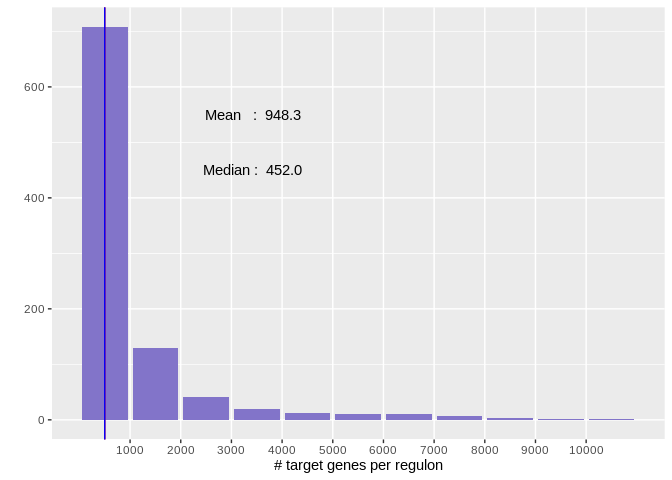<!-- -->

``` r
## save to png
# png(paste0(params$outdir,"hist_genesxregulon.png"), width = 600, height = 200)
# p + annotate("text", x = 3500, y = 450,
#              label = c(summary(n.genes.per.reg)[3,])) +
#   annotate("text", x = 3500, y = 550,
#              label = c(summary(n.genes.per.reg)[4,]))
# dev.off()
```

Make lists of regulons defined as upregulated or downregulated:

``` r
## Make lists of up/down regulons
tfs_da_up = list()
tfs_da_down = list()
tfs_da_enrich_up = list()
tfs_da_enrich_down = list()
for (exp in names(tfs_da)) {
  tfs_da_up[[exp]] <- tfs_da[[exp]][tfs_da[[exp]] %in%  rownames(l2fc)[which(l2fc[exp] > 0)]]
  tfs_da_down[[exp]] <- tfs_da[[exp]][tfs_da[[exp]] %in% rownames(l2fc)[which(l2fc[exp] < 0)]]
  tfs_da_enrich_up[[exp]] <- intersect(tfs_da_enrich[[exp]], tfs_da_up[[exp]])
  tfs_da_enrich_down[[exp]] <- intersect(tfs_da_enrich[[exp]], tfs_da_down[[exp]])
}
```

### **Plots: DA**

#### **Upset Plot**

  

##### **Upregulated Regulons**

Upset Plot of distinctly shared upregulated regulons between
experiments:

``` r
m <- make_comb_mat(tfs_da_up, mode = "distinct")
ss = set_size(m)
cs = comb_size(m)
ht = UpSet(m,
    set_order = order(ss),
    comb_order = order(comb_degree(m), -cs),
    top_annotation = HeatmapAnnotation(
        "Regulons Intersection" = anno_barplot(cs,
            ylim = c(0, max(cs)*1.1),
            border = FALSE,
            gp = gpar(fill = "black"),
            height = unit(4, "cm")
        ),
        annotation_name_side = "left",
        annotation_name_rot = 90),
    left_annotation = rowAnnotation(
        "Regulons Per Tissue" = anno_barplot(-ss,
            baseline = 0,
            axis_param = list(
                at = c(0, -500, -1000, -1500),
                labels = c(0, 500, 1000, 1500),
                labels_rot = 0),
            border = FALSE,
            gp = gpar(fill = "black"),
            width = unit(4, "cm")
        ),
        set_name = anno_text(set_name(m),
            location = 0.5,
            just = "center",
            width = max_text_width(set_name(m)) + unit(1, "mm"))
    ),
    right_annotation = NULL,
    show_row_names = FALSE,
    pt_size = unit(3, "mm"),
    lwd = 2,
    comb_col = RColorBrewer::brewer.pal(n = max(comb_degree(m)), name = "Set1")[comb_degree(m)]
    )
ht = draw(ht)
od = column_order(ht)
decorate_annotation("Regulons Intersection", {
    grid.text(cs[od], x = seq_along(cs), y = unit(cs[od], "native") + unit(2, "pt"),
        default.units = "native", just = c("left", "bottom"),
        gp = gpar(fontsize = 9, col = "#404040"), rot = 45)
})
```

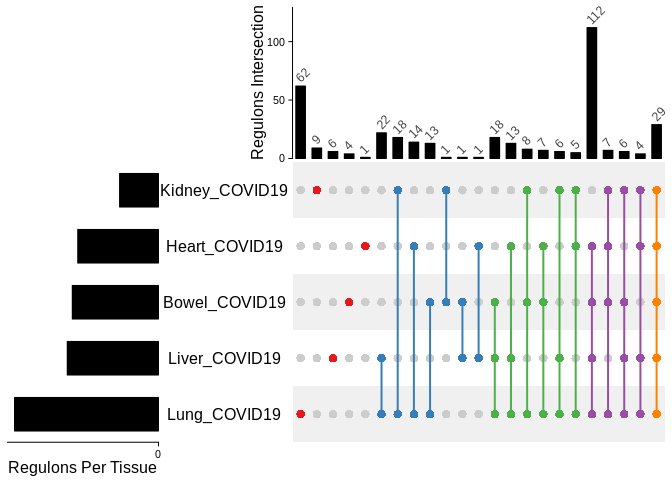<!-- -->

``` r
# ## save to png
# png(paste0(params$outdir,"upset_upregulated.png"), width = 600, height = 00)
# ht = draw(ht)
# od = column_order(ht)
# decorate_annotation("Regulons Intersection", {
#     grid.text(cs[od], x = seq_along(cs), y = unit(cs[od], "native") + unit(2, "pt"),
#         default.units = "native", just = c("left", "bottom"),
#         gp = gpar(fontsize = 9, col = "#404040"), rot = 45)
# })
# dev.off()
```

Pairwise comparison of shared regulons, distinctly shared regulons are
shown in the next table:

Sets were compared twice, once showing which are unique to each
experiment, and the second time excluding comparison of a experiment to
itself so sharing of regulons between regulons could be found.

``` r
tableCommonDistinct <- distinctlySharedRegs(tfs_per_exp_list = tfs_da_up)
tableCommonDistinct
```

    ##                           Bowel_COVID19 Heart_COVID19
    ## Bowel_COVID19  HOXC9,POLD2,TBX21,ZNF726              
    ## Heart_COVID19                      <NA>          HMX3
    ## Kidney_COVID19                     <NA>          <NA>
    ## Liver_COVID19                      <NA>          <NA>
    ## Lung_COVID19                       <NA>          <NA>
    ##                                                             Kidney_COVID19
    ## Bowel_COVID19                                                       ZNF782
    ## Heart_COVID19                                                             
    ## Kidney_COVID19 BARHL1,BHLHE22,FUBP1,NFAT5,RBAK,ZNF189,ZNF260,ZNF420,ZNF625
    ## Liver_COVID19                                                         <NA>
    ## Lung_COVID19                                                          <NA>
    ##                                   Liver_COVID19
    ## Bowel_COVID19                             STAT4
    ## Heart_COVID19                             SNAI3
    ## Kidney_COVID19                                 
    ## Liver_COVID19  CUX1,EMX2,NFE2,NR1H2,NRF1,ZNF846
    ## Lung_COVID19                               <NA>
    ##                                                                                                                                                                                                                                                                                                                                                                            Lung_COVID19
    ## Bowel_COVID19                                                                                                                                                                                                                                                                                             FOXA1,FOXA3,FOXC1,KLF2,KLF7,MSC,NANOG,NANOS1,NEUROD1,ONECUT1,TCF7L2,THRB,VSX2
    ## Heart_COVID19                                                                                                                                                                                                                                                                                                ERG,FLI1,FOXP3,GRHL2,GTF2B,MLXIPL,NFKB2,NFYB,OTP,REST,RUNX1,SP4,TEAD1,TFEC
    ## Kidney_COVID19                                                                                                                                                                                                                                                              BCL11B,FOXC2,FOXJ3,FOXK2,HOXB6,MEIS1,MXD1,PLAGL2,POU2AF1,PRRX2,PSMC2,RFX7,RUNX2,SIX1,SMC3,UBP1,VEZF1,ZNF667
    ## Liver_COVID19                                                                                                                                                                                                                                         ATF5,BARX2,CEBPA,E2F2,EOMES,FOSB,GMEB1,HSF1,IKZF1,KDM4B,MLXIP,PATZ1,POLR3G,RFX1,SOX17,SOX6,STAT2,TCF7L1,TFAP2C,TFAP4,ZFP64,ZNF513
    ## Lung_COVID19   ALX3,ARID3A,ARNTL,ATF4,ATF6B,BCL6,CCDC25,CRX,DMBX1,E2F1,E2F3,E2F7,ELF2,EN1,ERF,ESRRA,FOXB2,FOXM1,GATA2,GATA6,GCM1,GSX2,HAND1,HEY1,HNF1B,HOXB7,HOXB8,HOXC8,HSF4,MAFB,MECOM,NFATC3,NR1D1,NR1D2,NR2C2,NR2E3,ONECUT3,POU1F1,POU2F1,PPARGC1A,RFX2,RORC,RXRB,SALL2,SIX2,SIX5,SMAD1,SOX1,SOX5,SP3,STUB1,TAF1,TRIM28,ZBTB14,ZFP69B,ZHX1,ZNF214,ZNF282,ZNF384,ZNF436,ZNF653,ZNF76

``` r
# save table
write_csv(tableCommonDistinct,
          file = paste0(params$outdir,"tableDistinctlySharedRegulons_up.csv"), col_names = T)
```

Regulons that are only present in Lung, Heart and Liver COVID19 samples:

``` r
getDistinct(tfs_per_exp_list = tfs_da_up, indexInterestGroup = c(2,4,5))
```

    ##   [1] "ALX3"     "AR"       "ARID3A"   "ARID5A"   "ARNTL"    "ARNTL2"  
    ##   [7] "ARX"      "ATF1"     "ATF3"     "ATF4"     "ATF5"     "ATF6B"   
    ##  [13] "ATF7"     "BACH1"    "BACH2"    "BARX2"    "BATF"     "BCL3"    
    ##  [19] "BCL6"     "BCL6B"    "BCLAF1"   "BHLHE40"  "BHLHE41"  "BRF2"    
    ##  [25] "CCDC25"   "CEBPA"    "CEBPB"    "CEBPD"    "CEBPZ"    "CHD2"    
    ##  [31] "CLOCK"    "CREB1"    "CREB3"    "CREB3L1"  "CREB3L2"  "CREBL2"  
    ##  [37] "CRX"      "DMBX1"    "E2F1"     "E2F2"     "E2F3"     "E2F4"    
    ##  [43] "E2F7"     "EGR1"     "EGR3"     "EHF"      "ELF1"     "ELF2"    
    ##  [49] "ELF3"     "ELF4"     "ELK3"     "ELK4"     "EN1"      "EOMES"   
    ##  [55] "EP300"    "ERF"      "ERG"      "ESR1"     "ESRRA"    "ETS1"    
    ##  [61] "ETS2"     "ETV3"     "ETV4"     "ETV6"     "FLI1"     "FOSB"    
    ##  [67] "FOSL1"    "FOSL2"    "FOXA1"    "FOXA3"    "FOXB2"    "FOXC1"   
    ##  [73] "FOXF2"    "FOXM1"    "FOXN1"    "FOXN2"    "FOXO1"    "FOXP3"   
    ##  [79] "GATA2"    "GATA6"    "GCM1"     "GMEB1"    "GRHL2"    "GRHPR"   
    ##  [85] "GSX2"     "GTF2B"    "HAND1"    "HDAC2"    "HES1"     "HEY1"    
    ##  [91] "HINFP"    "HIVEP2"   "HLX"      "HNF1B"    "HOXA7"    "HOXB4"   
    ##  [97] "HOXB7"    "HOXB8"    "HOXC8"    "HSF1"     "HSF4"     "IKZF1"   
    ## [103] "IRF1"     "IRF2"     "IRF4"     "IRF8"     "IRF9"     "JDP2"    
    ## [109] "JUN"      "JUNB"     "JUND"     "KDM4B"    "KDM5A"    "KLF11"   
    ## [115] "KLF12"    "KLF14"    "KLF16"    "KLF17"    "KLF2"     "KLF3"    
    ## [121] "KLF4"     "KLF5"     "KLF6"     "KLF7"     "KLF9"     "MAFB"    
    ## [127] "MAFF"     "MAFG"     "MAFK"     "MAX"      "MAZ"      "MECOM"   
    ## [133] "MEIS2"    "MLXIP"    "MLXIPL"   "MSC"      "MYBL1"    "MYCN"    
    ## [139] "NANOG"    "NANOGP8"  "NANOS1"   "NEUROD1"  "NFATC3"   "NFE2L1"  
    ## [145] "NFE2L2"   "NFIL3"    "NFKB1"    "NFKB2"    "NFYA"     "NFYB"    
    ## [151] "NKX1-2"   "NKX3-1"   "NR1D1"    "NR1D2"    "NR2C2"    "NR2E3"   
    ## [157] "NR2F2"    "NR2F6"    "NR3C1"    "ONECUT1"  "ONECUT3"  "OTP"     
    ## [163] "PATZ1"    "PKNOX1"   "POLR2A"   "POLR3A"   "POLR3G"   "POU1F1"  
    ## [169] "POU2F1"   "POU3F2"   "PPARG"    "PPARGC1A" "RAD21"    "RARA"    
    ## [175] "RBBP5"    "RBPJ"     "REL"      "RELA"     "REST"     "RFX1"    
    ## [181] "RFX2"     "RORC"     "RREB1"    "RUNX1"    "RXRB"     "SALL2"   
    ## [187] "SIN3A"    "SIX2"     "SIX5"     "SMAD1"    "SMAD5"    "SMARCC2" 
    ## [193] "SOX1"     "SOX17"    "SOX4"     "SOX5"     "SOX6"     "SOX9"    
    ## [199] "SP1"      "SP2"      "SP3"      "SP4"      "SPI1"     "SREBF1"  
    ## [205] "SREBF2"   "SRF"      "STAT1"    "STAT2"    "STAT3"    "STUB1"   
    ## [211] "TAF1"     "TAF7"     "TBX20"    "TBX22"    "TCF7L1"   "TCF7L2"  
    ## [217] "TEAD1"    "TEAD2"    "TEF"      "TFAP2C"   "TFAP4"    "TFCP2L1" 
    ## [223] "TFDP1"    "TFE3"     "TFEC"     "THRA"     "THRB"     "TRIM28"  
    ## [229] "UBTF"     "VSX2"     "YY1"      "ZBTB14"   "ZBTB33"   "ZBTB7A"  
    ## [235] "ZBTB7B"   "ZFHX3"    "ZFP64"    "ZFP69B"   "ZFX"      "ZHX1"    
    ## [241] "ZNF148"   "ZNF214"   "ZNF282"   "ZNF316"   "ZNF35"    "ZNF358"  
    ## [247] "ZNF384"   "ZNF436"   "ZNF444"   "ZNF460"   "ZNF467"   "ZNF513"  
    ## [253] "ZNF524"   "ZNF579"   "ZNF653"   "ZNF671"   "ZNF76"    "ZNF813"  
    ## [259] "ZNF878"   "ZNF91"    "ZXDA"

------------------------------------------------------------------------

  

##### **Downregulated Regulons**

Upset Plot of distinctly shared downregulated regulons between
experiments:

``` r
m <- make_comb_mat(tfs_da_down, mode = "distinct")
ss = set_size(m)
cs = comb_size(m)
ht = UpSet(m,
    set_order = order(ss),
    comb_order = order(comb_degree(m), -cs),
    top_annotation = HeatmapAnnotation(
        "Regulons Intersection" = anno_barplot(cs,
            ylim = c(0, max(cs)*1.1),
            border = FALSE,
            gp = gpar(fill = "black"),
            height = unit(4, "cm")
        ),
        annotation_name_side = "left",
        annotation_name_rot = 90),
    left_annotation = rowAnnotation(
        "Regulons Per Tissue" = anno_barplot(-ss,
            baseline = 0,
            axis_param = list(
                at = c(0, -500, -1000, -1500),
                labels = c(0, 500, 1000, 1500),
                labels_rot = 0),
            border = FALSE,
            gp = gpar(fill = "black"),
            width = unit(4, "cm")
        ),
        set_name = anno_text(set_name(m),
            location = 0.5,
            just = "center",
            width = max_text_width(set_name(m)) + unit(1, "mm"))
    ),
    right_annotation = NULL,
    show_row_names = FALSE,
    pt_size = unit(3, "mm"),
    lwd = 2,
    comb_col = RColorBrewer::brewer.pal(n = max(comb_degree(m)), name = "Set1")[comb_degree(m)]
    )
ht = draw(ht)
od = column_order(ht)
decorate_annotation("Regulons Intersection", {
    grid.text(cs[od], x = seq_along(cs), y = unit(cs[od], "native") + unit(2, "pt"),
        default.units = "native", just = c("left", "bottom"),
        gp = gpar(fontsize = 9, col = "#404040"), rot = 45)
})
```

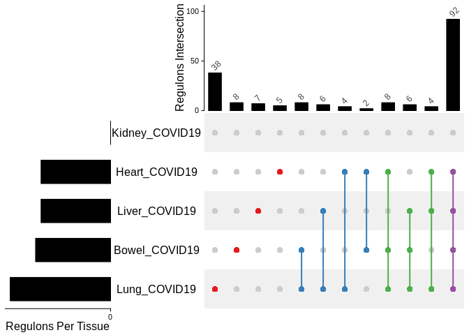<!-- -->

``` r
# ## save to png
# png(paste0(params$outdir,"upset_downregulated.png"), width = 1200, height = 600)
# ht = draw(ht)
# od = column_order(ht)
# decorate_annotation("Regulons Intersection", {
#     grid.text(cs[od], x = seq_along(cs), y = unit(cs[od], "native") + unit(2, "pt"),
#         default.units = "native", just = c("left", "bottom"),
#         gp = gpar(fontsize = 9, col = "#404040"), rot = 45)
# })
# dev.off()
```

Pairwise comparison of shared regulons, distinctly shared downregulated
regulons are shown in the next table:

``` r
tabledown <- distinctlySharedRegs(tfs_per_exp_list = tfs_da_down)
tabledown
```

    ##                                         Bowel_COVID19             Heart_COVID19
    ## Bowel_COVID19  CRX,DBX1,GATA3,GLI1,GSC,GSX1,RORC,TP53               TBX2,ZNF502
    ## Heart_COVID19                                    <NA> CDX1,HES5,HOXD4,NPAS2,ZFY
    ## Kidney_COVID19                                   <NA>                      <NA>
    ## Liver_COVID19                                    <NA>                      <NA>
    ## Lung_COVID19                                     <NA>                      <NA>
    ##                Kidney_COVID19                         Liver_COVID19
    ## Bowel_COVID19                                                      
    ## Heart_COVID19                                                      
    ## Kidney_COVID19                                                     
    ## Liver_COVID19            <NA> AHR,CERS5,HOXD1,MSX2,NFIB,NOBOX,SMAD9
    ## Lung_COVID19             <NA>                                  <NA>
    ##                                                                                                                                                                                                                                        Lung_COVID19
    ## Bowel_COVID19                                                                                                                                                                                         FOXN3,HOXA2,MZF1,PAX8,RFX4,ZBTB2,ZNF18,ZNF341
    ## Heart_COVID19                                                                                                                                                                                                            FOXA2,HOXA1,ZNF768,ZSCAN16
    ## Kidney_COVID19                                                                                                                                                                                                                                     
    ## Liver_COVID19                                                                                                                                                                                                       BSX,DLX1,ESX1,FOXI1,HOXB3,TBX18
    ## Lung_COVID19   ASCL2,ATOH7,BRF1,CELF4,DMRT2,ESRRB,EVX1,FOXD4L1,FOXL2,GABPB1,GBX1,GLI3,HOXC10,HOXC13,ING4,INSM1,IRF3,IRF7,LEF1,MDM2,MEF2C,PAX1,POU5F1B,POU6F1,SP5,TBX5,TFAP2E,TGIF1,USF2,ZNF235,ZNF3,ZNF439,ZNF540,ZNF585A,ZNF660,ZNF729,ZNF831,ZXDC

``` r
# # save table
# write_csv(tabledown,
#           file = paste0(params$outdir,"tableDistinctlySharedRegulons_down.csv"), col_names = T)
```

#### **Heatmap auc_mtx**

``` r
## Load and tidy data to plot: pvalues adjusted of regulons in DA [UP|DOWN]

# Load metadata to name samples as experiments
meta2 <- as.data.frame(read_csv(params$metadata.fn, col_names = T))

# Load and tidy data: adjusted pvalues, format
auc_mtx.hm <- auc_mtx
colnames(auc_mtx.hm) <- tfs

# rearrange meta as in auc_mtx
meta2 <- meta2[match(rownames(auc_mtx.hm),meta2$ID),]
meta2$source_num <- paste0(meta2$source,"-",1:122)    
rownames(auc_mtx.hm) <- meta2$source_num
paste0("using auc_mtx")
```

    ## [1] "using auc_mtx"

**Basic heatmap**

Regulons that passed `Mann Whitney` and `Kolmogrov` Tests for
Differential Activation with and `FDR Adjusted Pval of <= 0.2`.

``` r
# heatmap colors
max.auc = max(apply(auc_mtx, 1, max))
median.auc = summary(apply(auc_mtx, 1, sum)/length(colnames(auc_mtx)))[3]
min.auc = min(apply(auc_mtx, 1, min))
col_fun = colorRamp2(c(max.auc, median.auc, min.auc), c("red", "white", "steelblue1")) # red is cool, blue is bad pval

# retrieve regs/tfs in DA
selectedTFs <- selectTFs(tfs_per_exp_list = tfs_da_up) ## subset for COVID - 19 samples
# subset pvalues for selectedTFs
auc_mtx.hm <- as.matrix(auc_mtx.hm[,colnames(auc_mtx.hm) %in% selectedTFs])
hm <- Heatmap(auc_mtx.hm, name = "AUC", col = col_fun,
         column_title = "Per Tissue Upregulated Regulons",
         column_title_gp = gpar(fontsize = 10, fontface = "bold"),
         column_names_gp = gpar(fontsize = 2), 
        row_names_gp = gpar(fontsize = 4))
hm
```

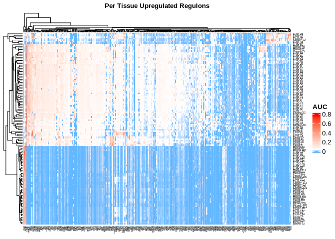<!-- -->

``` r
# save to png
# png(paste0(params$outdir,"heatmap_upreg.png"), width = 600, height = 600)
# hm
# dev.off()


# clustering order
d <- dist(auc_mtx.hm, method = "euclidean") # distance matrix
fit <- hclust(d)
plot(fit)
```

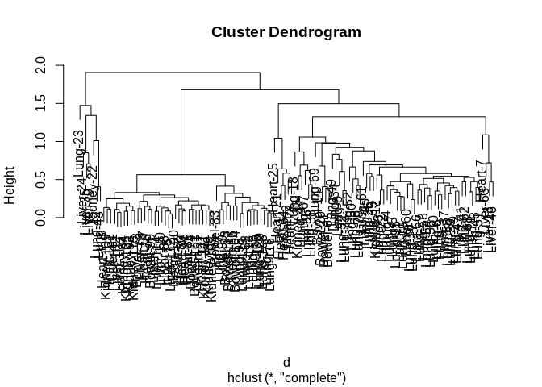<!-- -->

``` r
# save to png
# png(paste0(params$outdir,"dendogram_heatmap_upreg.png"), width = 1800, height = 600)
# plot(fit)
# dev.off()
```

Heatmaps showing AUC values for the subset of regulons that were
Differentially Activated - upregulated in COVID19 Tissues.

**TF family info**

``` r
## Tf families annotation
tf_fam_dbd <- family_annot(tfs_interest = colnames(auc_mtx.hm))
```

    ## [1] "Warning! 41 TFs were not found in the database. Annotating them as UNKNOWN"

``` r
cols.tfs <- rainbow(n = length(unique(tf_fam_dbd$Family_Name))) # colors vector
names(cols.tfs) <- unique(tf_fam_dbd$Family_Name)

# rearrange matrix in TF family order
auc_mtx.hm <- auc_mtx.hm[,match(tf_fam_dbd$TF_Name,colnames(auc_mtx.hm))]

## Prepare Heatmap annotations
order <- c(23,24,35,40,22,42,43,118,109,122,81,102,103,84,121,92,115,73,78,97,76,90,77,114,110,88,75,112,100,85,80,94,86,74,101,91,107,111,89,105,83,87,99,93,117,96,104,98,119,82,113,95,106,120,108,79,116,25,21,11,64,2,28,18,30,44,67,36,38,69,14,20,31,65,49,34,8,32,33,52,50,66,70,61,45,26,39,12,3,72,4,27,5,15,1,19,60,16,17,56,57,53,54,55,10,6,9,37,58,59,29,47,41,62,68,71,48,51,7,63,13,46)
nums <- str_remove(rownames(auc_mtx.hm), "\\w+-")
auc_mtx.hm <- auc_mtx.hm[match(order, nums),]

meta2 <- meta2[match(rownames(auc_mtx.hm), meta2$source_num),]

# ## highlight tfs shared in lung liver and heart
# luheli <- getDistinct(tfs_da_up, indexInterestGroup = c(2,4,5))
# shared.tfs <- rep("No",length(selectedTFs))
# shared.tfs[selectedTFs %in% luheli] <- "Yes"
# cols.tfs <- c("#FF00FF","#00ff00") # colors vector
# names(cols.tfs) <- c("Yes","No")

## COVID
covid <- meta2$disease
cols.covid <- RColorBrewer::brewer.pal(n=2, name = "Accent")
names(cols.covid) <- unique(covid)
cols.covid <- cols.covid[1:2]

## tissue
tissue <- meta2$source
cols.tissue <- c("#e41a1c","#377eb8","#4daf4a","#984ea3","#ff7f00")
names(cols.tissue) <- c("Heart","Bowel","Liver","Kidney","Lung")

## Plots

# TF family annotation
h1 <- HeatmapAnnotation(TF_family = tf_fam_dbd$Family_Name, 
                        col = list(TF_family = cols.tfs),
                        annotation_name_side = "left", 
                        annotation_name_gp = gpar(fontsize = 9),
                        annotation_legend_param = 
                          list(TF_family = list(direction = "horizontal", 
                                                nrow = 3)))
# experiment cell lines and treatment annotation
h2 <- rowAnnotation(Tissue = tissue, COVID = covid,
                    annotation_name_gp = gpar(fontsize = 9),
                        col = list(Tissue = cols.tissue, COVID = cols.covid),
                        annotation_legend_param = list(
                          Tissue = list(direction = "horizontal", nrow = 1),
                          COVID = list(direction = "horizontal", nrow = 1)))
## regs_heatmap_DA_[UP|DOWN]_tffam.png
htmp <- Heatmap(auc_mtx.hm, name = "AUC", cluster_columns = FALSE, col = col_fun,
        column_title = "COVID-19 Upregulated Regulons",
        column_title_gp = gpar(fontsize = 12, fontface = "bold"),
        column_names_gp = gpar(fontsize = 3),
        row_names_gp = gpar(fontsize = 6),
        bottom_annotation = h1, right_annotation = h2,
        heatmap_legend_param = list(direction = "horizontal"))

draw(htmp, merge_legend = TRUE, heatmap_legend_side = "bottom",
    annotation_legend_side = "bottom")
```

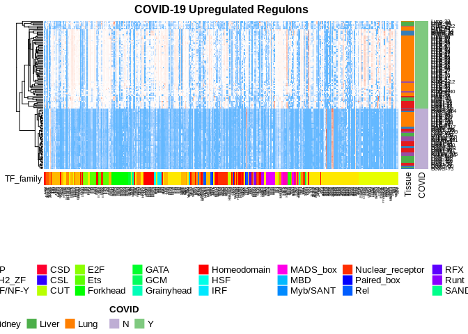<!-- -->

``` r
## regs_heatmap_DA_[UP|DOWN]_tffam_tfclust.png
htmp <- Heatmap(auc_mtx.hm, name = "AUC", cluster_columns = TRUE, col = col_fun,
        column_title = "COVID-19 Upregulated Regulons",
        column_title_gp = gpar(fontsize = 12, fontface = "bold"),
        column_names_rot = 45, column_names_gp = gpar(fontsize = 3),
        row_names_gp = gpar(fontsize = 6),
        bottom_annotation = h1, right_annotation = h2,
        heatmap_legend_param = list(direction = "horizontal"))

draw(htmp, merge_legend = TRUE, heatmap_legend_side = "bottom",
    annotation_legend_side = "bottom")
```

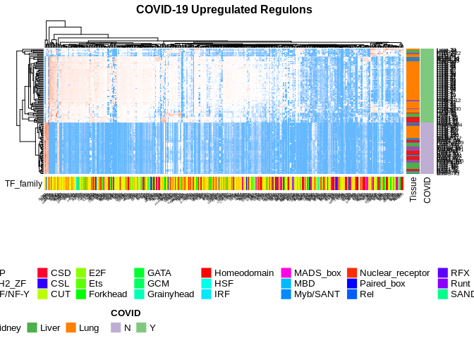<!-- -->

``` r
## save to png
png(paste0(params$outdir,"heatmap_upreg_annot-tf-covid-tissues.png"), 
    width = 1000, height = 500)
draw(htmp, merge_legend = TRUE, heatmap_legend_side = "bottom",
    annotation_legend_side = "bottom")
dev.off()
```

    ## png 
    ##   2

#### **GO Enrichment Analysis**

``` r
# Load and tidy data: regulons/tfs that were in DA + enriched
# Store all genes from all upregulated regulons Per Tissue to search for enriched terms
regs_genes_per_exp <- regsGenesPerExp(tfs_per_exp_list = tfs_da_up, tfs_targets = tfs_targets, entrezids = T)
```

Number of genes in all regulons Per Tissue

``` r
# number of genes in all regulons Per Tissue
t(as.data.frame(lapply(regs_genes_per_exp, length)))
```

    ##                 [,1]
    ## Bowel_COVID19  17038
    ## Heart_COVID19  16974
    ## Kidney_COVID19 12613
    ## Liver_COVID19  17037
    ## Lung_COVID19   17319

<GO:BP> analysis

``` r
# Perform GO Enrichment Analysis on regulons Per Tissue case
# BP Biological Process, CC Cellular Component, MF Molecular Functions
ego_perexp_da <- list()
i <- 1
for (regs in regs_genes_per_exp) {
  ego <- enrichGO(gene = regs, universe = genes_universe, #  change
                OrgDb = org.Hs.eg.db, ont = "BP", pAdjustMethod = "BH", pvalueCutoff  = 0.01,
                qvalueCutoff  = 0.05, readable = TRUE)
  ego_perexp_da[i] <- list(ego)
  i=i+1
}
names(ego_perexp_da) <- names(regs_genes_per_exp)

## Generate Dotplots iteratively
plots <- iterDotplot(ego_perexp_da, db = "GO:BP", savepngs = T, outdir = params$outdir, test_name = "upregulated")
plots
```

    ## $Kidney_COVID19

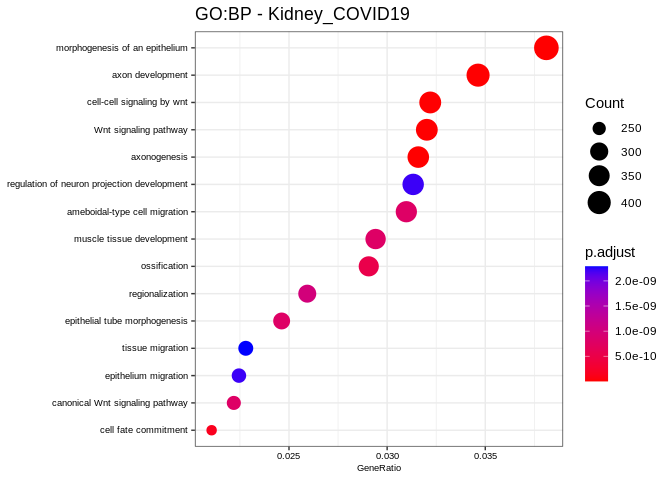<!-- -->

#### **KEGG Enrichment Analysis**

``` r
# Perform KEGG Pathway over-representation Analysis on regulons Per Tissue case
kk_perexp_da <- list()
i <- 1
for (regs in regs_genes_per_exp) {
  kk <- enrichKEGG(gene = regs, organism = 'hsa', pvalueCutoff = 0.05,
                    pAdjustMethod = "BH", universe = genes_universe)
  kk_perexp_da[i] <- list(kk)
  i=i+1
}
names(kk_perexp_da) <- names(regs_genes_per_exp)

## Generate Dotplots iteratively
plots <- iterDotplot(kk_perexp_da, db = "KEGG", savepngs = T, outdir = params$outdir, test_name = "upregulated")
plots
```

#### **Enrichment Analysis per Regulon**

##### **<GO:BO>**

Perform Enrichment Analysis runs for all regulons (tfs and target genes)

``` r
# Perform GO Enrichment Analysis on individual regulons
# BP Biological Process, CC Cellular Component, MF Molecular Functions
ego_per_regulon <- list()
for (tf in names(tfs_targets)) {
  regulon <- unique(c(str_remove(tf,"_\\(\\+\\)"), tfs_targets[[tf]]))
  ego <- enrichGO(gene = regulon, universe = genes_universe.df$SYMBOL, keyType = "SYMBOL",
                OrgDb = org.Hs.eg.db, ont = "BP", pAdjustMethod = "BH",
                pvalueCutoff  = 0.01, qvalueCutoff  = 0.05, readable = TRUE)
  ego_per_regulon[[tf]] <- ego
}
```

Number of regulons for which at least one enriched term was found:

For each experiment, take GOEA of each regulon and make a cloudplot of
the terms:

``` r
# For each experiment, take GOEA of each regulon and make a cloudplot of the terms:
plots_per_exp <- list()
for (exp in names(tfs_per_exp_list)) {
  # Store ego enriched terms per regulon
  terms_perexp <- c()
  for (tf in names(tfs_per_exp_list[[exp]])) {
    # take top n enriched terms per regulon of experiment
    enriched_terms <- as.data.frame(ego_per_regulon[[tf]])[,2]
    enriched_terms <- str_replace_all(enriched_terms," ","_")
    if(length(enriched_terms) > n){
      enriched_terms <- enriched_terms[1:n]
    }
    terms_perexp <- c(terms_perexp, enriched_terms)
    wordcloud(terms_perexp, max.words = 1,
                                    colors = RColorBrewer::brewer.pal(1,name = "Paired"))
  }
  plots_per_exp[[exp]] <- wordcloud(terms_perexp, max.words = 1,
                                    colors = RColorBrewer::brewer.pal(1,name = "Paired"))
}
```

##### **KEGG**

### **Plots: DA+enrichment Regulon Selection**

#### **Upset Plot**

##### **Upregulated Regulons**

``` r
# Load and tidy data: regulons/tfs that were in DA + enriched
# tfs_da_enrich

## Upset Plot
# subset for experiments that had intersections with other experiments, also plot only intersections >=2
#m <- make_comb_mat(lfc[names(lfc) %in% has.intersections], mode = "intersect")
m <- make_comb_mat(tfs_da_enrich_up, mode = "distinct")
ss = set_size(m)
cs = comb_size(m)
ht = UpSet(m,
    set_order = order(ss),
    comb_order = order(comb_degree(m), -cs),
    top_annotation = HeatmapAnnotation(
        "Regulons Intersection" = anno_barplot(cs,
            ylim = c(0, max(cs)*1.1),
            border = FALSE,
            gp = gpar(fill = "black"),
            height = unit(4, "cm")
        ),
        annotation_name_side = "left",
        annotation_name_rot = 90),
    left_annotation = rowAnnotation(
        "# Regulons" = anno_barplot(-ss,
            baseline = 0,
            border = FALSE,
            gp = gpar(fill = "black"),
            width = unit(4, "cm")
        ),
        set_name = anno_text(set_name(m),
            location = 0.5,
            just = "center",
            width = max_text_width(set_name(m)) + unit(4, "mm"))
    ),
    right_annotation = NULL,
    show_row_names = FALSE,
    pt_size = unit(5, "mm"),
    lwd = 3,
    comb_col = RColorBrewer::brewer.pal(n = max(comb_degree(m)), name = "Set1")[comb_degree(m)]
    )
ht = draw(ht)
od = column_order(ht)
decorate_annotation("Regulons Intersection", {
    grid.text(cs[od], x = seq_along(cs), y = unit(cs[od], "native") + unit(2, "pt"),
        default.units = "native", just = c("left", "bottom"),
        gp = gpar(fontsize = 11, col = "#404040"), rot = 45)
})
```

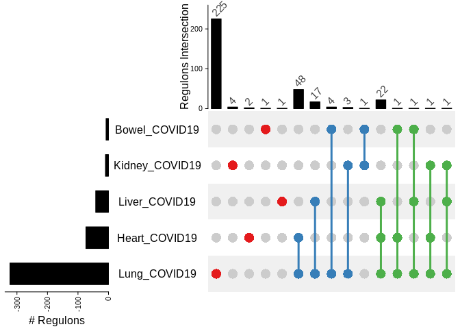<!-- -->

``` r
## save to png
# png(paste0(params$outdir,"upset_upregulated_enrich.png"), width = 800, height = 600)
# ht = draw(ht)
# od = column_order(ht)
# decorate_annotation("Regulons Intersection", {
#     grid.text(cs[od], x = seq_along(cs), y = unit(cs[od], "native") + unit(2, "pt"),
#         default.units = "native", just = c("left", "bottom"),
#         gp = gpar(fontsize = 11, col = "#404040"), rot = 45)
# })
# dev.off()
```

Pairwise comparison of shared regulons, distinctly shared regulons are
shown in the next table:

``` r
tableCommonDistinct <- distinctlySharedRegs(tfs_per_exp_list = tfs_da_enrich_up)
tableCommonDistinct
```

    ##                Bowel_COVID19 Heart_COVID19           Kidney_COVID19
    ## Bowel_COVID19         ZNF726                                 ZNF782
    ## Heart_COVID19           <NA>    HMX3,SNAI3                         
    ## Kidney_COVID19          <NA>          <NA> ZNF420,NFAT5,ZNF625,RBAK
    ## Liver_COVID19           <NA>          <NA>                     <NA>
    ## Lung_COVID19            <NA>          <NA>                     <NA>
    ##                Liver_COVID19
    ## Bowel_COVID19               
    ## Heart_COVID19               
    ## Kidney_COVID19              
    ## Liver_COVID19          KLF14
    ## Lung_COVID19            <NA>
    ##                                                                                                                                                                                                                                                                                                                                                                                                                                                                                                                                                                                                                                                                                                                                                                                                                                                                                                                                                                                                                                                                                                                                                                                                                                                                                                                                                        Lung_COVID19
    ## Bowel_COVID19                                                                                                                                                                                                                                                                                                                                                                                                                                                                                                                                                                                                                                                                                                                                                                                                                                                                                                                                                                                                                                                                                                                                                                                                                                                                                                                                 THRB,ZNF426,ZIC5,TBX4
    ## Heart_COVID19                                                                                                                                                                                                                                                                                                                                                                                                                                                                                                                                                                                                                                                                                                                                                                                                                                                                                                                                                                                                                                                              MECP2,OSR1,NKX2-4,GTF2A1,NKX3-1,EGR3,MYBL1,ZNF813,RBPJ,ESR1,HDAC2,HOXB2,ELF3,ZNF429,ZBTB33,MTHFD1,TFDP1,PAX9,CREBL2,JUNB,TEAD2,NFIL3,SNAI1,SOX4,JUND,BHLHE40,CEBPB,MYBL2,SOX11,TRPS1,ELK4,NFYA,CLOCK,EHF,ELF4,ZBTB7A,TFE3,POLR2A,SREBF2,ZNF785,ELK3,KLF3,MSX1,E2F4,CEBPZ,IRF2,BDP1,FOXJ2
    ## Kidney_COVID19                                                                                                                                                                                                                                                                                                                                                                                                                                                                                                                                                                                                                                                                                                                                                                                                                                                                                                                                                                                                                                                                                                                                                                                                                                                                                                                                       HOXB6,SMC3,ID1
    ## Liver_COVID19                                                                                                                                                                                                                                                                                                                                                                                                                                                                                                                                                                                                                                                                                                                                                                                                                                                                                                                                                                                                                                                                                                                                                                                                                                                 HOXB4,PIR,SOX6,TFAP4,TMEM33,HES1,POLR3A,BATF,TFAP2C,CSNK2B,HIVEP3,NR1I2,MLXIP,PLG,POLR3G,BCL6B,ZNF671
    ## Lung_COVID19   HLX,EGR1,JDP2,THRA,TEF,ZNF460,MAFG,FOXO1,UBTF,ZNF358,JUN,IRF9,SIN3A,ZNF467,ZNF569,EP300,RBBP5,KLF6,MAFB,BRF2,KLF5,ETS1,ZNF91,GLIS2,CREB3L2,CHD2,NFE2L2,CREB3L1,KLF12,KLF4,NR3C1,MECOM,CREB1,SRF,MAFK,ZNF524,CREB3,ZBTB7B,ETS2,NR2F2,BCL3,KLF1,FOXN2,RFXAP,GRHPR,ATF7,SP2,STAT3,SP1,HOXA7,HIVEP2,IRF4,SMARCC2,ETV4,ATF3,STAT5B,BCLAF1,HINFP,GTF2B,HSF1,BACH1,IRF8,SPI1,GMEB1,ARID3A,SMAD5,STAT1,ATF1,RFX7,NR1D1,FOXM1,HSF4,MAFF,NHLH1,ETV3,FOXK2,MSC,ERG,ELF1,NFKB2,MXD1,NR2F6,PPARGC1A,ZNF513,FLI1,ZNF134,KDM4B,FOXF2,MAX,PKNOX1,HEYL,FOXC1,KLF17,MAZ,GATA2,RREB1,EZR,IKZF1,FOXF1,ZNF878,REST,ZBTB14,RELA,FOSL1,RUNX1,NKX1-2,NFYB,ZNF148,NR2E3,ZNF444,RARA,KLF2,HEY1,TRIM28,ESRRA,E2F1,ZNF579,BATF3,TCF7L2,AR,PRRX2,BCL6,EOMES,HNF1B,HOXC8,ERF,NR2C2,TAF1,FOXQ1,SP3,TEAD1,SIX5,NFKB1,SMAD3,GRHL2,BACH2,SREBF1,RFX2,ARX,ZNF653,ELF2,E2F3,TFEC,POU2F1,HOXB7,BHLHE41,FOXP3,SP4,GATA6,HOXB8,STAT2,SOX7,BCL11B,PATZ1,NR1D2,RFX1,CEBPA,ZFX,RUNX2,RXRB,ATF4,SOX10,SALL2,SMAD6,TBX22,PPARG,ZNF436,ATF5,NR3C2,ONECUT1,FOSB,STUB1,ZXDA,UBP1,E2F2,ZFP64,POU1F1,KLF7,ZHX1,NEUROD1,NFATC3,MEIS2,RUNX3,VSX2,ALX3,POU3F2,HAND1,MEIS1,KLF16,CCDC25,NANOG,NANOGP8,PLAGL2,SIX1,FOXA1,PSMC2,BARX2,ZNF282,VEZF1,FOXA3,NANOS1,SOX17,FOXJ3,ZNF48,OTP,DMBX1,ZNF316,EN1,SOX5,KLF11,TCF7L1,SOX9,ONECUT3,E2F7,KLF8,FOXC2,MLXIPL,SMAD1,SOX1,POU2AF1,GCM1,ATF6B,MYCN,FOXB2,ZNF35

``` r
# # save table
# write_csv(tableCommonDistinct,
#           file = paste0(params$outdir,"tableDistinctlySharedRegulons_up-enrich.csv"), col_names = T)
```

Regulons that are only present in Lung, Heart and Liver COVID19 samples:

``` r
getDistinct(tfs_per_exp_list = tfs_da_enrich_up, indexInterestGroup = c(2,4,5))
```

    ##   [1] "ALX3"     "AR"       "ARID3A"   "ARID5A"   "ARX"      "ATF1"    
    ##   [7] "ATF3"     "ATF4"     "ATF5"     "ATF6B"    "ATF7"     "BACH1"   
    ##  [13] "BACH2"    "BARX2"    "BATF"     "BATF3"    "BCL11B"   "BCL3"    
    ##  [19] "BCL6"     "BCL6B"    "BCLAF1"   "BDP1"     "BHLHE40"  "BHLHE41" 
    ##  [25] "BRF2"     "CCDC25"   "CEBPA"    "CEBPB"    "CEBPD"    "CEBPZ"   
    ##  [31] "CHD2"     "CLOCK"    "CREB1"    "CREB3"    "CREB3L1"  "CREB3L2" 
    ##  [37] "CREBL2"   "CSNK2B"   "DMBX1"    "E2F1"     "E2F2"     "E2F3"    
    ##  [43] "E2F4"     "E2F7"     "EGR1"     "EGR3"     "EHF"      "ELF1"    
    ##  [49] "ELF2"     "ELF3"     "ELF4"     "ELK3"     "ELK4"     "EN1"     
    ##  [55] "ENO1"     "EOMES"    "EP300"    "ERF"      "ERG"      "ESR1"    
    ##  [61] "ESRRA"    "ETS1"     "ETS2"     "ETV3"     "ETV4"     "ETV6"    
    ##  [67] "EZR"      "FLI1"     "FOSB"     "FOSL1"    "FOSL2"    "FOXA1"   
    ##  [73] "FOXA3"    "FOXB2"    "FOXC1"    "FOXC2"    "FOXF1"    "FOXF2"   
    ##  [79] "FOXJ2"    "FOXJ3"    "FOXK1"    "FOXK2"    "FOXM1"    "FOXN1"   
    ##  [85] "FOXN2"    "FOXO1"    "FOXP3"    "FOXQ1"    "GATA2"    "GATA6"   
    ##  [91] "GCM1"     "GLIS2"    "GMEB1"    "GRHL2"    "GRHPR"    "GTF2A1"  
    ##  [97] "GTF2B"    "HAND1"    "HDAC2"    "HES1"     "HEY1"     "HEYL"    
    ## [103] "HINFP"    "HIVEP2"   "HIVEP3"   "HLX"      "HNF1B"    "HOXA7"   
    ## [109] "HOXB2"    "HOXB4"    "HOXB7"    "HOXB8"    "HOXC8"    "HSF1"    
    ## [115] "HSF4"     "IKZF1"    "IRF1"     "IRF2"     "IRF4"     "IRF8"    
    ## [121] "IRF9"     "IRX3"     "JAZF1"    "JDP2"     "JUN"      "JUNB"    
    ## [127] "JUND"     "KDM4B"    "KDM5A"    "KLF1"     "KLF11"    "KLF12"   
    ## [133] "KLF16"    "KLF17"    "KLF2"     "KLF3"     "KLF4"     "KLF5"    
    ## [139] "KLF6"     "KLF7"     "KLF8"     "KLF9"     "MAFB"     "MAFF"    
    ## [145] "MAFG"     "MAFK"     "MAX"      "MAZ"      "MECOM"    "MECP2"   
    ## [151] "MEIS1"    "MEIS2"    "MIOS"     "MLXIP"    "MLXIPL"   "MSC"     
    ## [157] "MSX1"     "MTHFD1"   "MXD1"     "MXD4"     "MYBL1"    "MYBL2"   
    ## [163] "MYCN"     "NANOG"    "NANOGP8"  "NANOS1"   "NEUROD1"  "NFATC3"  
    ## [169] "NFE2L1"   "NFE2L2"   "NFIL3"    "NFKB1"    "NFKB2"    "NFYA"    
    ## [175] "NFYB"     "NHLH1"    "NKX1-2"   "NKX2-4"   "NKX3-1"   "NR1D1"   
    ## [181] "NR1D2"    "NR1I2"    "NR2C2"    "NR2E3"    "NR2F2"    "NR2F6"   
    ## [187] "NR3C1"    "NR3C2"    "ONECUT1"  "ONECUT3"  "OSR1"     "OTP"     
    ## [193] "PATZ1"    "PAX9"     "PIR"      "PKNOX1"   "PLAGL2"   "PLG"     
    ## [199] "POLR2A"   "POLR3A"   "POLR3G"   "POU1F1"   "POU2AF1"  "POU2F1"  
    ## [205] "POU3F2"   "PPARG"    "PPARGC1A" "PRRX2"    "PSMC2"    "RAD21"   
    ## [211] "RARA"     "RBBP5"    "RBPJ"     "RELA"     "REST"     "RFX1"    
    ## [217] "RFX2"     "RFX7"     "RFXAP"    "RREB1"    "RUNX1"    "RUNX2"   
    ## [223] "RUNX3"    "RXRB"     "SALL2"    "SIN3A"    "SIX1"     "SIX5"    
    ## [229] "SMAD1"    "SMAD3"    "SMAD5"    "SMAD6"    "SMARCC1"  "SMARCC2" 
    ## [235] "SNAI1"    "SOX1"     "SOX10"    "SOX11"    "SOX17"    "SOX4"    
    ## [241] "SOX5"     "SOX6"     "SOX7"     "SOX9"     "SP1"      "SP2"     
    ## [247] "SP3"      "SP4"      "SPI1"     "SREBF1"   "SREBF2"   "SRF"     
    ## [253] "STAT1"    "STAT2"    "STAT3"    "STAT5B"   "STUB1"    "TAF1"    
    ## [259] "TAF7"     "TBX22"    "TBX4"     "TCF21"    "TCF7L1"   "TCF7L2"  
    ## [265] "TEAD1"    "TEAD2"    "TEF"      "TFAP2C"   "TFAP4"    "TFDP1"   
    ## [271] "TFE3"     "TFEC"     "THRA"     "THRB"     "TMEM33"   "TRIM28"  
    ## [277] "TRPS1"    "UBP1"     "UBTF"     "VEZF1"    "VSX2"     "YBX1"    
    ## [283] "YY1"      "YY2"      "ZBTB14"   "ZBTB33"   "ZBTB7A"   "ZBTB7B"  
    ## [289] "ZFHX3"    "ZFP64"    "ZFX"      "ZHX1"     "ZIC5"     "ZNF134"  
    ## [295] "ZNF148"   "ZNF282"   "ZNF316"   "ZNF35"    "ZNF358"   "ZNF426"  
    ## [301] "ZNF429"   "ZNF436"   "ZNF444"   "ZNF460"   "ZNF467"   "ZNF48"   
    ## [307] "ZNF513"   "ZNF524"   "ZNF569"   "ZNF579"   "ZNF653"   "ZNF671"  
    ## [313] "ZNF785"   "ZNF787"   "ZNF813"   "ZNF878"   "ZNF91"    "ZXDA"

##### **Downregulated Regulons**

``` r
# Load and tidy data: regulons/tfs that were in DA + enriched
# tfs_da_enrich

## Upset Plot
# subset for experiments that had intersections with other experiments, also plot only intersections >=2
#m <- make_comb_mat(lfc[names(lfc) %in% has.intersections], mode = "intersect")
m <- make_comb_mat(tfs_da_enrich_down, mode = "distinct")
#m <- m[comb_degree(m) >= 2]
ss = set_size(m)
cs = comb_size(m)
ht = UpSet(m,
    set_order = order(ss),
    comb_order = order(comb_degree(m), -cs),
    top_annotation = HeatmapAnnotation(
        "Regulons Intersection" = anno_barplot(cs,
            ylim = c(0, max(cs)*1.1),
            border = FALSE,
            gp = gpar(fill = "black"),
            height = unit(4, "cm")
        ),
        annotation_name_side = "left",
        annotation_name_rot = 90),
    left_annotation = rowAnnotation(
        "# Regulons" = anno_barplot(-ss,
            baseline = 0,
            border = FALSE,
            gp = gpar(fill = "black"),
            width = unit(4, "cm")
        ),
        set_name = anno_text(set_name(m),
            location = 0.5,
            just = "center",
            width = max_text_width(set_name(m)) + unit(4, "mm"))
    ),
    right_annotation = NULL,
    show_row_names = FALSE,
    pt_size = unit(5, "mm"),
    lwd = 3,
    comb_col = RColorBrewer::brewer.pal(n = max(comb_degree(m)), name = "Set1")[comb_degree(m)]
    )
ht = draw(ht)
od = column_order(ht)
decorate_annotation("Regulons Intersection", {
    grid.text(cs[od], x = seq_along(cs), y = unit(cs[od], "native") + unit(2, "pt"),
        default.units = "native", just = c("left", "bottom"),
        gp = gpar(fontsize = 11, col = "#404040"), rot = 45)
})
```

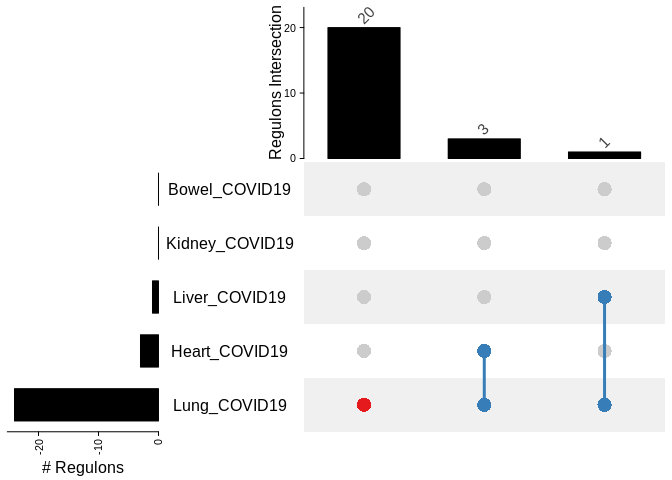<!-- -->

``` r
## save to png
# png(paste0(params$outdir,"upset_downregulated_enrich.png"), width = 1000, height = 600)
# ht = draw(ht)
# od = column_order(ht)
# decorate_annotation("Regulons Intersection", {
#     grid.text(cs[od], x = seq_along(cs), y = unit(cs[od], "native") + unit(2, "pt"),
#         default.units = "native", just = c("left", "bottom"),
#         gp = gpar(fontsize = 11, col = "#404040"), rot = 45)
# })
# dev.off()
```

Pairwise comparison of shared regulons, distinctly shared regulons are
shown in the next table:

``` r
tabledown <- distinctlySharedRegs(tfs_per_exp_list = tfs_da_enrich_down)
tabledown
```

    ##                Bowel_COVID19 Heart_COVID19 Kidney_COVID19 Liver_COVID19
    ## Bowel_COVID19                                                          
    ## Heart_COVID19           <NA>                                           
    ## Kidney_COVID19          <NA>          <NA>                             
    ## Liver_COVID19           <NA>          <NA>           <NA>              
    ## Lung_COVID19            <NA>          <NA>           <NA>          <NA>
    ##                                                                                                                                     Lung_COVID19
    ## Bowel_COVID19                                                                                                                                   
    ## Heart_COVID19                                                                                                                  ZNF66,SHOX,ZNF382
    ## Kidney_COVID19                                                                                                                                  
    ## Liver_COVID19                                                                                                                            TGIF2LY
    ## Lung_COVID19   ZNF362,ZNF319,ARNT,ZBTB2,ARNT2,RELB,ZNF84,ZNF235,TBX18,POU5F1B,ZNF283,PRDM16,ZNF768,ZNF263,ZNF227,ZNF70,ZSCAN16,HOXA1,FOXD4,ZNF16

``` r
# # save table
# write_csv(tabledown,
#           file = paste0(params$outdir,"tableDistinctlySharedRegulons_down-enrich.csv"), col_names = T)
```

#### **Heatmap**

``` r
## Load and tidy data
# rss <- as.data.frame(read_csv(paste0(params$inputdir,params$RSS.fn), col_names = T))
# rss <- column_to_rownames(rss, var="...1")
rownames(rss) <- str_remove(rownames(rss),"_\\(\\+\\)")
#colnames(rss) <- str_remove(colnames(rss), "[YN]$")
rss <- t(as.matrix(rss))
rss <- rss[,-(which(is.na(apply(rss, 2, sum))))] ## remove tfs with nas

# Load and tidy data: regulons/tfs that were in DA + enriched
## Subset for tfs that were in DA and were enriched in COVID19 Tissues
selectedTFsUpLFC <- selectTFs(tfs_per_exp_list = tfs_da_enrich_up)
rssUp <- rss[,match(selectedTFsUpLFC, colnames(rss))]

## down
selectedTFsDownLFC <- selectTFs(tfs_per_exp_list = tfs_da_enrich_down)
rssDown <- rss[,match(selectedTFsDownLFC, colnames(rss))]
```

**Basic heatmap**

Heatmap of all upregulated + enriched regulons

``` r
## Plot
Heatmap(rssUp, name = "RSS",
        column_title = "Per Tissue Most Enriched Upregulated Regulons",
        column_title_gp = gpar(fontsize = 10, fontface = "bold"),
        column_names_gp = gpar(fontsize = 5), row_names_gp = gpar(fontsize = 10))
```

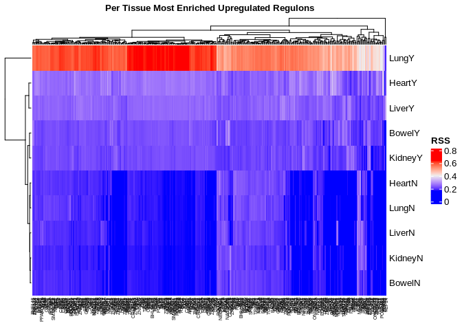<!-- -->

**Annotating TFs by families**

``` r
## TF Family annotation
tf_fam_dbd <- family_annot(tfs_interest = colnames(rssUp))
```

    ## [1] "Warning! 39 TFs were not found in the database. Annotating them as UNKNOWN"

``` r
cols.tfs <- rainbow(n = length(unique(tf_fam_dbd$Family_Name))) # colors vector
names(cols.tfs) <- unique(tf_fam_dbd$Family_Name)
# rearrange matrix in tf fam order
rssUp <- rssUp[,match(tf_fam_dbd$TF_Name,colnames(rssUp))]

## highlight immune related tfs
immune.tfs <- rep("No",length(selectedTFsUpLFC))
immune.tfs[tf_fam_dbd$Family_Name %in%
             c("Ets","GATA","IRF","Rel","RFX","SMAD","STAT",
               "ARID/BRIGHT","HSF","p53")] <- "Yes"
cols.tfsi <- c("#c51b7d","#7fbc41") # colors vector
names(cols.tfsi) <- c("Yes","No")

## Celllines annotation
if(params$organs==1){
  ## COVID19
  covid <- rep("No",length(rownames(rssUp)))
  covid[str_detect(rownames(rssUp),"Y")] <- "Yes"
  cols.covid <- RColorBrewer::brewer.pal(n=2, name = "Accent")
  names(cols.covid) <- unique(covid)
  cols.covid <- cols.covid[1:2]
  
  ## highlight tfs shared in lung liver and heart
  # luheli <- getDistinct(tfs_da_enrich_up, indexInterestGroup = c(2,4,5))
  luheli <- str_remove(intersect(intersect(tfs_da_enrich_up$Heart,
                                           tfs_da_enrich_up$Liver),
                      tfs_da_enrich_up$Lung), "_\\(\\+\\)")
  luheli.tfs <- rep("No",length(selectedTFsUpLFC))
  luheli.tfs[selectedTFsUpLFC %in% luheli] <- "Yes"
  cols.luheli <- c("#FF00FF","#00ff00") # colors vector
  names(cols.luheli) <- c("Yes","No")
  
  # reorder experiments in matrix by clustering order
  order <- c(2,5,1,3,4,8,9,7,10,6)
  rssUp <- rssUp[order,]
}

# heatmap colors
# col_fun = colorRamp2(c(0, 0.2, 0.23, 0.4), c("blue", "white","indianred1", "red3"))
## plot RSS metric colors
max.rss = max(apply(rssUp, 1, max))
firstqrt.rss = mean(apply(rssUp, 1, summary)[2,])
thirdqrt.rss = mean(apply(rssUp, 1, summary)[5,])
mean.rss = mean(apply(rssUp, 1, summary)[3,])
#min.rss = min(apply(rssUp, 1, min))
col_fun = colorRamp2(c(0.4, thirdqrt.rss, firstqrt.rss, 0), c("red3", "indianred1", "white", "blue"))

## Plot
h1 <- HeatmapAnnotation(TF_family = tf_fam_dbd$Family_Name, Immune_TF = immune.tfs,
                        LuHeLi = luheli.tfs,
                        col = list(TF_family = cols.tfs, Immune_TF = cols.tfsi,
                                   LuHeLi = cols.luheli),
                        annotation_name_side = "left",
                        annotation_legend_param =
                          list(TF_family = list(direction = "horizontal", nrow = 3),
                               Immune_TF = list(direction = "horizontal", nrow = 1),
                               LuHeLi = list(direction = "horizontal", nrow = 1)))
# covid annotation
h2 <- rowAnnotation(COVID = covid,
                    annotation_name_gp = gpar(fontsize = 9),
                        col = list(COVID = cols.covid),
                        annotation_legend_param = list(
                          COVID = list(direction = "horizontal", nrow = 1)))
htmp <- Heatmap(rssUp, name = "RSS", cluster_columns = FALSE, col = col_fun,
        column_title = "Per Tissue Most Enriched Upregulated Regulons",
        column_title_gp = gpar(fontsize = 15, fontface = "bold"),
        #column_names_rot = 45, 
        column_names_gp = gpar(fontsize = 4),
        row_names_gp = gpar(fontsize = 9),
        bottom_annotation = h1, right_annotation = h2,
        heatmap_legend_param = list(direction = "horizontal"))

draw(htmp, merge_legend = TRUE, heatmap_legend_side = "bottom",
    annotation_legend_side = "bottom")
```

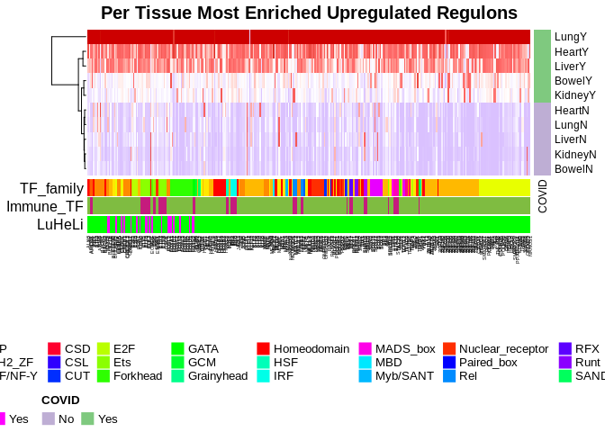<!-- -->

``` r
## save to png
# png(paste0(params$outdir,"heatmap_upreg_enrich_tfannot_notfclust.png"), width = 900, height = 600)
# draw(htmp, merge_legend = TRUE, heatmap_legend_side = "bottom",
#     annotation_legend_side = "bottom")
# dev.off()

# cluster TFs
htmp <- Heatmap(rssUp, name = "RSS", cluster_columns = TRUE, col = col_fun,
        column_title = "Per Tissue Most Enriched Upregulated Regulons",
        column_title_gp = gpar(fontsize = 15, fontface = "bold"),
        #column_names_rot = 45, 
        column_names_gp = gpar(fontsize = 4),
        row_names_gp = gpar(fontsize = 9),
        bottom_annotation = h1, right_annotation = h2,
        heatmap_legend_param = list(direction = "horizontal"))

draw(htmp, merge_legend = TRUE, heatmap_legend_side = "bottom",
    annotation_legend_side = "bottom")
```

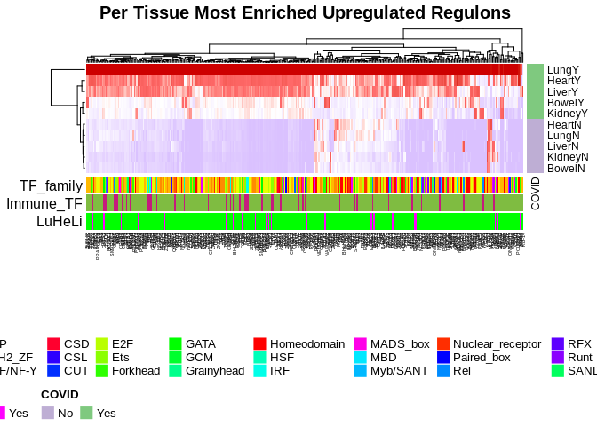<!-- -->

``` r
## save to png
png(paste0(params$outdir,"heatmap_upreg_enrich_tfannot_tfclust.png"), width = 1200, height = 600)
draw(htmp, merge_legend = TRUE, heatmap_legend_side = "bottom",
    annotation_legend_side = "bottom")
dev.off()
```

    ## png 
    ##   2

Heatmap excluding regulons in specific to Lung:

``` r
selectedTFsUpLFC <- selectTFs(tfs_per_exp_list = tfs_da_enrich_up[1:4])
rssUp <- rss[,match(selectedTFsUpLFC, colnames(rss))]

## TF Family annotation
tf_fam_dbd <- family_annot(tfs_interest = colnames(rssUp))
```

    ## [1] "Warning! 19 TFs were not found in the database. Annotating them as UNKNOWN"

``` r
cols.tfs <- rainbow(n = length(unique(tf_fam_dbd$Family_Name))) # colors vector
names(cols.tfs) <- unique(tf_fam_dbd$Family_Name)
# rearrange matrix in tf fam order
rssUp <- rssUp[,match(tf_fam_dbd$TF_Name,colnames(rssUp))]

## highlight da+enriched tfs per tissue
set <- rep("Heart",length(colnames(rssUp)))
set[colnames(rssUp) %in% str_remove(tfs_da_enrich_up$Bowel,"_\\(\\+\\)")] <- "Bowel"
set[colnames(rssUp) %in% str_remove(tfs_da_enrich_up$Liver,"_\\(\\+\\)")] <- "Liver"
set[colnames(rssUp) %in% str_remove(tfs_da_enrich_up$Kidney,"_\\(\\+\\)")] <- "Kidney"
cols.sets <- c("#e41a1c","#377eb8","#4daf4a","#984ea3")
names(cols.sets) <- c("Heart","Bowel","Liver","Kidney")

#reorder matrix to match enriched regs per tisue
tf_fam_dbd_tiss <- cbind(tf_fam_dbd,set)
tf_fam_dbd_tiss <- dplyr::arrange(tf_fam_dbd_tiss, set)
tf_fam_dbd_tiss$set <- str_replace(str_replace(str_replace(
  str_replace(tf_fam_dbd_tiss$set,"Bowel","3"),
  "Heart","1"),"Liver","2"),"Kidney","4")
tf_fam_dbd_tiss <- dplyr::arrange(tf_fam_dbd_tiss, set)
tf_fam_dbd_tiss$set <- str_replace(str_replace(str_replace(
  str_replace(tf_fam_dbd_tiss$set,"3","Bowel"),
  "1","Heart"),"2","Liver"),"4","Kidney")

rssUp <- rssUp[,match(tf_fam_dbd_tiss$TF_Name,colnames(rssUp))]

## highlight immune related tfs
immune.tfs <- rep("No",length(selectedTFsUpLFC))
immune.tfs[tf_fam_dbd$Family_Name %in%
             c("Ets","GATA","IRF","Rel","RFX","SMAD","STAT",
               "ARID/BRIGHT","HSF","p53")] <- "Yes"
cols.tfsi <- c("#c51b7d","#7fbc41") # colors vector
names(cols.tfsi) <- c("Yes","No")

## Celllines annotation
if(params$organs==1){
  ## highlight tfs shared in lung liver and heart
  # luheli <- getDistinct(tfs_da_enrich_up, indexInterestGroup = c(2,4,5))
  luheli <- str_remove(intersect(intersect(tfs_da_enrich_up$Heart,
                                           tfs_da_enrich_up$Liver),
                      tfs_da_enrich_up$Lung), "_\\(\\+\\)")
  luheli.tfs <- rep("No",length(selectedTFsUpLFC))
  luheli.tfs[selectedTFsUpLFC %in% luheli] <- "Yes"
  cols.luheli <- c("#FF00FF","#00ff00") # colors vector
  names(cols.luheli) <- c("Yes","No")
  
  # reorder experiments in matrix by clustering order
  order <- c(2,5,1,3,4,8,9,7,10,6)
  rssUp <- rssUp[order,]
  
  ## COVID19
  covid <- rep("No",length(rownames(rssUp)))
  covid[str_detect(rownames(rssUp),"Y")] <- "Yes"
  cols.covid <- RColorBrewer::brewer.pal(n=2, name = "Accent")
  names(cols.covid) <- unique(covid)
  cols.covid <- cols.covid[1:2]
}

# heatmap colors
# col_fun = colorRamp2(c(0, 0.2, 0.23, 0.4), c("blue", "white","indianred1", "red3"))
## plot RSS metric colors
max.rss = max(apply(rssUp, 1, max))
firstqrt.rss = mean(apply(rssUp, 1, summary)[2,])
thirdqrt.rss = mean(apply(rssUp, 1, summary)[5,])
mean.rss = mean(apply(rssUp, 1, summary)[3,])
#min.rss = min(apply(rssUp, 1, min))
col_fun = colorRamp2(c(0.4, thirdqrt.rss, firstqrt.rss, 0), c("red3", "indianred1", "white", "blue"))

## Plot
h1 <- HeatmapAnnotation(Tissue = tf_fam_dbd_tiss$set, 
                        TF_family = tf_fam_dbd_tiss$Family_Name, 
                        Immune_TF = immune.tfs, LuHeLi = luheli.tfs,
                        col = list(Tissue = cols.sets, TF_family = cols.tfs, 
                                   Immune_TF = cols.tfsi, LuHeLi = cols.luheli),
                        annotation_name_side = "left",
                        annotation_legend_param =
                          list(Tissue = list(direction = "horizontal", nrow = 1),
                               TF_family = list(direction = "horizontal", nrow = 3),
                               Immune_TF = list(direction = "horizontal", nrow = 1),
                               LuHeLi = list(direction = "horizontal", nrow = 1)))
# covid annotation
h2 <- rowAnnotation(COVID = covid,
                    annotation_name_gp = gpar(fontsize = 9),
                        col = list(COVID = cols.covid),
                        annotation_legend_param = list(
                          COVID = list(direction = "horizontal", nrow = 1)))
# cluster TFs
htmp <- Heatmap(rssUp, name = "RSS", cluster_columns = FALSE, col = col_fun,
        column_title = "Per Tissue Most Enriched Upregulated Regulons",
        column_title_gp = gpar(fontsize = 15, fontface = "bold"),
        column_names_rot = 45,
        column_names_gp = gpar(fontsize = 7),
        row_names_gp = gpar(fontsize = 9),
        bottom_annotation = h1, right_annotation = h2,
        heatmap_legend_param = list(direction = "horizontal"))

draw(htmp, merge_legend = TRUE, heatmap_legend_side = "bottom",
    annotation_legend_side = "bottom")
```

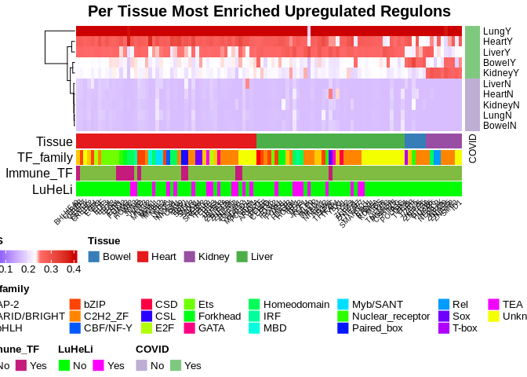<!-- -->

``` r
## save to png
png(paste0(params$outdir,"heatmap_upreg_enrich_tfannot_tfclust-subHeLiBoKi-orderTissue.png"), width = 1200, height = 400)
draw(htmp, merge_legend = TRUE, heatmap_legend_side = "bottom",
    annotation_legend_side = "bottom")
dev.off()
```

    ## png 
    ##   2

Lung, Heart and Liver (**LuHeLi**) Regulon guiding TFs:

``` r
luheli
```

    ##  [1] "NFE2L1"  "ZFHX3"   "YY2"     "MXD4"    "FOXK1"   "FOXN1"   "ZNF787" 
    ##  [8] "IRF1"    "TAF7"    "SMARCC1" "ENO1"    "FOSL2"   "CEBPD"   "ETV6"   
    ## [15] "YBX1"    "YY1"     "KLF9"    "RAD21"   "IRX3"    "KDM5A"   "MIOS"   
    ## [22] "JAZF1"

#### **GO Term Enrichment Analysis**

``` r
# Load and tidy data: regulons/tfs that were in DA + enriched
# Store all genes from all upregulated regulons Per Tissue to search for enriched terms
regs_genes_per_exp <- regsGenesPerExp(tfs_per_exp_list = tfs_da_enrich_up, tfs_targets = tfs_targets, entrezids = T)
```

Number of genes in all regulons Per Tissue

``` r
# number of genes in all regulons Per Tissue
t(as.data.frame(lapply(regs_genes_per_exp, length)))
```

    ##                 [,1]
    ## Bowel_COVID19   1680
    ## Heart_COVID19  15470
    ## Kidney_COVID19  1825
    ## Liver_COVID19  13961
    ## Lung_COVID19   17008

``` r
# Perform GO Enrichment Analysis on regulons Per Tissue case
# BP Biological Process, CC Cellular Component, MF Molecular Functions
ego_perexp_da <- list()
i <- 1
for (regs in regs_genes_per_exp) {
  ego <- enrichGO(gene = regs, universe = genes_universe, #  change
                OrgDb = org.Hs.eg.db, ont = "BP", pAdjustMethod = "BH", pvalueCutoff  = 0.01,
                qvalueCutoff  = 0.05, readable = TRUE)
  ego_perexp_da[i] <- list(ego)
  i=i+1
}
names(ego_perexp_da) <- names(regs_genes_per_exp)

## Generate Dotplots iteratively
plots <- iterDotplot(ego_perexp_da, db = "GO:BP", savepngs = F, outdir = params$outdir, test_name = "upregulated-rss")
plots
```

    ## $Heart_COVID19

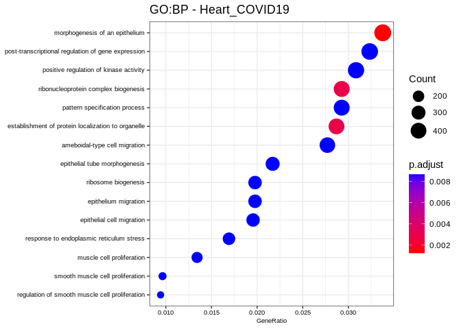<!-- -->

    ## 
    ## $Kidney_COVID19

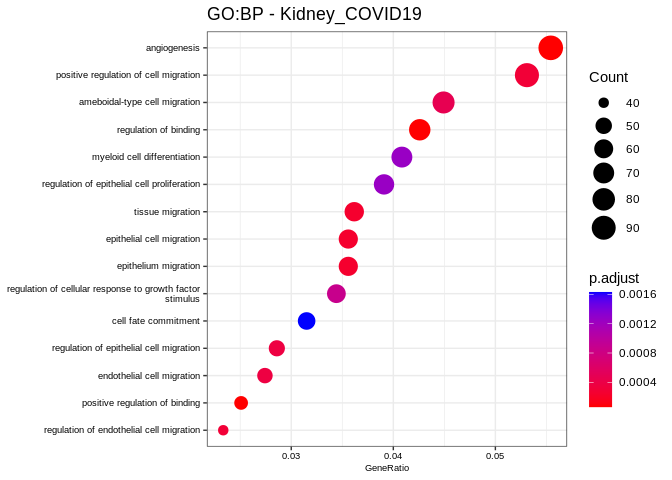<!-- -->

    ## 
    ## $Liver_COVID19

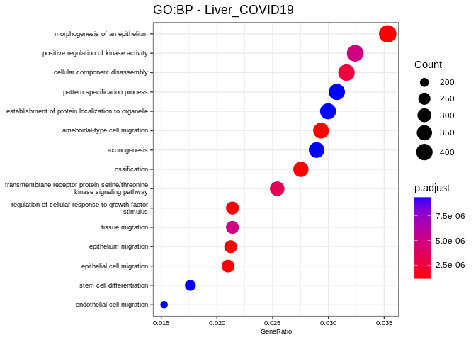<!-- -->

``` r
# if(params$celllines==1){
#   # display plots together
#   p <- ggarrange(plots$IAVdNS1_infected_NHBE,plots$human_IFNB_treated_NHBE, ncol = 2, nrow = 1)
#   annotate_figure(p, top = text_grob("GO:BP Enriched Terms in Upregulated+Enriched Regulons",
#                                      face = "bold", size = 14))
#   p <- ggarrange(plots$SARSCoV2_infected_A549_hACE2,plots$SARSCoV2_infected_A549_hACE2_pt,
#                  plots$SARSCoV2_infected_Calu3,ncol = 3, nrow = 1)
#   annotate_figure(p, top = text_grob("GO:BP Enriched Terms in Upregulated+Enriched Regulons",
#                                      face = "bold", size = 14))
# }
```

#### **KEGG Enrichment Analysis**

``` r
# Perform KEGG Pathway over-representation Analysis on regulons Per Tissue case
kk_perexp_da <- list()
i <- 1
for (regs in regs_genes_per_exp) {
  kk <- enrichKEGG(gene = regs, organism = 'hsa', pvalueCutoff = 0.05,
                    pAdjustMethod = "BH", universe = genes_universe)
  kk_perexp_da[i] <- list(kk)
  i=i+1
}
names(kk_perexp_da) <- names(regs_genes_per_exp)

## Generate Dotplots iteratively
plots <- iterDotplot(kk_perexp_da, db = "KEGG", savepngs = F, outdir = params$outdir, test_name = "upregulated-rss")
plots
```

#### **Disease Ontology Enrichment Analysis**

DOSE supports enrichment analysis of Disease Ontology (DO) (Schriml et
al. 2011), Network of Cancer Gene (A. et al. 2016) and Disease Gene
Network (DisGeNET) (Janet et al. 2015).

``` r
# Perform Disease Enrichment Analysis qith only the tfs (no target genes) Per Tissue case
edo_perexp_da <- list()
i <- 1
for (regs in regs_genes_per_exp) {
  edo <- enrichDO(gene = regs, pvalueCutoff = 0.1, ont = "DO",
                    pAdjustMethod = "BH", universe = genes_universe)
  edo_perexp_da[i] <- list(edo)
  i=i+1
}
names(edo_perexp_da) <- names(regs_genes_per_exp)

## Generate Dotplots iteratively
plots <- iterDotplot(edo_perexp_da, db = "DO", savepngs = T, outdir = params$outdir, test_name = "upregulated-rss")
plots
```

    ## $Liver_COVID19

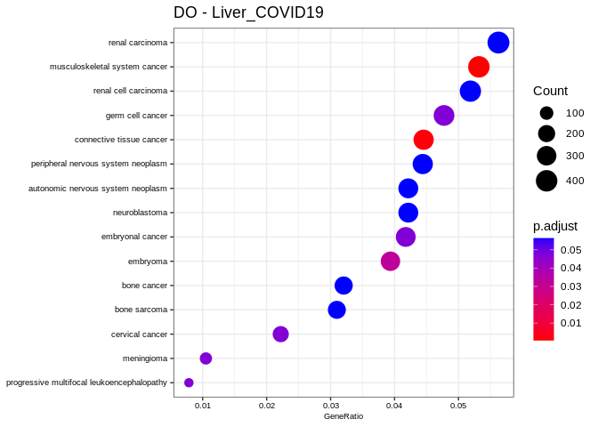<!-- -->

**DisGeNet**

``` r
## Enrich DisGeNet
edgn_perexp_da <- list()
i <- 1
for (regs in regs_genes_per_exp) {
  ego <- enrichDGN(gene = regs, pvalueCutoff = 0.1,
                    pAdjustMethod = "BH", universe =genes_universe)
  edgn_perexp_da[i] <- list(ego)
  i=i+1
}
names(edgn_perexp_da) <- names(regs_genes_per_exp)

## Generate Dotplots iteratively
plots <- iterDotplot(edo_perexp_da, db = "DGN", savepngs = F, outdir = params$outdir, test_name = "upregulated-rss")
plots
```

    ## $Liver_COVID19

<!-- -->

### **References**

\[1\]
<https://www.cienciadedatos.net/documentos/19b_comparaciones_multiples_correccion_p-value_fdr>

\[2\]
<https://yulab-smu.top/biomedical-knowledge-mining-book/clusterprofiler-go.html>

``` r
sessionInfo()
```

    ## R version 4.2.2 Patched (2022-11-10 r83330)
    ## Platform: x86_64-pc-linux-gnu (64-bit)
    ## Running under: Ubuntu 18.04.6 LTS
    ## 
    ## Matrix products: default
    ## BLAS:   /usr/lib/x86_64-linux-gnu/blas/libblas.so.3.7.1
    ## LAPACK: /usr/lib/x86_64-linux-gnu/lapack/liblapack.so.3.7.1
    ## 
    ## locale:
    ##  [1] LC_CTYPE=en_US.UTF-8       LC_NUMERIC=C              
    ##  [3] LC_TIME=es_MX.UTF-8        LC_COLLATE=en_US.UTF-8    
    ##  [5] LC_MONETARY=es_MX.UTF-8    LC_MESSAGES=en_US.UTF-8   
    ##  [7] LC_PAPER=es_MX.UTF-8       LC_NAME=C                 
    ##  [9] LC_ADDRESS=C               LC_TELEPHONE=C            
    ## [11] LC_MEASUREMENT=es_MX.UTF-8 LC_IDENTIFICATION=C       
    ## 
    ## attached base packages:
    ## [1] stats4    grid      stats     graphics  grDevices utils     datasets 
    ## [8] methods   base     
    ## 
    ## other attached packages:
    ##  [1] wordcloud_2.6         RColorBrewer_1.1-3    DOSE_3.24.2          
    ##  [4] pathview_1.38.0       clusterProfiler_4.6.0 enrichplot_1.18.1    
    ##  [7] ggpubr_0.5.0          org.Hs.eg.db_3.16.0   AnnotationDbi_1.60.0 
    ## [10] IRanges_2.32.0        S4Vectors_0.36.0      Biobase_2.58.0       
    ## [13] BiocGenerics_0.44.0   circlize_0.4.15       ComplexHeatmap_2.14.0
    ## [16] forcats_0.5.2         stringr_1.4.1         dplyr_1.0.10         
    ## [19] purrr_0.3.5           readr_2.1.3           tidyr_1.2.1          
    ## [22] tibble_3.1.8          ggplot2_3.4.0         tidyverse_1.3.2      
    ## 
    ## loaded via a namespace (and not attached):
    ##   [1] shadowtext_0.1.2       readxl_1.4.1           backports_1.4.1       
    ##   [4] fastmatch_1.1-3        plyr_1.8.8             igraph_1.3.5          
    ##   [7] lazyeval_0.2.2         splines_4.2.2          BiocParallel_1.32.3   
    ##  [10] GenomeInfoDb_1.34.3    digest_0.6.30          yulab.utils_0.0.5     
    ##  [13] foreach_1.5.2          htmltools_0.5.3        GOSemSim_2.24.0       
    ##  [16] viridis_0.6.2          GO.db_3.16.0           fansi_1.0.3           
    ##  [19] magrittr_2.0.3         memoise_2.0.1          googlesheets4_1.0.1   
    ##  [22] cluster_2.1.4          doParallel_1.0.17      tzdb_0.3.0            
    ##  [25] Biostrings_2.66.0      graphlayouts_0.8.4     modelr_0.1.10         
    ##  [28] matrixStats_0.63.0     vroom_1.6.0            timechange_0.1.1      
    ##  [31] colorspace_2.0-3       blob_1.2.3             rvest_1.0.3           
    ##  [34] ggrepel_0.9.2          haven_2.5.1            xfun_0.35             
    ##  [37] crayon_1.5.2           RCurl_1.98-1.9         jsonlite_1.8.3        
    ##  [40] graph_1.76.0           scatterpie_0.1.8       ape_5.6-2             
    ##  [43] iterators_1.0.14       glue_1.6.2             polyclip_1.10-4       
    ##  [46] gtable_0.3.1           gargle_1.2.1           zlibbioc_1.44.0       
    ##  [49] XVector_0.38.0         GetoptLong_1.0.5       car_3.1-1             
    ##  [52] Rgraphviz_2.42.0       shape_1.4.6            abind_1.4-5           
    ##  [55] scales_1.2.1           DBI_1.1.3              rstatix_0.7.1         
    ##  [58] Rcpp_1.0.9             viridisLite_0.4.1      clue_0.3-63           
    ##  [61] tidytree_0.4.1         gridGraphics_0.5-1     bit_4.0.5             
    ##  [64] httr_1.4.4             fgsea_1.24.0           ellipsis_0.3.2        
    ##  [67] XML_3.99-0.12          pkgconfig_2.0.3        farver_2.1.1          
    ##  [70] dbplyr_2.2.1           utf8_1.2.2             labeling_0.4.2        
    ##  [73] ggplotify_0.1.0        tidyselect_1.2.0       rlang_1.0.6           
    ##  [76] reshape2_1.4.4         munsell_0.5.0          cellranger_1.1.0      
    ##  [79] tools_4.2.2            cachem_1.0.6           downloader_0.4        
    ##  [82] cli_3.4.1              generics_0.1.3         RSQLite_2.2.19        
    ##  [85] gson_0.0.9             broom_1.0.1            evaluate_0.18         
    ##  [88] fastmap_1.1.0          yaml_2.3.6             ggtree_3.6.2          
    ##  [91] knitr_1.41             bit64_4.0.5            fs_1.5.2              
    ##  [94] tidygraph_1.2.2        KEGGREST_1.38.0        ggraph_2.1.0          
    ##  [97] nlme_3.1-160           KEGGgraph_1.58.0       aplot_0.1.9           
    ## [100] xml2_1.3.3             compiler_4.2.2         rstudioapi_0.14       
    ## [103] png_0.1-7              ggsignif_0.6.4         treeio_1.22.0         
    ## [106] reprex_2.0.2           tweenr_2.0.2           stringi_1.7.8         
    ## [109] highr_0.9              lattice_0.20-45        Matrix_1.5-1          
    ## [112] vctrs_0.5.1            pillar_1.8.1           lifecycle_1.0.3       
    ## [115] GlobalOptions_0.1.2    data.table_1.14.6      cowplot_1.1.1         
    ## [118] bitops_1.0-7           patchwork_1.1.2        qvalue_2.30.0         
    ## [121] R6_2.5.1               gridExtra_2.3          codetools_0.2-18      
    ## [124] MASS_7.3-58            assertthat_0.2.1       rjson_0.2.21          
    ## [127] withr_2.5.0            GenomeInfoDbData_1.2.9 parallel_4.2.2        
    ## [130] hms_1.1.2              ggfun_0.0.9            HDO.db_0.99.1         
    ## [133] rmarkdown_2.18         carData_3.0-5          googledrive_2.0.0     
    ## [136] ggforce_0.4.1          lubridate_1.9.0
